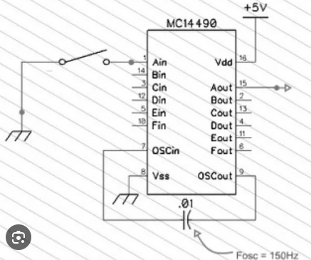
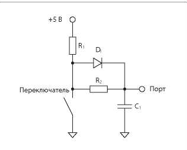
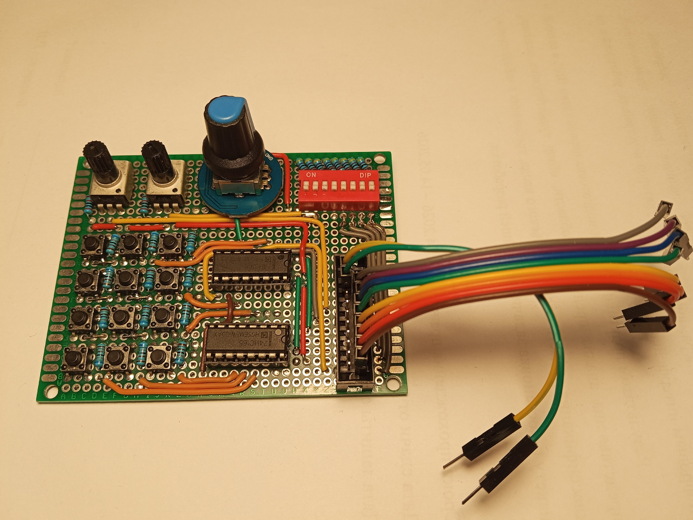

# Средства пользовательского ввода для лабораторного макета микроконтроллера MIK32 АМУР

## Введение

При обучении работе с микроконтроллерами важно использовать не только программные примеры, но и наглядные лабораторные макеты, позволяющие связать код с реальными внешними сигналами. Для распространенных зарубежных микроконтроллерных платформ существует большое количество отладочных плат, учебных наборов и дополнительных модулей. В случае отечественного микроконтроллера MIK32 АМУР, выбор готовых учебных решений значительно уже. Поэтому при разработке лабораторного стенда на его основе возникает необходимость создавать собственные аппаратные модули, приспособленные к особенностям этой платформы.

Одной из ключевых частей такого макета являются средства пользовательского ввода. К ним относятся кнопки, переключатели, клавиатуры, поворотные энкодеры, потенциометры и другие устройства, с помощью которых пользователь входные сигналы. Работа с этими устройствами позволяет изучать настройку портов ввода-вывода, обработку дребезга контактов, опрос клавиатурных матриц, применение сдвиговых регистров, использование таймеров, прерываний и аналого-цифрового преобразователя, а так же работу с цифровыми протоколами SPI, USART, I2C и другими.

Большинство доступных отладочных плат содержит только ограниченный набор встроенных органов управления: одну или несколько кнопок, светодиоды и разъемы для подключения внешних цепей. Для выполнения лабораторных работ с несколькими кнопками, переключателями, энкодером или аналоговыми регуляторами приходится собирать дополнительные схемы на макетной плате. Это увеличивает время подготовки, повышает вероятность ошибок подключения и затрудняет повторяемость экспериментов в учебной аудитории.

В данной работе рассматривается разработка отдельной платы пользовательского ввода для лабораторного макета на базе MIK32 АМУР. На текущем этапе плата выполняется как самостоятельный модуль и подключается к отладочной плате с микроконтроллером с помощью проводов-перемычек. В дальнейшем разработанные решения будут перенесены на большую лабораторную плату, где пользовательский ввод будет объединен с устройствами вывода, индикацией, разъемами расширения и другими узлами учебного стенда.

Цель публикации - обосновать необходимость разработки отдельной платы пользовательского ввода для учебного макета на базе микроконтроллера MIK32 АМУР и описать основные аппаратные и программные решения, применяемые при ее создании.

### 1. Назначение и состав модуля пользовательского ввода

Лабораторный макет должен позволять студентам работать с основными типами входных сигналов: дискретными, аналоговыми, импульсными и сигналами, передаваемыми через цифровые интерфейсы. Если освоить простейшее устройство каждого типа, то переход к другим устройствам того же класса обычно не вызывает существенных трудностей, так как сохраняются общие принципы считывания, фильтрации и программной обработки.

Дискретный ввод представлен тактовыми кнопками и рычажковыми переключателями. К этому типу также относятся концевые выключатели, герконы, датчики открытия и датчики с релейным выходом. Кнопки выбраны для изучения кратковременных событий нажатия и отпускания, а переключатели - для задания устойчивых логических состояний. На этих элементах удобно рассматривать настройку GPIO, подтягивающие резисторы и обработку дребезга контактов. В модуле используется набор из 8 DIP переключателей, а так же клавиатура из 12 кнопок, подключаемых через сдвиговые регистры 74HC165. Такой вариант уменьшает число занятых выводов микроконтроллера и одновременно знакомит студентов с передачей состояний внешних устройств через цифровой интерфейс.

Аналоговый ввод представлен потенциометрами. Аналогичными по принципу обработки устройствами являются аналоговые джойстики, фоторезисторы, терморезисторы и датчики положения. Потенциометр выбран как самый простой источник регулируемого напряжения: на его примере можно изучить работу АЦП, масштабирование результата, усреднение измерений и фильтрацию шумов.

Импульсный ввод представлен поворотным энкодером. К этому типу также относятся датчики скорости вращения, тахометрические датчики, оптические прерыватели и датчики положения с импульсным выходом. Энкодер выбран потому, что он позволяет изучить обработку двух связанных каналов, определение направления вращения и влияние частоты опроса.

### 2. Рычажковые переключатели

Рычажковые переключатели применяются для задания устойчивых логических состояний, например выбора режима работы программы или имитации простых дискретных датчиков. В модуле предусмотрено 8 DIP-переключателей, подключенных к входам GPIO микроконтроллера. Для исключения неопределенного состояния входов используются подтягивающие резисторы.

Экспериментально была проверена частота переключения и длительность дребезга контактов. Максимальная частота переключения составила около 3 Гц. Длительность дребезга рычажковых переключателей не превысила 20 мс.

Для защиты от дребезга были рассмотрены три варианта. Первый вариант - специализированная микросхема MC14490, предназначенная для аппаратного подавления дребезга механических контактов. Второй вариант - RC-фильтр нижних частот на резисторе и конденсаторе, сглаживающий короткие импульсы дребезга перед подачей сигнала на вход микроконтроллера. Третий вариант - программная фильтрация, при которой новое состояние принимается только после сохранения в течение заданного времени. Все три схемы были собраны и показали работоспособность.

_Рис. 1. Схема аппаратного подавления дребезга на микросхеме MC14490._

_Рис. 2. RC-фильтр для подавления дребезга контактов._

| Способ | Цена | Доступность | Сложность монтажа | Сложность программирования |
| --- | --- | --- | --- | --- |
| MC14490 | ~300 руб. | низкая, срок доставки около 6 недель | средняя | низкая |
| RC-фильтр | ~ 500 руб. | высокая | высокая | низкая |
| Программная фильтрация | - | - | низкая | средняя |

Для макета выбрана программная борьба с дребезгом. Рычажковые переключатели опрашиваются с периодом 30 мс. Переключение фиксируется только в том случае, если новое состояние сохраняется при следующем опросе.

### 3. Кнопочная клавиатура

Кнопочная клавиатура предназначена для изучения кратковременных дискретных событий: нажатия, отпускания и удержания кнопки. В модуле используется 12 тактовых кнопок, подключенных через два сдвиговых регистра 74HC165. Один такой регистр имеет 8 параллельных входов и передает их состояния последовательно, поэтому две микросхемы позволяют считать все кнопки при малом числе занятых выводов MIK32.

Для клавиатуры рассматривались прямое подключение к GPIO, матрица 4x3 и подключение через 74HC165. Выбран вариант со сдвиговыми регистрами, так как он лучше масштабируется и позволяет студентам изучить работу с аппаратным SPI. Регистры объединены в цепочку, а выход последнего регистра подключается к линии MISO через резистор 1 кОм, чтобы уменьшить риск конфликта на общей SPI-шине.

Готовых примеров работы с 74HC165 для MIK32 найти не удалось, поэтому для макета был написан собственный драйвер. Он формирует сигнал загрузки состояний кнопок, считывает данные по SPI и преобразует полученное значение в битовую маску кнопок. Минимальная длительность уверенного нажатия составила около 50 мс. Длительность дребезга использованных кнопок не превышала 2 мс.  Далее эта маска используется программой для определения нажатий и фильтрации дребезга, условием нажатия является сохранение состояния на протяжении 10 мс. 

### 4. Поворотный энкодер

Поворотный энкодер используется для изучения импульсных входных сигналов. Он формирует две последовательности импульсов на каналах A и B, по которым программа определяет направление вращения и изменение положения. В текущей версии макета используется готовый модуль энкодера, уже содержащий RC-фильтр для подавления дребезга. В дальнейшем такая схема может быть распаяна непосредственно на общей лабораторной плате, но на этапе разработки модуль установлен целиком.

Работа энкодера была проверена экспериментально. При полном обороте за 500 мс программа не теряла состояния и корректно определяла направление вращения. Такой скорости достаточно для ручного управления, так как пользователь обычно вращает энкодер медленнее, чем в предельном тесте.

Готового драйвера энкодера для MIK32 также найдено не было, поэтому обработка входного сигнала была реализована самостоятельно.

### 5. Потенциометры

Потенциометры представляют аналоговый ввод и позволяют вручную задавать плавно изменяющееся напряжение. В модуле используются два потенциометра номиналом 10 кОм, подключенные к входам АЦП микроконтроллера. Для ограничения напряжения на выходе при питании 3,3 В добавлены два резистора по 20 кОм, поэтому максимальное напряжение на входе АЦП составляет около 1,1 В.

Программа считывает результаты преобразования, масштабирует их в удобный диапазон и при необходимости фильтрует небольшие шумовые колебания. На этом примере можно изучить работу АЦП и обработку аналоговых данных.

### Заключение

В работе рассмотрена разработка отдельной платы пользовательского ввода для лабораторного макета на базе отечественного микроконтроллера MIK32 АМУР. Плата подключается к макету проводами-перемычками, а позже содержимое платы будет перенесено на общую лабораторную печатную плату.

_Рис. 3. Внешний вид платы пользовательского ввода._

В состав платы вошли рычажковые переключатели, кнопочная клавиатура на сдвиговых регистрах 74HC165, поворотный энкодер и два потенциометра. Эти устройства позволяют изучать дискретный, импульсный и аналоговый ввод, а также работу с внешними цифровыми микросхемами по SPI.

Для переключателей и кнопок проведены измерения частоты действий пользователя и длительности дребезга. Рассмотрены аппаратные и программные способы подавления дребезга, для макета выбрана программная фильтрация. Для клавиатуры и энкодера были написаны собственные драйверы под MIK32, так как готовых примеров для этой платформы найдено не было.

Экспериментальная проверка показала работоспособность выбранных решений. В дальнейшем разработанные узлы могут быть перенесены на единую лабораторную плату, объединяющую пользовательский ввод, средства вывода, индикацию и дополнительные интерфейсы.

### Список источников
