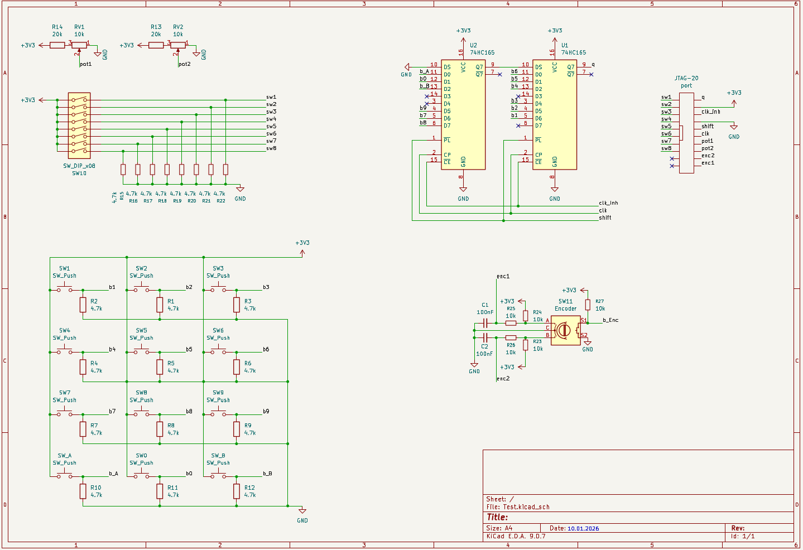

## TODO
- проверить самодельную схему борьбы с дребезгом
- проверить готовое решение
- принести в уник и написать тест для всех устройств ввода
- подключить 74HC165 к SPI через резистор
- сравнить bit-banging и SPI для 74HC165

## Bookmarks
- [toolchain](https://habr.com/ru/articles/854050/)
- [uploader](https://docs.mikron.ru/wiki/dev-tools/soft/uploader.html)
- [debouncer IC](https://www.chipdip.ru/product/mc14490dwg-ic-digital-contact-bounce-on-semiconductor-8051233161)

## rev. 1

### Особенности
- 12 кнопок через 2 74HC165
- готовый китайский модуль энкодера
- 8 рычажковых переключателей подключены напрямую без борьбы с дребезгом.
- 2 потенциометра от 0v до 1v1
- все устройства ввода проверены с Arduino -> все собрано верно

### Список компонентов
TODO

## Исследование условий эксплуатации
Нужно исследовать как часто нажимаются кнопки, как быстро отпускаются, худшие характеристики нажатия и тд

## Защита от дребезга
Рассмотрим различные варианты защиты от дребезга контактов (кнопок и рычажковых переключателей)
### MC14490
[ссылка на чип и дип](https://www.chipdip.ru/product/mc14490dwg-ic-digital-contact-bounce-on-semiconductor-8051233161)\
Хорошо работает, не занимает дополнительных пинов и не требует дополнительного ПО, каждая схема имеет 6 каналов. Цена в районе 100 рублей за штуку (200 рублей за плату). Существует задержка до 100 мс (можно уменьшить до 10 мс поменяв конденсатор с 10 нф на 1 нф). 
### Программная фильтрация дребезга
TODO
### RC-фильтр
Требует большого количества компонентов (N x 3), но практически ничего не стоит и компоненты всегда в наличии, задержка до 10 мс, но может быть значительно меньше при хороших кнопках. Имеет смысл использовать при распайке на печатной плате, но на макетке очень тяжело будет все разместить и паять.