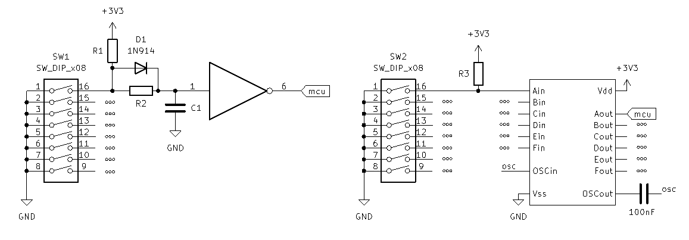
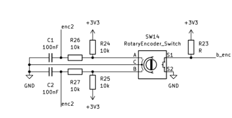
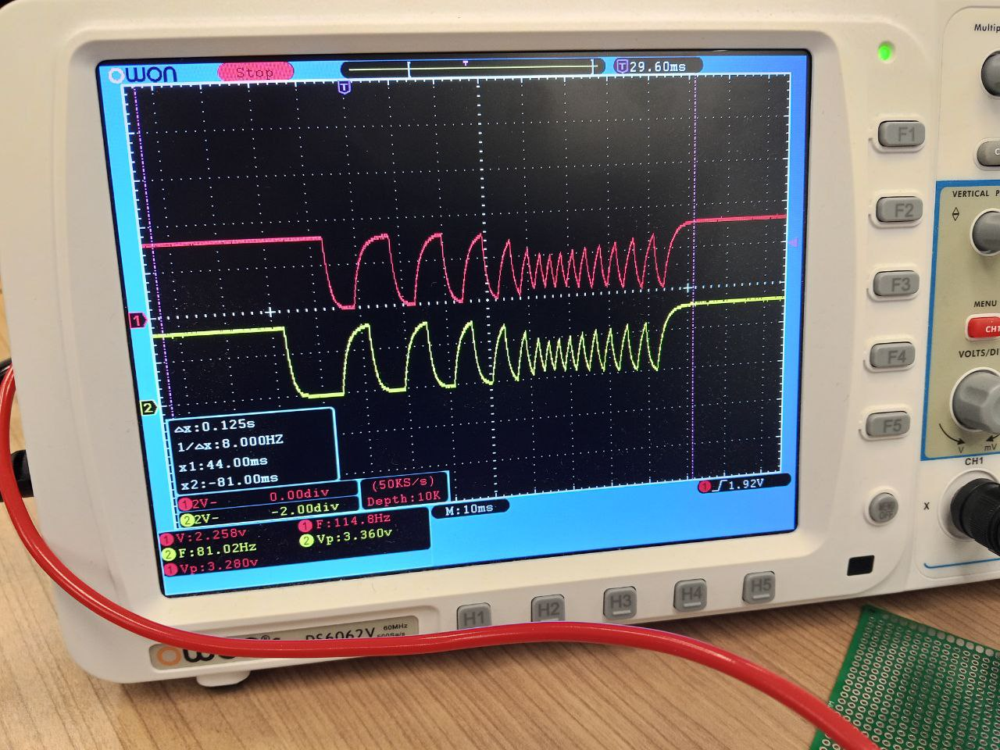
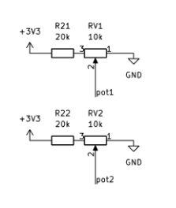
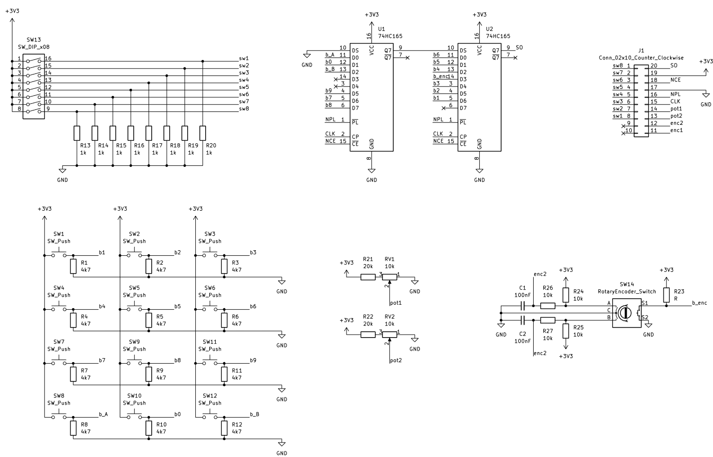

# ВЫПУСКНАЯ КВАЛИФИКАЦИОННАЯ РАБОТА БАКАЛАВРА
### Тема: Средства пользовательского ввода для лабораторного макета микроконтроллера
### Студент: Буянов Михаил Юрьевич

## Введение

Микроконтроллерные системы применяются в измерительной технике, промышленной автоматике, бытовых устройствах и средствах связи. При изучении таких систем важно не только освоить программирование микроконтроллера, но и получить практические навыки работы с внешними сигналами. Для этого в учебном процессе используются лабораторные макеты, позволяющие подключать органы управления, наблюдать реакцию программы и исследовать работу периферийных блоков микроконтроллера.

Целевой платформой разрабатываемого лабораторного макета является отечественный микроконтроллер MIK32 АМУР. Он построен на архитектуре RISC-V и может использоваться для изучения современных встраиваемых систем. При этом для MIK32 ограничено количество готовых лабораторных решений и примеров программного обеспечения, связанных с обработкой пользовательского ввода.

Данная работа посвящена разработке средств пользовательского ввода как одной из частей лабораторного макета на базе MIK32 АМУР. Остальные узлы, включая средства вывода, индикацию, питание и разъемы расширения, разрабатываются отдельно и в дальнейшем могут быть объединены с модулем ввода в составе общего устройства. К средствам пользовательского ввода относятся кнопки, переключатели, клавиатуры, энкодеры, потенциометры и другие устройства, с помощью которых пользователь формирует дискретные, аналоговые или импульсные сигналы. Работа со средствами ввода позволяет изучать настройку портов ввода-вывода, обработку дребезга контактов, использование прерываний, таймеров, аналого-цифрового преобразователя и интерфейсов обмена.

В настоящее время существует большое количество отладочных плат и учебных стендов для микроконтроллеров. Однако большинство доступных плат содержит только минимальный набор встроенных органов управления, например одну или две кнопки и несколько светодиодов. Для выполнения лабораторных работ с клавиатурой, переключателями, аналоговыми регуляторами или энкодером требуется подключать дополнительные модули и собирать схемы на макетной плате. Это увеличивает время подготовки, повышает вероятность ошибок подключения, способных привести к повреждению микроконтроллера или отладочной платы, и затрудняет повторяемость экспериментов. Готовые профессиональные стенды, напротив, часто обладают широкими функциональными возможностями, но имеют высокую стоимость и ориентированы на другие микроконтроллерные платформы. Поэтому разработка средств пользовательского ввода для лабораторного макета на базе MIK32 АМУР является актуальной задачей.

Целью данной работы является разработка средств пользовательского ввода для лабораторного макета микроконтроллера MIK32 АМУР.

Объектом работы является лабораторный макет микроконтроллерной системы на базе MIK32 АМУР. Предметом разработки являются аппаратные и программные средства пользовательского ввода, предназначенные для формирования и обработки входных сигналов в учебных лабораторных работах.

Для достижения поставленной цели необходимо решить следующие задачи:

1. Рассмотреть роль пользовательского ввода в лабораторных макетах микроконтроллерных систем.
2. Проанализировать существующие отладочные платы и учебные стенды, которые могут применяться при обучении работе с микроконтроллерами.
3. Сформулировать требования к разрабатываемому модулю пользовательского ввода.
4. Выбрать состав устройств ввода, обеспечивающий работу с дискретными, аналоговыми и импульсными сигналами.
5. Разработать схемотехнические решения для подключения кнопок, переключателей, клавиатуры, энкодера и аналоговых регуляторов к микроконтроллеру.
6. Подготовить программные алгоритмы для обработки сигналов от выбранных устройств ввода.
7. Провести экспериментальную проверку работоспособности разработанных решений.

В первой главе проводится анализ существующих лабораторных макетов, отладочных плат и учебных стендов, формулируются требования к разрабатываемому модулю пользовательского ввода и обосновывается актуальность работы. Во второй главе рассматриваются способы подключения и программной обработки кнопок, клавиатуры и рычажковых переключателей. В третьей главе описываются решения для работы с поворотным энкодером и аналоговыми ручками вращения. В четвертой главе приводится текущая реализация платы пользовательского ввода и ее схема. В пятой главе рассматриваются вопросы безопасности при изготовлении и эксплуатации лабораторного макета. В заключении приводятся основные результаты работы.

# Глава 1. Анализ существующих лабораторных макетов и постановка задачи разработки

Данная глава посвящена постановке задачи разработки лабораторного макета пользовательского ввода для микроконтроллера MIK32 АМУР. В главе рассматривается роль пользовательского ввода в учебных микроконтроллерных системах, приводится классификация устройств ввода и формулируются требования к лабораторному макету. Далее анализируются особенности применения MIK32 АМУР, доступные отладочные платы на его основе, распространенные платы на других микроконтроллерах и готовые учебные стенды. По результатам сравнения обосновывается актуальность разработки собственного модуля ввода, сочетающего кнопки, переключатели, клавиатуру, энкодер и аналоговые регуляторы с программными алгоритмами их обработки.

## 1.1 Роль лабораторного макета в обучении работе с микроконтроллерами

Лабораторные макеты микроконтроллеров применяются для изучения принципов работы цифровых устройств, периферийных модулей и программного обеспечения встраиваемых систем. В отличие от готового бытового устройства, учебный макет должен позволять быстро изменять режимы работы, проверять отдельные функции программы и наблюдать реакцию микроконтроллера на внешние воздействия.

Средства пользовательского ввода в таком макете выполняют несколько задач:

1. Формирование команд управления программой.
2. Задание режимов работы устройства.
3. Имитация внешних дискретных и аналоговых сигналов.
4. Проверка работы GPIO, АЦП, таймеров, прерываний и интерфейсов обмена.
5. Отладка алгоритмов обработки событий пользователя.

К средствам ввода относятся кнопки, переключатели, энкодеры, потенциометры и клавиатурные блоки. Эти устройства позволяют пользователю взаимодействовать с микроконтроллером без подключения сложного внешнего оборудования. Для учебного стенда это особенно важно, так как обучающийся должен видеть связь между физическим действием, электрическим сигналом и программной реакцией.

Модуль пользовательского ввода должен быть достаточно наглядным и надежным. Нажатие кнопки или изменение положения переключателя должны приводить к предсказуемому изменению входного сигнала. Кроме того, модуль не должен занимать слишком много выводов микроконтроллера, так как в лабораторном макете часть выводов требуется для других периферийных устройств. Поэтому при разработке необходимо учитывать не только удобство пользователя, но и ограничения аппаратной платформы.

Если на плате отсутствуют встроенные органы ввода, студент вынужден каждый раз собирать внешнюю схему на макетной плате. Такой подход полезен при изучении схемотехники, но он увеличивает время подготовки лабораторной работы, повышает вероятность ошибок подключения и затрудняет массовое использование макета в учебной аудитории. Поэтому для лабораторного стенда важно иметь готовый, повторяемый и надежный модуль пользовательского ввода.

## 1.2 Классификация устройств пользовательского ввода

Устройства пользовательского ввода можно классифицировать по характеру формируемого сигнала и способу его обработки микроконтроллером. В микроконтроллерных системах наиболее распространены дискретные, аналоговые, импульсные и интерфейсные устройства ввода. В учебном макете целесообразно использовать простые представители этих групп, так как они позволяют изучить базовые принципы обработки сигналов без лишней схемотехнической сложности.

Дискретные устройства формируют один из двух логических уровней. К ним относятся кнопки, переключатели, тумблеры, концевые выключатели, герконы и датчики с дискретным выходом. В работе используются тактовые кнопки и рычажковые переключатели: кнопка формирует кратковременное событие, а переключатель задает устойчивое состояние. На этих элементах можно изучить считывание GPIO, обработку изменения уровня и подавление дребезга контактов.

При увеличении числа команд отдельные кнопки удобно объединять в клавиатурный блок. Если подключать каждую кнопку напрямую к отдельному выводу микроконтроллера, расход GPIO быстро становится слишком большим: например, для клавиатуры из 12 кнопок потребуется 12 входных линий без учета переключателей, энкодера и аналоговых регуляторов. Поэтому клавиатура отличается от простого набора кнопок не только конструктивным исполнением, но и способом организации считывания: несколько кнопок объединяются в общую схему и опрашиваются программно.

В работе используется клавиатура 4x3, содержащая 12 кнопок. На ее примере рассматривается задача считывания группы дискретных входов при ограниченном числе выводов микроконтроллера. Такая клавиатура может подключаться напрямую, матрицей строк и столбцов или через внешние регистры ввода. Сравнение этих вариантов позволяет выбрать схему, которая обеспечивает достаточное количество команд и при этом не занимает чрезмерное число GPIO.

Аналоговые устройства ввода формируют непрерывно изменяющееся напряжение, которое измеряется АЦП. К ним относятся потенциометры, аналоговые джойстики и датчики с аналоговым выходом. В работе в качестве базового аналогового элемента используется потенциометр, поскольку изменение положения ручки непосредственно приводит к изменению напряжения на входе АЦП. На этом примере можно изучить считывание аналогового канала, масштабирование результата и фильтрацию шумов измерения.

Импульсные устройства ввода формируют последовательность переходов между логическими уровнями. К ним относятся механические, оптические и магнитные энкодеры, а также датчики с импульсным или квадратурным выходом. В работе используется механический поворотный энкодер. При его вращении формируются два связанных сигнала, по которым программа определяет направление и количество шагов. Такой элемент позволяет изучить обработку переходов, учет дребезга и влияние частоты опроса на корректность распознавания.

Отдельную группу составляют интерфейсные устройства ввода, которые передают данные по SPI, I2C, UART или USB. К ним относятся клавиатурные контроллеры, сенсорные панели, цифровые джойстики, RFID-считыватели и датчики с цифровым выходом. Для учебного макета удобным примером является клавиатура с внешним контроллером или регистром ввода: ее состояние задается пользователем и легко проверяется визуально, поэтому обмен по цифровому интерфейсу можно изучать без дополнительного контроля внешней физической величины.

В данной работе основной акцент сделан на простых и наглядных устройствах ввода: кнопках, переключателях, клавиатуре, потенциометрах и поворотном энкодере. Такой выбор позволяет изучить основные типы сигналов, с которыми сталкивается микроконтроллер: логический уровень, набор логических уровней, аналоговое напряжение и импульсную последовательность. После освоения этих базовых случаев можно переходить к более сложным устройствам, так как они в большинстве случаев являются комбинацией тех же принципов.

## 1.3 Требования к лабораторному макету пользовательского ввода

Лабораторный макет пользовательского ввода должен быть пригоден не только для демонстрации отдельных схем, но и для регулярного применения в учебном процессе. Поэтому к нему предъявляются требования, связанные с составом устройств, стоимостью, удобством эксплуатации, использованием ресурсов микроконтроллера и возможностью расширения.

Основные требования к такому макету можно сформулировать следующим образом:

1. Наличие основных типов устройств ввода. Макет должен содержать дискретные органы управления, например кнопки и переключатели, клавиатурный блок, аналоговые регуляторы и импульсное устройство ввода, например поворотный энкодер. Такой состав позволяет выполнять лабораторные работы по всем базовым видам пользовательского ввода: считыванию логических уровней, опросу группы кнопок, обработке аналогового напряжения и анализу последовательности импульсов.

2. Умеренная стоимость. Учебный макет должен быть доступен для изготовления в нескольких экземплярах, так как лабораторное оборудование обычно используется не одним студентом, а учебной группой. Слишком дорогой стенд затрудняет тиражирование и ремонт, а также делает невозможным самостоятельное повторение работы вне лаборатории.

3. Доступность элементной базы. При разработке необходимо использовать распространенные компоненты и избегать избыточно сложных узлов, если их функции можно показать на более простых элементах. Это упрощает изготовление, ремонт и повторение макета.

4. Экономное использование выводов микроконтроллера. В лабораторном макете выводы GPIO нужны не только для пользовательского ввода, но и для интерфейсов связи, отладки, индикации, измерений и подключения внешних модулей. Поэтому макет должен позволять сравнивать разные способы подключения: прямое подключение, матричное подключение, использование сдвиговых регистров или других расширителей ввода.

5. Возможность отключения отдельных устройств ввода. В учебной практике один и тот же вывод может потребоваться в разных лабораторных работах: в одной работе он используется для кнопки, в другой - для SPI, UART, АЦП или внешнего модуля. Поэтому желательно предусмотреть перемычки, разъемы, переключатели или другие средства разрыва соединений. Это позволяет временно отключить клавиатуру, энкодер или аналоговый регулятор и использовать соответствующие линии микроконтроллера для других задач без демонтажа элементов.

6. Удобство наблюдения и проверки сигналов. Основные линии ввода желательно вывести на контрольные точки или разъемы, к которым можно подключить осциллограф, логический анализатор или мультиметр. Это особенно важно при изучении дребезга контактов, сканирования клавиатуры, работы энкодера и изменения аналогового напряжения.

7. Электрическая надежность и защита входов. Пользовательские элементы управления активно используются во время занятий, поэтому схема должна быть устойчива к частым нажатиям, ошибкам подключения и кратковременным переходным процессам. Для этого необходимо учитывать подтягивающие резисторы, ограничение токов, защиту от неопределенных состояний входов и согласование уровней с напряжением питания микроконтроллера.

8. Эргономика и однозначность использования. Органы управления должны быть расположены так, чтобы студент мог быстро понять их назначение. Кнопки, переключатели, энкодер и аналоговые ручки должны иметь понятные обозначения, а их состояние должно легко считываться визуально.

9. Ремонтопригодность. В учебных условиях отдельные элементы могут выходить из строя из-за интенсивного использования, поэтому предпочтительно применять доступные компоненты и разъемные соединения. Это позволяет заменить поврежденный элемент без переработки всей платы.

Таким образом, хороший лабораторный макет пользовательского ввода должен сочетать достаточный набор органов управления, низкую стоимость, экономное использование выводов, возможность отключения отдельных блоков, удобство измерений, электрическую надежность и понятную компоновку. Эти требования используются далее при анализе существующих плат и при постановке задачи разработки собственного модуля ввода.

## 1.4 MIK32 АМУР как целевая платформа учебного макета

В данной работе микроконтроллер MIK32 АМУР задан в качестве целевой аппаратной платформы лабораторного макета. Согласно техническому описанию, MIK32 АМУР является 32-разрядным микроконтроллером на архитектуре RISC-V [1]. Для разработки средств пользовательского ввода важны состав периферийных блоков, количество доступных выводов и электрические параметры входов.

На момент выполнения работы микроконтроллер доступен в 64-выводном корпусе QFN [13]. Часть выводов используется для питания, тактирования, отладки и интерфейсов связи, поэтому число линий, доступных для органов пользовательского ввода, ограничено. Клавиатура, переключатели, энкодер и аналоговые регуляторы в сумме требуют большого числа сигналов, поэтому при разработке макета необходимо экономно расходовать GPIO и предусматривать способы сокращения числа занятых выводов.

Схема ввода должна быть согласована с электрическими параметрами MIK32. Согласно информационному листу, напряжение питания микроконтроллера составляет 3,3 В ±10 % [13]. Цифровые устройства ввода должны формировать уровни, допустимые для входов микроконтроллера. Для аналоговых входов дополнительно учитывается диапазон входного сигнала АЦП: согласно техническому описанию, он составляет 0,015...UREF, где UREF находится в пределах 1,1...1,3 В и имеет номинальное значение 1,2 В [1]. Поэтому сигналы от потенциометров и других аналоговых источников должны быть ограничены до допустимого диапазона АЦП.

Для MIK32 доступно меньше готовых примеров программ, чем для более распространенных платформ, таких как Arduino или STM32. В частности, готовых примеров работы со сдвиговыми регистрами 74HC165 и поворотным энкодером для MIK32 найти не удалось. Поэтому программные алгоритмы опроса, фильтрации и преобразования входных состояний необходимо разрабатывать и проверять самостоятельно.

## 1.5 Обзор доступных отладочных плат на базе MIK32

На момент выполнения работы доступны несколько отладочных плат и модулей на базе MIK32. Они позволяют познакомиться с микроконтроллером, загрузить программу и подключить внешние устройства, однако их возможности с точки зрения готового пользовательского ввода ограничены.

DIP-MIK32 представляет собой компактный модуль с микроконтроллером MIK32, разъемами и минимальной необходимой обвязкой [2]. Такое исполнение удобно для прототипирования и установки на макетную плату. Однако развитых средств пользовательского ввода на нем нет: для выполнения лабораторных работ с кнопками, переключателями, клавиатурой, энкодером или потенциометрами требуется собирать дополнительную схему. Стоимость DIP-MIK32 на странице заказа Микрона составляет 5 500 руб. [3], что приемлемо для отдельной отладочной платы, но не включает полноценный учебный интерфейс.

_рис.1. Отладочная плата DIP-MIK32._

Плата СТАРТ-MIK32 является более готовым решением для запуска программ, так как содержит внешнюю flash-память и программатор [3, 4]. Это облегчает первое знакомство с микроконтроллером и снижает порог входа при отладке программ. Тем не менее, с точки зрения лабораторных работ по пользовательскому вводу ее возможности также ограничены. Встроенный набор органов управления не позволяет полноценно изучать разные варианты подключения кнопок, тумблеров, матричной клавиатуры, энкодера и аналоговых регуляторов. Стоимость платы на странице заказа составляет 7 500 руб. [3].

_рис.2. Отладочная плата СТАРТ-MIK32._

Плата ELBEAR ACE-UNO выполнена в форм-факторе, близком к Arduino UNO, и может использоваться с Arduino-совместимыми модулями расширения [5]. Это делает ее удобной для экспериментов, так как многие периферийные устройства можно подключать через стандартные разъемы. Однако встроенных средств ввода на самой плате немного: пользовательская кнопка и светодиод не заменяют лабораторный набор из клавиатуры, переключателей, энкодера и аналоговых ручек. Стоимость платы в Arduino54 составляет 8 400 руб. [5].

_рис.3. Плата ELBEAR ACE-UNO на базе MIK32 АМУР._

Плата RADIANT MIK32 также ориентирована на разработку и эксперименты с MIK32. В ее руководстве указаны пользовательские кнопки, светодиоды, Arduino UNO-совместимый разъем и выводы GPIO [6]. Это решение ближе к учебной отладочной плате, чем минимальные модули, однако и оно не содержит развитого набора органов управления. Для большинства лабораторных работ по пользовательскому вводу все равно потребуется отдельный модуль или внешняя макетная сборка.

Следовательно, доступные платы на базе MIK32 решают задачу запуска и отладки программ, но не закрывают задачу готового лабораторного макета пользовательского ввода. Они предоставляют микроконтроллер и интерфейсы подключения, однако набор встроенных органов управления слишком мал для системного изучения дискретного, импульсного и аналогового ввода.

## 1.6 Сравнение с платами на других микроконтроллерах

Для оценки ситуации полезно сравнить платы MIK32 с распространенными решениями на других микроконтроллерах. Такие платы широко используются в обучении и прототипировании, поэтому они позволяют понять, какие подходы уже применяются в учебной практике.

Одним из самых дешевых решений является STM32F103C8T6 Blue Pill. Эта плата имеет большое количество выведенных контактов ввода-вывода и низкую стоимость: на странице магазина Амперо указана цена 249-299 руб. [7]. При этом встроенных средств пользовательского ввода на плате практически нет. Она хорошо подходит для недорогого прототипирования, но не является самостоятельным лабораторным стендом: кнопки, переключатели, потенциометры и другие элементы необходимо подключать отдельно.

_рис.4. Отладочная плата STM32F103C8T6 Blue Pill._

Платы семейства STM32 Nucleo являются более промышленно оформленными отладочными средствами. Например, NUCLEO-F401RE содержит микроконтроллер STM32F401RE, встроенный отладчик-программатор и Arduino-совместимые разъемы расширения [8]. Однако штатный пользовательский ввод на такой плате также минимален: обычно это одна пользовательская кнопка, кнопка сброса и один пользовательский светодиод. Для изучения сложных вариантов ввода, таких как клавиатура, набор тумблеров или энкодер, требуются дополнительные модули.

Еще одним примером является TI EK-TM4C123GXL LaunchPad. Эта плата построена на микроконтроллере TM4C123GH6PM и содержит встроенный отладчик, пользовательские кнопки и RGB-светодиод [9]. По сравнению с минимальными платами она лучше подходит для начальных лабораторных работ, однако набор средств ввода остается ограниченным. Плата позволяет изучать отдельные события от кнопок, но не заменяет специализированный учебный макет с большим числом органов управления.

Более удачным примером с точки зрения учебной комплектации является Arduino Student Kit. В него входит плата Arduino UNO, макетная плата, кнопки, потенциометры и другие компоненты для выполнения учебных заданий [10]. Такой комплект показывает, что для обучения важно иметь не только микроконтроллерную плату, но и готовый набор периферийных элементов. Однако данный комплект построен на другой аппаратной платформе и не решает задачу подготовки лабораторного макета на базе MIK32.

_рис.5. Набор Arduino Student Kit._

## 1.7 Сравнение с готовыми учебными лабораторными стендами

Отдельную группу решений составляют профессиональные учебные стенды для изучения микроконтроллеров. В отличие от обычных отладочных плат, такие стенды часто содержат набор тумблеров, кнопок, индикаторов, аналоговых задатчиков, разъемов, клемм и методических материалов. Например, лабораторный стенд ЭЛБ-020.003.01 предназначен для изучения программирования микроконтроллеров и содержит элементы, необходимые для выполнения учебных работ [11].

_рис.6. Лабораторный стенд «Программирование микроконтроллеров» ЭЛБ-020.003.03._

Преимущество таких стендов заключается в их завершенности. Студент работает с готовым оборудованием, где органы управления, индикация и измерительные точки уже размещены на панели и согласованы с учебной методикой. Это снижает количество ошибок подключения и делает лабораторные занятия более повторяемыми.

Основным недостатком готовых стендов является высокая стоимость и ориентация на конкретную учебную платформу. Например, цена стенда ЭЛБ-020.003.03 на странице поставщика составляет 392 824 руб. [12]. Такая стоимость существенно превышает стоимость большинства отладочных плат и делает стенд труднодоступным для небольших лабораторий, индивидуальной разработки и тиражирования в учебных группах. Кроме того, подобные стенды обычно ориентированы на другие микроконтроллеры, например AVR или STM32, и не предназначены для работы с MIK32.

Таким образом, между дешевыми отладочными платами и дорогими профессиональными стендами существует заметный разрыв. Отладочные платы доступны, но имеют мало встроенных органов ввода. Готовые стенды функциональны, но дороги и не ориентированы на MIK32. Это подтверждает необходимость разработки отдельного доступного модуля пользовательского ввода для лабораторного макета на базе MIK32.

## 1.8 Сравнительный анализ решений

Сводное сравнение рассмотренных решений приведено в таблице 1.1. В таблице указаны контроллеры, состав средств ввода, ориентировочная стоимость и вывод о применимости решения для задач данной работы. Стоимость приведена по открытым источникам на дату обращения и используется как ориентир для сравнения классов устройств.

Таблица 1.1 - Сравнение отладочных плат и лабораторных макетов

| Решение | Контроллер | Средства ввода на плате/в комплекте | Ориентировочная стоимость | Вывод для работы |
| --- | --- | --- | --- | --- |
| DIP-MIK32 | MIK32 АМУР | Выводы GPIO, JTAG, светодиоды; развитых органов ввода нет | 5 500 руб. [3] | Требуется внешний модуль ввода |
| СТАРТ-MIK32 | MIK32 АМУР | Минимальная обвязка, программатор, внешняя flash; развитых органов ввода нет | 7 500 руб. [3] | Требуется внешний модуль ввода |
| ELBEAR ACE-UNO | MIK32 АМУР | 1 пользовательская кнопка, 1 пользовательский светодиод, Arduino-совместимые разъемы | 8 400 руб. [5] | Требуется внешний модуль ввода |
| RADIANT MIK32 | MIK32 АМУР | 2 кнопки, 2 светодиода, Arduino UNO-разъем, GPIO на разъемах | Цена зависит от поставщика | Требуется внешний модуль ввода |
| STM32F103C8T6 Blue Pill | STM32F103 | GPIO выведены на разъемы, встроенных органов ввода почти нет | 249-299 руб. [7] | Крайне низкая цена, но нет средств ввода |
| STM32 Nucleo-F401RE | STM32F401RE | 1 пользовательская кнопка, 1 reset, 1 пользовательский светодиод | Цена зависит от поставщика | Требуется внешний модуль ввода |
| TI EK-TM4C123GXL LaunchPad | TM4C123GH6PM | Пользовательские кнопки и RGB-светодиод | Цена зависит от поставщика | Хороший пример платы с другим контроллером, но ввод ограничен |
| Arduino Student Kit | ATmega328P / Arduino UNO | 5 кнопок, 2 потенциометра 10 кОм, ручки потенциометров, макетная плата | $79.75 [10] | Хороший пример учебного комплекта, но не на MIK32 |
| ЭЛБ-020.003.01/03 | AVR | 8 тумблеров, 2 кнопки, аналоговый задатчик 0...5 В, индикация | ЭЛБ-020.003.03: 392 824 руб. [12] | Функционально богатый, но дорогой и не на MIK32 |

Из таблицы видно, что платы на базе MIK32 находятся в ценовом диапазоне, приемлемом для отладочных средств, однако они не содержат развитого набора пользовательского ввода. Платы на других микроконтроллерах демонстрируют ту же особенность: они удобны для программирования и подключения внешних модулей, но штатных кнопок, переключателей и аналоговых органов управления у них мало. Учебные комплекты и профессиональные стенды лучше подходят для лабораторной работы, однако они либо построены на другой аппаратной платформе, либо имеют высокую стоимость.

## 1.9 Актуальность работы и постановка задачи разработки

Проведенный анализ показывает, что задача разработки лабораторного макета пользовательского ввода для MIK32 АМУР является актуальной, поскольку существующие решения не закрывают ряд требований, важных для учебного применения.

Во-первых, MIK32 АМУР является отечественным 32-разрядным микроконтроллером на архитектуре RISC-V, поэтому его применение в учебном лабораторном макете позволяет формировать практический опыт работы с российской элементной базой. При этом на рынке отсутствует доступный и функционально полный учебный макет на базе MIK32, ориентированный именно на изучение пользовательского ввода. Существующие платы позволяют познакомиться с микроконтроллером, но не предоставляют достаточного набора органов управления для проведения полноценных лабораторных работ.

Во-вторых, в доступных платах на базе MIK32 отсутствует развитый набор средств пользовательского ввода. DIP-MIK32, СТАРТ-MIK32, ELBEAR ACE-UNO и RADIANT MIK32 подходят для запуска и отладки программ, но в них мало встроенных кнопок, переключателей и аналоговых регуляторов. Для учебного макета этого недостаточно, так как студенту необходимо изучать не один отдельный вход, а несколько типов пользовательского воздействия: дискретные сигналы, клавиатурный ввод, аналоговое напряжение и импульсные сигналы энкодера.

В-третьих, сравнение с другими платами и стендами показывает разрыв между дешевыми отладочными платами и дорогими профессиональными учебными стендами. Недорогие платы имеют мало встроенных средств ввода, а функционально богатые стенды стоят значительно дороже и обычно ориентированы на другие микроконтроллеры. Например, профессиональные лабораторные стенды содержат кнопки, тумблеры, аналоговые задатчики и индикацию, но их стоимость затрудняет массовое использование и самостоятельное повторение.

В-четвертых, для MIK32 доступно меньше готовых примеров программ, чем для более распространенных платформ, таких как Arduino или STM32. Это означает, что для лабораторного макета недостаточно разработать только аппаратную часть. Необходимо также подготовить алгоритмы опроса кнопок и переключателей, обработки клавиатуры, определения направления вращения энкодера и считывания аналоговых значений. Без такой программной части макет будет менее полезен в учебном процессе.

Таким образом, актуальность работы определяется тем, что в существующих продуктах отсутствует сочетание свойств, необходимых для учебного макета на базе MIK32: отечественный микроконтроллер, развитый набор устройств пользовательского ввода, умеренная стоимость, возможность отключения отдельных блоков, удобство измерений и наличие программных примеров для лабораторных работ.

В связи с этим в работе ставится задача разработки средств пользовательского ввода для лабораторного макета микроконтроллера MIK32 АМУР. Разрабатываемое решение должно включать аппаратную часть, обеспечивающую подключение кнопок, переключателей, клавиатуры, энкодера и аналоговых регуляторов, а также программные примеры для их опроса и обработки. В следующих главах рассматриваются схемотехнические варианты подключения устройств ввода, особенности их программной обработки и проверка работоспособности разработанного решения.

# Глава 2. Кнопки и рычажковые переключатели

## 2.1 Требования к дискретным устройствам ввода

Дискретные устройства ввода предназначены для формирования логических сигналов, по которым программа микроконтроллера определяет действия пользователя. В разрабатываемом лабораторном макете используются два типа таких устройств: тактовые кнопки для кратковременных команд и рычажковые переключатели для задания устойчивых состояний. Для макета требуется подключить 12 кнопок, которые можно рассматривать как клавиатуру 4x3, и 8 рычажковых переключателей.

Дискретные входы должны быть согласованы с логическими уровнями МИК32 АМУР. Согласно информационному листу микроконтроллера, напряжение питания составляет 3,3 В ±10 % [13], то есть допустимый диапазон питания основного домена составляет 2,97-3,63 В. В проектируемой схеме логический «0» должен формироваться уровнем, близким к GND, а логическая «1» - уровнем, близким к VCC 3,3 В. Подача на входы сигналов уровня 5 В не допускается.

Чтобы программа могла однозначно определить состояние входа, вывод микроконтроллера не должен оставаться неподключенным. Для задания устойчивого уровня в разомкнутом состоянии применяются подтягивающие резисторы. Возможны два типовых варианта включения. При подтяжке к земле в разомкнутом состоянии на входе находится логический ноль, а при нажатии кнопки вход соединяется с питанием и формируется логическая единица. При подтяжке к питанию в разомкнутом состоянии на входе находится логическая единица, а при нажатии кнопки вход соединяется с землей и формируется логический ноль. Выбор активного уровня зависит от схемы, удобства разводки платы и требований программы.

Особенность использования МИК32 АМУР в составе учебного макета состоит в том, что один и тот же микроконтроллер должен обслуживать не только кнопки и переключатели, но и энкодер, аналоговые входы, интерфейсы связи и отладочные цепи. Поэтому прямое подключение каждого элемента управления к отдельному выводу быстро приводит к дефициту свободных линий. Это отличает рассматриваемую задачу от простых учебных примеров, где одна кнопка или один переключатель подключаются к отдельному GPIO без анализа дальнейшего расширения схемы.

Для макета принято решение использовать рычажковые переключатели как наиболее простые дискретные устройства ввода. Их состояние можно считать непосредственно с входа GPIO без настройки внешнего интерфейса и сложной схемы опроса. Это удобно для начальных лабораторных работ, где необходимо показать связь между положением элемента управления и логическим уровнем на входе микроконтроллера.

Для увеличения числа кнопок используется клавиатура 4x3. В отличие от отдельных переключателей, клавиатура содержит группу однотипных кнопок, число которых в дальнейшем может быть увеличено, например при переходе к клавиатуре 4x4 или панели функциональных клавиш. Поэтому способ подключения клавиатуры должен сохранять общий принцип считывания группы кнопок и по возможности не приводить к пропорциональному росту числа занятых выводов микроконтроллера.

При выборе способа подключения необходимо учитывать временные характеристики пользовательского ввода и минимизировать расход ресурсов контроллера, в первую очередь количество занятых GPIO.

## 2.2 Временные параметры опроса кнопок и переключателей

Для определения временных параметров пользовательского воздействия была проведена серия из 10 экспериментов с быстрым нажатием кнопки. По результатам измерений наименьшая продолжительность уверенного нажатия составила около 40 мс. Кроме того, при быстром повторном нажатии пользователь способен формировать события с частотой до 10 Гц, что соответствует периоду около 100 мс между соседними нажатиями. Эти значения рассматриваются как предельные условия работы, полученные при намеренно быстром нажатии на кнопку; при обычной эксплуатации лабораторного макета такие режимы, как правило, достигаться не будут.

_рис.7. Один из тестов быстрого нажатия кнопки. Кнопка подключена к первому каналу осциллографа._

Длительность дребезга кнопки, использованной в макете, не превысила 2 мс и, как правило, составляла около 50 мкс. На рисунке ниже приведена осциллограмма дребезга данной модели кнопки. Для рычажковых переключателей длительность дребезга не превысила 7 мс.

_рис.8. Один из тестов длительности дребезга кнопки. Кнопка подключена ко второму каналу осциллографа._

_рис.9. Временные характеристики нажатия кнопки и переключателя: максимальная длительность дребезга, минимальная продолжительность состояний "0" и "1"._

На основании этих измерений система опроса должна иметь запас и надежно регистрировать нажатия длительностью не менее 40 мс, а также корректно обрабатывать повторные нажатия с частотой до 10 Гц. Алгоритм обработки должен определять текущее состояние и его смену, подавлять дребезг контактов и сохранять возможность обработки нескольких входов в пределах одного цикла опроса. Для переключателей максимальная частота переключения составляет около 3 Гц и длительность одного состояния около 300 мс.

Период опроса должен быть выбран так, чтобы программа успевала обнаруживать самые быстрые действия пользователя и при этом не тратила лишние вычислительные ресурсы. По результатам проведенных тестов минимальная длительность уверенного нажатия кнопки составила около 40 мс, а предельная частота повторных нажатий - до 10 Гц. Следовательно, система должна иметь запас по времени и выполнять опрос заметно чаще, чем один раз за 40 мс.

Если использовать программную фильтрацию с ориентировочным временем подтверждения 10-20 мс, период опроса должен быть меньше этого интервала. Практически удобным является опрос с периодом порядка 1-5 мс: за время дребезга программа получает несколько последовательных измерений и может подтвердить устойчивое состояние без заметной для пользователя задержки. При этом итоговая задержка реакции складывается из периода опроса и выбранного времени фильтрации.

Для лабораторного макета важно сохранить компромисс между надежностью и отзывчивостью. Слишком малое время фильтрации может пропускать дребезг и приводить к ложным срабатываниям, а слишком большое - ухудшать реакцию на быстрые нажатия. Поэтому предварительно допустимым диапазоном фильтрации можно считать 10-20 мс, а окончательное значение должно быть выбрано после измерения дребезга конкретных кнопок и переключателей макета.

## 2.3 Подключение рычажковых переключателей

Рычажковый переключатель задает устойчивое логическое состояние, которое сохраняется после воздействия пользователя. Поэтому он подходит для выбора режима работы, задания начальных условий программы или имитации простого датчика с дискретным выходом. В разрабатываемом макете используется 8 рычажковых переключателей DIP Switch 2.54 mm Regular Type производства CONNFLY [18], подключенных напрямую к выводам GPIO микроконтроллера. Каждый переключатель остается независимым входом, поэтому его состояние можно считывать как при периодическом опросе, так и при обработке прерывания по изменению уровня.

При прямом подключении один контакт переключателя соединяется с линией питания, а второй подключается к входу микроконтроллера. Чтобы вход не оставался в неопределенном состоянии, используется подтягивающий резистор. В выбранной схеме подтяжка выполнена к земле: при разомкнутом контакте на входе формируется логический «0», а при замыкании переключателя вход соединяется с питанием и формируется логическая «1». Подтяжка реализована внешним резистором для каждого переключателя.

_рис.10. Схема подключения рычажковых переключателей. TODO убрать кнопки_

При изменении положения контакты переключателя не переходят из одного состояния в другое мгновенно. Как и у кнопок, у них возникает дребезг контактов, из-за которого микроконтроллер может зафиксировать несколько быстрых изменений уровня вместо одного переключения. Вопрос подавления дребезга рассматривается далее в отдельном подразделе.

## 2.4 Подключение клавиатуры 4x3 напрямую к выводам микроконтроллера

В макете клавиатура 4x3 выполнена на тактовых кнопках серии KLS7-TS6601 6x6 [19]. Самый простой способ заключается в соединении каждой кнопки с отдельным входом микроконтроллера. В этом случае 12 кнопок требуют 12 GPIO. Один контакт кнопки подключается к линии питания, а второй - к входу микроконтроллера. Для формирования низкого уровня в разомкнутом состоянии используются подтягивающие резисторы к земле. Нажатие кнопки формирует на входе логическую «1». Прямое подключение клавиатуры 4x3 рассматривается как базовый вариант, с которым далее сравниваются другие способы подключения.

_рис.10. Схема подключения кнопок напрямую. TODO убрать переключатели_

Преимущество прямого подключения заключается в простоте схемы и программы. Состояние каждой кнопки можно считать напрямую из регистра GPIO, а обработка нажатий сводится к сравнению текущего и предыдущего состояния входа. При таком подходе легко поддерживать одновременные нажатия, поскольку каждая кнопка имеет собственный входной канал. Кроме того, прямое подключение позволяет использовать внешние прерывания GPIO для реакции на изменение состояния кнопки без постоянного циклического опроса всех входов. Можно легко добавить аппаратное средство борьбы с дребезгом.

Программный код для прямого подключения клавиатуры аналогичен коду для рычажковых переключателей: для каждой кнопки настраивается вход GPIO, после чего программа считывает соответствующий бит регистра состояния порта. Отличие состоит только в количестве входов.

Недостаток прямого подключения состоит в большом расходе выводов микроконтроллера. Только клавиатура 4x3 занимает 12 GPIO, а с учетом 8 рычажковых переключателей суммарно требуется уже 20 цифровых входов, не считая энкодера, аналоговых ручек и других сигналов макета. Для лабораторного стенда выводы микроконтроллера являются одним из наиболее ценных ресурсов. Поэтому прямое подключение удобно для небольшой проверки, но не является оптимальным решением для итоговой платы.

## 2.5 Подключение клавиатуры 4x3 матрицей

Матричное подключение уменьшает число занятых выводов за счет объединения кнопок в строки и столбцы. Для клавиатуры 4x3 требуется 7 линий: 4 строки и 3 столбца. При сканировании программа поочередно активирует строки и считывает состояние столбцов. Если при активной строке на одном из столбцов обнаруживается изменение уровня, программа определяет нажатую кнопку по номеру строки и столбца. Если подключать переключатели, как часть матрицы, то выйдет 4х5 матрица, потребуется 9 GPIO и 20 диодов.

По сравнению с прямым подключением матрица позволяет сэкономить 5 выводов микроконтроллера: вместо 12 GPIO используются 7. Однако такая схема требует более сложного алгоритма опроса. Необходимо последовательно переключать строки, выдерживать время установления уровней и выполнять чтение столбцов для каждой строки. Период полного опроса клавиатуры зависит от числа строк и задержек в алгоритме сканирования. В отличие от прямого подключения, матрица не позволяет просто назначить независимое прерывание на каждую кнопку: прерывание может использоваться только как дополнительный сигнал пробуждения или признак изменения, а определение конкретной кнопки все равно требует сканирования.

Алгоритм сканирования матрицы включает несколько этапов:

1. Перевести одну строку в активное состояние.
2. Выдержать небольшую задержку для установления уровней.
3. Считать уровни на линиях столбцов.
4. Определить нажатые кнопки для текущей строки.
5. Повторить действия для остальных строк.

Дополнительная проблема матричной клавиатуры возникает при одновременном нажатии нескольких кнопок. В некоторых сочетаниях возможно появление фантомных срабатываний, когда программа определяет нажатой кнопку, которая фактически не нажималась. Для устранения этой проблемы применяют диоды [14], включенные последовательно с кнопками, но это увеличивает количество компонентов и усложняет монтаж. В рассматриваемом макете желательно сохранить возможность корректной обработки нескольких входов и не усложнять схему без необходимости, поэтому матричное подключение является промежуточным вариантом: оно экономит GPIO, но добавляет схемотехнические и программные ограничения.

_рис.11. Схема подключения кнопок матрицей_
_TODO нарисовать схему самому, включить рычажки и обозначить, что куда подключено._

## 2.6 Подключение кнопок через сдвиговые регистры 74HC165

Третий вариант заключается в подключении кнопок к параллельным входам сдвигового регистра, например 74HC165. 74HC165 является распространенным решением: микросхема выпускается разными производителями и представлена в каталогах поставщиков в значительных количествах [16, 17]. Такой принцип хорошо подходит для клавиатуры, состояние которой можно считывать периодически. Один 74HC165 имеет 8 параллельных входов, поэтому для 12 кнопок достаточно двух микросхем. Оставшиеся входы могут быть использованы для части рычажковых переключателей или зарезервированы для дальнейшего расширения, например для кнопки на ручке энкодера.

При работе с 74HC165 микроконтроллер сначала формирует сигнал загрузки параллельных входов, после чего последовательно считывает биты состояния. Несколько микросхем можно каскадировать: последовательный выход одной микросхемы подключается к последовательному входу следующей, и вся цепочка считывается как один более длинный сдвиговый регистр. Это делает решение хорошо расширяемым: увеличение числа кнопок требует добавления микросхемы, но почти не увеличивает число линий микроконтроллера. Недостатком такого подхода является невозможность получить отдельное прерывание от каждой кнопки: микроконтроллер видит не отдельные входы, а последовательный поток данных, поэтому состояние кнопок определяется периодическим считыванием регистра.

Считывание 74HC165 можно выполнить двумя способами. Первый способ - программное управление линиями GPIO. В этом случае тактовые импульсы формируются средствами программы, а данные считываются по одному биту после каждого импульса. Такой подход не требует настройки аппаратного SPI, но расходует процессорное время и делает обмен зависимым от задержек в программе.

Второй способ - подключение 74HC165 к аппаратному интерфейсу SPI. В этом случае тактовый сигнал формируется периферийным блоком SPI, а данные считываются через вход MISO. Дополнительная линия GPIO используется для загрузки параллельного состояния в регистр. Такой вариант уменьшает программную нагрузку, использует стандартную периферию микроконтроллера и позволяет быстро считывать несколько каскадированных микросхем.

Готовых примеров работы с 74HC165 для MIK32 найти не удалось, поэтому для макета был написан собственный драйвер. Он формирует сигнал загрузки состояний кнопок, считывает данные по SPI и преобразует полученное значение в битовую маску. При проверке аппаратного SPI на MIK32 были обнаружены две практические особенности: сигнал CS инвертирован, поэтому им приходится управлять вручную, а линия CLK после завершения обмена не сразу возвращается к нулю и устанавливается в низкий уровень только через несколько миллисекунд. Эти особенности не нарушили целостность считывания, но были учтены при настройке обмена и отладке программы.

TODO не очень понятно написано, надо переписать + добавить резисторы на MISO в схематике и на плате.

Штатный способ расширения числа входов - каскадирование регистров, при котором последовательный выход QH/Q7 одного регистра подключается к последовательному входу SER/DS следующего; такая возможность прямо указана в описании 74HC165 [15]. Если необходимо подключить к той же SPI-шине другие устройства, нужно обеспечить, чтобы в каждый момент времени линию MISO формировало только одно устройство. Это важно при совместном использовании выбранной SPI-шины несколькими внешними устройствами. Для обычных SPI-устройств это выполняется сигналом CS, переводящим невыбранное устройство в высокоимпедансное состояние. Для 74HC165 такой функции нет, поэтому возможны несколько решений: подключить выход цепочки 74HC165 к MISO через внешний буфер с третьим состоянием, например 74HC125, использовать отдельную линию MISO/отдельный SPI-интерфейс для регистров или включить последовательный резистор между выходом Q7 последнего 74HC165 и общей линией MISO.

TODO одной картинкой

_рис.12. Схема подключения кнопок через регистр 74HC165_

## 2.7 Сравнение способов подключения клавиатуры 4x3

Для выбора схемы подключения были рассмотрены три варианта: прямое подключение кнопок к GPIO, матричная клавиатура 4x3 и подключение через сдвиговые регистры 74HC165. Основным критерием выбора стало количество занятых выводов микроконтроллера, поскольку GPIO являются наиболее ограниченным ресурсом лабораторного макета.

При выборе способа построения модуля пользовательского ввода необходимо учитывать не только работоспособность отдельной схемы, но и ее пригодность для всего лабораторного макета. Один и тот же набор органов управления может быть подключен разными способами, каждый из которых имеет преимущества и ограничения. Для сравнения вариантов используются следующие критерии:

1. количество занятых выводов микроконтроллера;
2. сложность электрической схемы;
3. сложность программного алгоритма;
4. возможность обработки одновременных действий пользователя;
5. устойчивость к дребезгу и помехам;
6. стоимость и доступность компонентов;
7. удобство проверки и отладки;
8. возможность дальнейшего расширения;
9. объем программного кода и используемой памяти.

Таблица 2.1
| Способ подключения | GPIO для 12 кнопок | Дополнительные компоненты | Программная сложность | Прерывания от кнопок | Масштабирование |
| --- | ---: | --- | --- | --- | --- |
| Прямое подключение | 12 | подтягивающие резисторы или внутренние подтяжки | низкая | возможно для каждой кнопки | плохое, каждая новая кнопка требует GPIO |
| Матрица 4x3 | 7 | возможно диоды для корректной обработки одновременных нажатий | средняя | нет независимых прерываний от каждой кнопки, требуется сканирование | среднее |
| 74HC165 через SPI | 2 линии SPI + 1 GPIO загрузки | сдвиговые регистры 74HC165, подтяжки | средняя | нет независимых прерываний от каждой кнопки, требуется считывание регистра | хорошее, добавление входов каскадированием |

Затраты памяти для рассмотренных вариантов имеют один порядок, поскольку во всех случаях программа хранит текущее состояние кнопок, предыдущее состояние и служебные данные для фильтрации дребезга. По результатам сборки примеров объем памяти составил: прямое подключение - TODO байт flash и TODO байт RAM, матричное подключение - TODO байт flash и TODO байт RAM, подключение через 74HC165 - TODO байт flash и TODO байт RAM. Эти значения могут быть уточнены после сборки окончательных вариантов программ.

При прямом подключении клавиатура 4x3 занимает 12 выводов. Этот вариант имеет минимальную программную сложность и хорошо подходит для проверки отдельных кнопок, но плохо масштабируется. При добавлении 8 рычажковых переключателей расход GPIO становится слишком большим.

Матричное подключение уменьшает число линий до 7, что заметно лучше прямого варианта. Однако матрица требует сканирования строк, усложняет обработку одновременных нажатий и при необходимости надежной поддержки нескольких нажатых кнопок требует установки диодов. Для учебного макета это решение менее удобно, так как часть сложности связана не с исследованием микроконтроллера, а с особенностями самой клавиатурной матрицы.

Подключение через 74HC165 требует минимального числа дополнительных линий микроконтроллера и хорошо расширяется каскадированием микросхем. При использовании SPI для обмена задействуется аппаратная периферия, а программная часть сводится к загрузке состояния входов и чтению одного или нескольких байтов. Однако из-за отсутствия у 74HC165 входа CS и высокоимпедансного состояния выхода его нельзя без учета электрического конфликта подключать к общей линии MISO параллельно с другими устройствами. В выбранной реализации это ограничение учитывается двумя способами: все регистры 74HC165 объединены в одну цепочку, а выход Q7 последнего регистра подключен к MISO через резистор 1 кОм. Это позволяет освободить GPIO для других лабораторных задач, сохранить возможность увеличения числа дискретных входов и использовать общую SPI-шину совместно с другими устройствами.

Таким образом, для итоговой реализации выбран вариант подключения кнопок через сдвиговые регистры 74HC165 с чтением данных по SPI. Такое решение обеспечивает приемлемую сложность схемы, экономит выводы микроконтроллера и хорошо масштабируется.

## 2.8 Дребезг контактов кнопок и переключателей

Механические кнопки и рычажковые переключатели не формируют идеальный одиночный переход между логическими уровнями. При замыкании и размыкании контактов возникает дребезг: в течение короткого времени вход микроконтроллера может несколько раз переключаться между «0» и «1». Если не учитывать этот эффект, одно нажатие кнопки может быть ошибочно обработано как несколько нажатий, а изменение положения переключателя - как серия быстрых переключений. В разделе 2.2 были получены значения длительности дребезга: для кнопки до 2 мс, для рычажковых переключателей до 7 мс.

В работе были рассмотрены и проверены три варианта защиты от дребезга: специализированная микросхема MC14490, RC-фильтр и программная фильтрация. Эти варианты отличаются числом дополнительных компонентов, задержкой, стоимостью и влиянием на программную часть.

MC14490 является специализированной микросхемой подавления дребезга. Она удобна тем, что не требует отдельной программной обработки и не занимает дополнительные выводы микроконтроллера для каждого канала. Одна микросхема содержит 6 каналов, поэтому для 8 переключателей потребовались бы две микросхемы, а для переключателей и кнопок 4 микросхемы.
Рассмотрим способ подключения и проведем тесты работы микросхемы.

RC-фильтр является простым аппаратным способом сглаживания дребезга. Он дешев и может быть собран из распространенных компонентов, однако для большого количества входов требует значительного числа элементов. Для каждого канала необходимы как минимум резистивно-емкостная цепь и желательно формирователь с четким порогом переключения, например вход с триггером Шмитта. На печатной плате такое решение может быть приемлемым, но при макетировании оно усложняет монтаж и увеличивает вероятность ошибок соединения.

_рис.13. Схемы аппаратного подавления дребезга контактов: специализированная микросхема MC14490 и RC-фильтр._

Программная фильтрация не требует дополнительных компонентов и позволяет изменять параметры подавления дребезга без переделки схемы. Суть метода состоит в том, что изменение состояния входа принимается не сразу, а только после того, как новое значение сохраняется в течение заданного времени или подтверждается несколькими последовательными измерениями. Такой подход хорошо подходит для кнопок, подключенных через 74HC165, поскольку их состояние в любом случае считывается периодически. Для рычажковых переключателей, подключенных напрямую к GPIO, программная фильтрация также применима: прерывание может фиксировать факт изменения входа, а окончательное состояние подтверждается после небольшой задержки или серии повторных чтений.

Сравнение способов подавления дребезга для блока из 8 переключателей приведено в таблице 2.2.

Таблица 2.2 - Сравнение способов подавления дребезга контактов

| Способ | Примерная цена | Доступность | Сложность монтажа | Сложность программирования |
| --- | --- | --- | --- | --- |
| MC14490 | ~300 руб. | низкая, срок доставки около 6 недель | средняя | низкая |
| RC-фильтр | ~500 руб. | высокая | высокая | низкая |
| Программная фильтрация | - | - | низкая | средняя |

По результатам проверки для макета выбрана программная защита от дребезга. Она не увеличивает стоимость и сложность платы, не требует дополнительных микросхем и позволяет подобрать время фильтрации с учетом измеренных условий работы. Такой вариант особенно удобен для лабораторного макета, где важно иметь возможность изменять алгоритм обработки и сравнивать разные параметры фильтрации программно.

## 2.9 Программная обработка кнопок и переключателей

Программная обработка дискретных входов выполняется в несколько этапов. Сначала микроконтроллер получает сырые состояния входов: для кнопок они считываются из цепочки 74HC165 по SPI, а для рычажковых переключателей - непосредственно из регистров GPIO. Затем программа сравнивает новое состояние с предыдущим и определяет события: нажатие, отпускание или изменение положения переключателя.

Для защиты от дребезга используется программная фильтрация по времени. При первом обнаружении изменения входа программа не принимает его немедленно, а запускает проверку стабильности. Новое состояние считается действительным только после того, как оно сохраняется без изменений в течение заданного интервала. Такой алгоритм позволяет отделить реальное действие пользователя от кратковременных колебаний контактов.

В итоговой реализации для рычажковых переключателей используется опрос с периодом 30 мс. Переключение фиксируется только в том случае, если новое состояние сохраняется при следующем опросе. Для кнопок, подключенных через 74HC165, применяется более короткий интервал подтверждения: состояние кнопки принимается только при сохранении в течение 10 мс. Такие параметры согласуются с измеренной длительностью дребезга и не создают заметной задержки при обычной работе пользователя.

Для кнопок, подключенных через 74HC165, фильтрация естественно совмещается с периодическим опросом регистров. Для каждого входа хранится сырое состояние, подтвержденное состояние и время последнего изменения. Для рычажковых переключателей, подключенных напрямую к GPIO, возможны два режима: периодический опрос или прерывание по изменению уровня с последующей программной проверкой состояния после интервала подавления дребезга.

## 2.10 Выводы по главе

Во второй главе были рассмотрены дискретные органы управления лабораторного макета: рычажковые переключатели и кнопочная клавиатура. Для переключателей выбрано прямое подключение к GPIO, так как они задают устойчивые логические состояния, не требуют сложной схемы опроса и могут обрабатываться как периодическим чтением, так и через прерывание по изменению уровня.

Для подключения клавиатуры 4x3 были рассмотрены, реализованы и протестированы три варианта: прямое подключение каждой кнопки к отдельному входу микроконтроллера, матричное подключение строк и столбцов, а также подключение через сдвиговые регистры 74HC165.

По результатам сравнения для макета выбран вариант подключения клавиатуры через сдвиговые регистры 74HC165. Он лучше соответствует задаче экономии GPIO, позволяет расширять число дискретных входов без существенного изменения схемы подключения, а также дает возможность поработать с интерфейсными средствами ввода на примере обмена по SPI.

Также в главе были рассмотрены способы подавления дребезга контактов. Были сравнены аппаратные решения на MC14490 и RC-фильтрах, а также программная фильтрация. Для итогового макета выбрана программная защита от дребезга: она не увеличивает количество компонентов, позволяет изменять параметры обработки без переделки схемы и хорошо сочетается с периодическим опросом кнопок через 74HC165.

# Глава 3. Энкодер и аналоговые ручки вращения

## 3.1 Назначение поворотных органов управления

Поворотные органы управления применяются в лабораторных макетах для задания числовых параметров, выбора режимов работы и демонстрации обработки изменяющихся входных сигналов. В данной работе рассматриваются два типа таких устройств: инкрементальный поворотный энкодер и аналоговые ручки вращения на основе потенциометров.

Энкодер используется для ввода относительного изменения положения. В отличие от потенциометра, механический инкрементальный энкодер не задает абсолютное напряжение. При вращении он формирует последовательность импульсов, по которым программа определяет количество шагов и направление вращения. Такой орган управления удобен для изменения числовых параметров, выбора пунктов меню и работы с величинами, которые могут увеличиваться или уменьшаться без ограничения полного угла поворота.

Аналоговая ручка вращения, выполненная на потенциометре, формирует абсолютное значение. Ее положение соответствует определенному уровню напряжения, который считывается микроконтроллером с помощью АЦП. Такой ввод удобен для задания уровня, коэффициента, порога срабатывания или другого параметра, который должен изменяться плавно. Совместное использование энкодера и потенциометров в одном макете позволяет изучить различие между относительным и абсолютным вводом.

Для пользователя оба устройства выглядят как поворотные ручки, однако с точки зрения микроконтроллера они принципиально различаются. Энкодер требует обработки цифровых переходов и определения направления, а потенциометр требует измерения аналогового напряжения, масштабирования и фильтрации результата. Поэтому данные устройства целесообразно рассматривать в одной главе, но подключать и обрабатывать разными способами.

## 3.2 Подключение поворотного энкодера

На начальном этапе предполагалось сравнить несколько модулей поворотных энкодеров. Однако модуль KY-040 на основе механического инкрементального энкодера серии EC11 после первичной проверки удовлетворил требованиям макета, поэтому дальнейшее сравнение модулей не потребовалось. KY-040 является распространенным и недорогим модулем: в описании поставщика он прямо относится к low-cost quadrature encoder module, а также представлен в продаже как готовый модуль с ручкой [20, 21]. Типовой механический инкрементальный энкодер имеет два сигнальных канала A и B. Сигналы этих каналов сдвинуты по фазе. Если при вращении сначала изменяется канал A, а затем канал B, программа определяет одно направление. Если порядок изменений обратный, определяется противоположное направление. Такой способ называется квадратурным кодированием.

Каналы A и B подключаются к цифровым входам микроконтроллера. Как и для кнопок, входы не должны оставаться в неопределенном состоянии, поэтому применяются подтягивающие резисторы к питанию или земле. Модуль KY-040 уже содержит элементы аппаратной фильтрации сигналов энкодера, что упрощает подключение к входам микроконтроллера. На этапе разработки модуль установлен целиком; в дальнейшем его компоненты решения могут быть перенесены непосредственно на общую лабораторную плату. При вращении энкодера механические контакты поочередно замыкаются и размыкаются, формируя последовательность логических уровней.Энкодер имеет встроенную кнопку, она подключается как часть клавиатуры из 2 главы.

_рис.14. Схема подключения поворотного энкодера к цифровым входам микроконтроллера._

При проектировании схемы подключения необходимо учитывать логические уровни MIK32 АМУР и не допускать подачи на входы напряжения выше допустимого. Кроме того, линии энкодера желательно разводить так, чтобы минимизировать влияние помех: сигнальные дорожки не должны быть чрезмерно длинными, а рядом с входами должны быть предусмотрены подтяжки и, при необходимости, элементы фильтрации.

Энкодер удобен для лабораторного макета тем, что позволяет демонстрировать сразу несколько задач: считывание двух цифровых входов, анализ последовательности переходов, обработку внешних событий, работу с прерываниями или таймерным опросом, а также влияние дребезга контактов на алгоритм распознавания направления.

## 3.3 Алгоритм обработки энкодера

Для обработки энкодера программа хранит предыдущее состояние каналов A и B и сравнивает его с текущим. Каждое состояние можно представить двумя битами. При нормальном вращении состояния изменяются в определенной последовательности, а направление определяется порядком переходов.

Готовый драйвер энкодера для MIK32 найти не удалось, поэтому обработка входного сигнала реализована самостоятельно. Пример программы считывает два цифровых входа, определяет допустимость перехода между состояниями и изменяет счетчик положения в зависимости от направления вращения.

Общий алгоритм обработки энкодера включает следующие действия:

1. Считать текущие уровни каналов A и B.
2. Сформировать двухбитное состояние энкодера.
3. Сравнить текущее состояние с предыдущим.
4. Определить, соответствует ли переход допустимому шагу вращения.
5. Увеличить или уменьшить счетчик положения в зависимости от направления.
6. Отбросить некорректные переходы, связанные с дребезгом, пропуском импульса или слишком быстрым вращением.

Допустимые переходы соответствуют повороту на один шаг. Если переход невозможен для нормальной квадратурной последовательности, он может быть связан с дребезгом, пропуском импульса или ошибкой считывания. Поэтому алгоритм не должен реагировать на любое изменение входов как на реальный шаг. Он должен учитывать только те изменения, которые соответствуют допустимой последовательности состояний.

Период опроса влияет на максимальную скорость вращения, которую может корректно обработать программа. Если энкодер вращается быстрее, чем программа успевает считывать изменения, часть переходов будет пропущена. В результате может возникнуть ошибка подсчета шагов или неправильное определение направления. Поэтому при программном опросе необходимо выбирать период считывания с запасом относительно максимальной частоты сигналов энкодера.

## 3.4 Дребезг и фильтрация сигналов энкодера

Механические контакты энкодера, как и контакты кнопок, подвержены дребезгу. Однако в случае энкодера дребезг влияет не на один сигнал, а на последовательность переходов двух каналов. Из-за этого возможны ложные шаги, изменение направления на один отсчет или появление некорректных состояний.

Особенность фильтрации энкодера состоит в необходимости сохранить быстрые полезные импульсы. Если применить слишком сильную фильтрацию, программа может потерять часть переходов при быстром вращении. Если фильтрация будет недостаточной, дребезг может быть принят за реальные изменения положения. Поэтому параметры фильтрации для энкодера должны выбираться с учетом максимальной скорости вращения и фактической длительности дребезга контактов.

Аппаратная фильтрация может выполняться с помощью RC-цепей или входов с триггером Шмитта. Такой подход сглаживает быстрые колебания до поступления сигнала на микроконтроллер, но добавляет элементы в схему и может ограничить максимальную частоту сигналов. В выбранном модуле KY-040 аппаратная фильтрация уже предусмотрена на плате модуля. При проверке RC-фильтра модуля было установлено, что он справляется с подавлением дребезга при ручном вращении энкодера. Время перехода сигнала от уровня логического нуля до уровня логической единицы составило около 2 мс. Для многофункционального вывода MIK32 в цифровом режиме технические условия задают входное напряжение низкого уровня `UIL` в диапазоне `0...0,35*Ucc`, а входное напряжение высокого уровня `UIH` - в диапазоне `0,65*Ucc...Ucc` [22, табл. 3]. При номинальном питании `Ucc = 3,3 В` это соответствует напряжению до `1,16 В` для гарантированного логического нуля и от `2,15 В` для гарантированной логической единицы. Поэтому под уровнем логической единицы в данном случае понимается достижение входного порога `UIH` микроконтроллера, то есть минимального входного напряжения, которое гарантированно воспринимается как логическая «1». Такой фронт достаточен для ручного управления, однако при вращении энкодера двигателем может стать ограничением, так как полезные импульсы будут следовать быстрее и фильтр начнет искажать последовательность сигналов. Программная фильтрация может быть основана на проверке допустимости переходов, повторном чтении состояния или игнорировании слишком быстрых изменений, не соответствующих нормальной квадратурной последовательности.

Для лабораторного макета важно не только получить работоспособный алгоритм, но и показать влияние фильтрации на результат. Поэтому при экспериментальной проверке необходимо измерить сигналы каналов энкодера, оценить максимальную частоту при быстром вращении и проверить, не приводит ли выбранный фильтр к потере полезных импульсов. Для оценки предельного режима энкодер вращался между двумя ладонями: такой способ позволяет получить скорость выше обычного поворота ручки пальцами и проверить, при какой скорости фронты после RC-фильтра становятся слишком растянутыми, а отдельные переходы начинают теряться.

_рис.15. Осциллограмма сигналов каналов энкодера при вращении между двумя ладонями для оценки максимальной частоты импульсов._

Проведенные тесты показали, что аппаратная фильтрация модуля KY-040 достаточна для работы макета: при полном обороте примерно за 500 мс программа не теряла состояния и корректно определяла направление вращения. Такая скорость выше обычного режима ручного управления, поэтому для лабораторного макета выбранная фильтрация и период опроса являются достаточными.

## 3.5 Подключение аналоговых ручек вращения

Аналоговые устройства ввода применяются для задания плавно изменяющихся параметров. Наиболее простой вариант такого устройства - потенциометр. В выбранной реализации применен Bourns PTV09A-4225F-B103, 10 кОм [23]. Нижний крайний вывод потенциометра подключается к земле, верхний крайний вывод получает питание от линии 3,3 В через резистор 20 кОм, а средний вывод подключается непосредственно к аналоговому входу микроконтроллера. Левый потенциометр подключается к каналу АЦП 1, правый - к каналу АЦП 2.

При подключении потенциометра необходимо согласовать диапазон напряжений с допустимым диапазоном входа АЦП. Для MIK32 АМУР диапазон входного сигнала АЦП составляет 0,015...UREF, где UREF находится в пределах 1,1...1,3 В и имеет номинальное значение 1,2 В [1]. Поскольку сопротивление потенциометра составляет 10 кОм, резистор 20 кОм между питанием 3,3 В и верхним выводом потенциометра образует делитель напряжения. В результате напряжение на верхнем выводе потенциометра составляет около 1,1 В, а напряжение на среднем выводе изменяется в диапазоне примерно от 0 до 1,1 В в зависимости от положения ручки.

_рис.16. Схема подключения потенциометров к аналоговым входам микроконтроллера._

## 3.6 Программная обработка аналоговых значений

MIK32 АМУР содержит один многоканальный АЦП, к входу которого сигналы подключаются через внутренний аналоговый коммутатор [24]. Поэтому при работе с двумя потенциометрами программа не измеряет оба канала одновременно, а последовательно выбирает нужный канал и запускает преобразование.

При переключении каналов необходимо учитывать задержку коммутации. В статье с экспериментальной проверкой АЦП MIK32 отмечается, что после выбора нового канала полезно выполнить холостое преобразование, так как первое измерение после переключения может относиться к переходному процессу [24]. Этот подход использован в программе: после выбора канала выполняется первое одиночное преобразование, его результат отбрасывается, затем выполняется второе преобразование, и только оно используется как текущее значение потенциометра.

Для проверки работы потенциометров был подготовлен простой пример. В нем настраивается АЦП MIK32 и периодически опрашиваются два аналоговых канала: канал 1 для левой ручки и канал 2 для правой ручки. Полученное значение АЦП является безразмерным кодом. В примере оно переводится в милливольты по опорному напряжению АЦП и дополнительно масштабируется в проценты от полного диапазона. Такой вывод удобен при отладке: сырое значение позволяет видеть фактический код АЦП, значение в милливольтах - проверить соответствие электрической схеме, а проценты - оценить положение ручки в форме, удобной для прикладной программы.

Даже при неподвижной ручке результат АЦП может немного изменяться из-за шумов и внутренних особенностей преобразователя. В статье также отмечаются дрейф и разброс показаний при длительном измерении постоянного напряжения [24]. Для лабораторного макета это не является критичным, так как потенциометры используются как органы плавного задания параметра, а не как точный измерительный прибор. В примере применяется экспоненциальное сглаживание - один из наиболее простых алгоритмов сглаживания последовательности измерений [25]. Новое отфильтрованное значение вычисляется как `(7 * previous + current) / 8`, то есть новое измерение вносит одну восьмую результата, а семь восьмых сохраняются от предыдущего значения. Такая фильтрация уменьшает мелкие колебания показаний и сохраняет достаточно быструю реакцию на поворот ручки.

## 3.7 Выводы по главе

В третьей главе рассмотрены устройства ввода, формирующие не одиночное дискретное состояние, а изменение положения или плавно изменяющееся значение. Поворотный энкодер формирует последовательность импульсов на двух каналах, поэтому требует обработки переходов, определения направления вращения и учета возможного дребезга. Потенциометры формируют аналоговое напряжение и требуют использования АЦП, масштабирования результата и фильтрации шумов измерения.

Аналоговые ручки расширяют возможности лабораторного макета. С их помощью можно изучать работу АЦП, фильтрацию измерений, масштабирование данных и реакцию программы на плавное изменение входного сигнала. Если микроконтроллер корректно обрабатывает потенциометр, тот же подход может быть применен к аналоговому джойстику или датчику положения, поскольку они также формируют напряжение, измеряемое АЦП.

Энкодер и аналоговые ручки дополняют дискретные кнопки и переключатели, рассмотренные во второй главе. Вместе эти устройства позволяют исследовать основные типы пользовательского ввода: логические уровни, группы кнопок, импульсные последовательности и аналоговые сигналы. Это делает их необходимой частью лабораторного макета, предназначенного для изучения работы микроконтроллера MIK32 АМУР с внешними органами управления.

# Глава 4. Реализация платы пользовательского ввода

## 4.1 Плата пользовательского ввода

На текущем этапе плата пользовательского ввода выполнена как самостоятельный модуль размером примерно 7x9 см и подключается к отладочной плате с микроконтроллером проводами-перемычками. Все органы управления установлены на одной плате и припаяны, поэтому при выполнении лабораторных работ не требуется каждый раз собирать кнопки, переключатели, энкодер и потенциометры на макетной плате. Это уменьшает время подготовки, повышает повторяемость экспериментов и снижает вероятность ошибок подключения.

В состав платы вошли 8 рычажковых переключателей, кнопочная клавиатура 4x3 на сдвиговых регистрах 74HC165, поворотный энкодер KY-040, два потенциометра, подтягивающие и ограничительные резисторы, элементы аппаратной фильтрации для энкодера, разъемы для подключения к отладочной плате и цепи, необходимые для согласования входных сигналов с MIK32. Такой набор позволяет изучать дискретный, импульсный и аналоговый ввод, а также работу с внешними цифровыми микросхемами по SPI.

_рис.17. Внешний вид платы пользовательского ввода._

Полная электрическая схема платы пользовательского ввода приведена на рисунке 18. На схеме показаны цепи подключения кнопок через сдвиговые регистры, рычажковые переключатели, поворотный энкодер, потенциометры, подтягивающие и ограничительные резисторы, а также разъемы для соединения с отладочной платой MIK32.

_рис.18. Схема платы пользовательского ввода._

В дальнейшем модуль пользовательского ввода может быть перенесен на единую лабораторную плату и объединен с устройствами вывода, индикацией, цепями питания, разъемами расширения и другими узлами учебного стенда.

## 4.2 Библиотека для работы с устройствами ввода

Для упрощения использования платы была разработана библиотека `src/lab_input.h`. Она скрывает низкоуровневую настройку периферии и предоставляет простой программный интерфейс для учебных и проектных работ, включая лабораторные, курсовые, выпускные квалификационные и самостоятельные разработки. Инициализация выполняется функцией `li_init()`, а регулярный опрос устройств - функцией `li_update()`, которую необходимо вызывать периодически. Внутри библиотеки выполняется опрос энкодера, чтение кнопок через сдвиговые регистры 74HC165 по SPI, считывание аналоговых ручек через АЦП и хранение текущих состояний.

Библиотека предоставляет функции получения состояний устройств ввода: `li_get_keyboard_bitmask()` для кнопочной клавиатуры, `li_get_button_state()` для отдельной кнопки, `li_get_levers_bitmask()` для рычажковых переключателей, `li_get_enc_counter()` для счетчика энкодера и `li_get_pot_value_mv()` для значений потенциометров в милливольтах. Благодаря этому в учебных программах можно использовать готовые органы управления без повторной настройки GPIO, SPI и АЦП.

Такой подход особенно полезен для работ, которые направлены не на изучение самих устройств ввода, а на другие темы: обработка данных с внешних датчиков,  взаимодействие с устройствами вывода и так далее. В этих случаях кнопки, переключатели, энкодер и потенциометры нужны как источник команд и параметров, а библиотека позволяет подключить их к программе с минимальным количеством служебного кода.

## 4.3 Тестирование и экспериментальная проверка

Разработанная плата и библиотека были проверены в различных пользовательских сценариях. Для кнопок и рычажковых переключателей были измерены частота срабатываний и длительность дребезга, после чего подобраны параметры программной фильтрации. Для клавиатуры были протестированы три варианта подключения, а в итоговой реализации проверено считывание состояний через два каскадированных регистра 74HC165 по SPI.

Поворотный энкодер проверялся при обычном ручном вращении, при полном обороте примерно за 500 мс и в предельном режиме вращения между двумя ладонями. Эти испытания позволили оценить корректность определения направления и влияние аппаратной фильтрации на форму сигналов. Потенциометры проверялись через АЦП: программа считывала оба канала, масштабировала значения в милливольты и позволяла наблюдать изменение результата при повороте ручек.

В результате проверки подтверждено, что все устройства ввода опрашиваются и работают в типовых сценариях использования: нажатие отдельных и нескольких кнопок, изменение положения переключателей, вращение энкодера в обе стороны и плавное изменение положения аналоговых ручек. Это подтверждает пригодность разработанной платы для использования в составе лабораторного макета MIK32 АМУР.

# Глава 5. Безопасность жизнедеятельности

## 5.1 Анализ условий работы с лабораторным макетом

План раздела:

* описание рабочего места;
* используемое электрическое оборудование;
* возможные опасные и вредные факторы;
* особенности работы с макетными платами и измерительными приборами.

## 5.2 Электробезопасность при работе с низковольтными устройствами

План раздела:

* уровни напряжений в разрабатываемом устройстве;
* меры защиты от короткого замыкания;
* требования к подключению питания;
* правила безопасного подключения и отключения макета.

## 5.3 Организация рабочего места при пайке и отладке

План раздела:

* требования к освещению и вентиляции;
* безопасная работа с паяльным оборудованием;
* хранение компонентов и инструментов;
* предотвращение повреждения компонентов статическим электричеством.

## 5.4 Выводы по безопасности жизнедеятельности

План раздела:

* основные меры безопасности при работе с макетом;
* вывод о допустимости эксплуатации разработанного устройства в лабораторных условиях.

# Заключение

План раздела:

* кратко указать, что было разработано;
* перечислить основные аппаратные и программные результаты;
* оценить соответствие результата поставленной цели;
* привести основные результаты экспериментальной проверки;
* описать возможные направления развития: новая ревизия платы, улучшение фильтрации, расширение числа устройств ввода, подготовка лабораторных работ.

# Список источников
1. **АО «Микрон».** *Техническое описание К1948ВК018, К1948ВК015: MIK32 АМУР. Версия 2.2.3* [Электронный ресурс]. — Режим доступа: [https://docs.mikron.ru/wiki/_attachments/mik32_datasheet_v2_2_3.pdf](https://docs.mikron.ru/wiki/_attachments/mik32_datasheet_v2_2_3.pdf) (дата обращения: 28.04.2026).

2. **АО «Микрон».** *DIP-MIK32: руководство пользователя. Версия 1.4* [Электронный ресурс]. — Режим доступа: [https://docs.mikron.ru/wiki/_attachments/DIP-MIK32-V4-MANUAL-R1.4.pdf](https://docs.mikron.ru/wiki/_attachments/DIP-MIK32-V4-MANUAL-R1.4.pdf) (дата обращения: 11.05.2026).

3. **АО «Микрон».** RISC-V микроконтроллер MIK32 АМУР: страница заказа [Электронный ресурс]. — Режим доступа: [https://www.mcu.mikron.ru/mik32-order](https://www.mcu.mikron.ru/mik32-order) (дата обращения: 11.05.2026).

4. **Tellur Electronics.** Старт-MIK32 [Электронный ресурс]. — Режим доступа: [https://tellur-el.ru/catalog/razrabotka_i_konstruirovanie_1/otladochnye_platy_1/328685/](https://tellur-el.ru/catalog/razrabotka_i_konstruirovanie_1/otladochnye_platy_1/328685/) (дата обращения: 11.05.2026).

5. **Arduino54.** Плата ELBEAR ACE-UNO AC VER Flash 32 Мб [Электронный ресурс]. — Режим доступа: [https://arduino54.ru/catalog/platy-mikrokompyutery/arduino/elbear-ace-uno-ac-ver-flash-32-mb/](https://arduino54.ru/catalog/platy-mikrokompyutery/arduino/elbear-ace-uno-ac-ver-flash-32-mb/) (дата обращения: 11.05.2026).

6. **Tellur Electronics.** *RADIANT MIK32: руководство пользователя* [Электронный ресурс]. — Режим доступа: [https://tellur-el.ru/upload/iblock/683/vf01f8cuoblf7f9xdsvoab582c1hciqu/797126be_fe7e_11ef_b2d6_000c29da4576_3ddd7085_219b_11f0_aed8_0050568bb3a7.pdf](https://tellur-el.ru/upload/iblock/683/vf01f8cuoblf7f9xdsvoab582c1hciqu/797126be_fe7e_11ef_b2d6_000c29da4576_3ddd7085_219b_11f0_aed8_0050568bb3a7.pdf) (дата обращения: 11.05.2026).

7. **Амперо.** STM32F103C8T6, отладочная плата STM32 [Электронный ресурс]. — Режим доступа: [https://ampero.ru/stm32f103c8t6-otladochnaya-plata-stm32.html](https://ampero.ru/stm32f103c8t6-otladochnaya-plata-stm32.html) (дата обращения: 11.05.2026).

8. **STMicroelectronics.** *NUCLEO-F401RE: STM32 Nucleo-64 development board* [Электронный ресурс]. — Режим доступа: [https://www.st.com/en/evaluation-tools/nucleo-f401re.html](https://www.st.com/en/evaluation-tools/nucleo-f401re.html) (дата обращения: 11.05.2026).

9. **Texas Instruments.** *EK-TM4C123GXL Evaluation Board* [Электронный ресурс]. — Режим доступа: [https://www.ti.com/tool/EK-TM4C123GXL](https://www.ti.com/tool/EK-TM4C123GXL) (дата обращения: 11.05.2026).

10. **Pitsco Education.** *Arduino Education Student Kit* [Электронный ресурс]. — Режим доступа: [https://www.pitsco.com/products/arduino-education-student-kit](https://www.pitsco.com/products/arduino-education-student-kit) (дата обращения: 11.05.2026).

11. **Лабораторный стенд «Программирование микроконтроллеров» ЭЛБ-020.003.01.** Техническое описание [Электронный ресурс]. — Профистенд. — Режим доступа: [https://profistend.info/upload/iblock/af8/hr68wuobehwzibgbtikw2khs5ajwbcis/elb_020.003.01.pdf](https://profistend.info/upload/iblock/af8/hr68wuobehwzibgbtikw2khs5ajwbcis/elb_020.003.01.pdf) (дата обращения: 28.04.2026).

12. **ЭнергияЛаб.** Лабораторный стенд «Программирование микроконтроллеров» [Электронный ресурс]. — Режим доступа: [https://vrnlab.ru/catalog_item/200127/](https://vrnlab.ru/catalog_item/200127/) (дата обращения: 11.05.2026).

13. **АО «Микрон».** *Информационный лист MIK32 АМУР. Версия 1.2* [Электронный ресурс]. — Режим доступа: [https://docs.mikron.ru/wiki/_attachments/Information_AMUR_MIK32_r1_2.pdf](https://docs.mikron.ru/wiki/_attachments/Information_AMUR_MIK32_r1_2.pdf) (дата обращения: 28.04.2026).

14. **Lewis J.** *Arduino Keyboard Matrix Code and Hardware Tutorial* [Электронный ресурс] // Bald Engineer. — 15.12.2017. — Режим доступа: [https://www.baldengineer.com/arduino-keyboard-matrix-tutorial.html](https://www.baldengineer.com/arduino-keyboard-matrix-tutorial.html) (дата обращения: 11.05.2026).

15. **Nexperia.** *74HC165; 74HCT165: 8-bit parallel-in/serial-out shift register* [Электронный ресурс]. — Режим доступа: [https://www.nexperia.com/products/analog-logic-ics/logic/flip-flops-latches-registers-counters-dividers/shift-registers/series/74HC165-74HCT165.html](https://www.nexperia.com/products/analog-logic-ics/logic/flip-flops-latches-registers-counters-dividers/shift-registers/series/74HC165-74HCT165.html) (дата обращения: 18.05.2026).

16. **DigiKey.** 74HC165: результаты поиска в каталоге [Электронный ресурс]. — Режим доступа: [https://www.digikey.com/en/products/filter/logic/shift-registers/712?s=N4IgTCBcDaIIwA4BsBaAjABgGwKxIDkAREAXQF8g](https://www.digikey.com/en/products/filter/logic/shift-registers/712?s=N4IgTCBcDaIIwA4BsBaAjABgGwKxIDkAREAXQF8g) (дата обращения: 18.05.2026).

17. **LCSC.** 74HC165: результаты поиска в каталоге [Электронный ресурс]. — Режим доступа: [https://www.lcsc.com/search?q=74HC165](https://www.lcsc.com/search?q=74HC165) (дата обращения: 18.05.2026).

18. **CONNFLY Electronic Co., Ltd.** *2.54 mm DIP Switch Regular Type* [Электронный ресурс]. — Локальный файл: `docs/DOC040817789.pdf` (дата обращения: 18.05.2026).

19. **KLS Electronic.** *KLS7-TS6601 6x6 Tact Switch Series* [Электронный ресурс]. — Локальный файл: `docs/DOC045163890.pdf` (дата обращения: 18.05.2026).

20. **Keyes.** *KY-040 Arduino Rotary Encoder User Manual* [Электронный ресурс]. — Режим доступа: [https://components101.com/sites/default/files/component_datasheet/KY-04-Rotary-Encoder-Datasheet.pdf](https://components101.com/sites/default/files/component_datasheet/KY-04-Rotary-Encoder-Datasheet.pdf), локальный файл: `docs/KY-040_Rotary_Encoder_Datasheet.pdf` (дата обращения: 18.05.2026).

21. **Parallax.** *KY-040 Rotary Encoder Module* [Электронный ресурс]. — Режим доступа: [https://www.parallax.com/product/ky-040-rotary-encoder-module/](https://www.parallax.com/product/ky-040-rotary-encoder-module/) (дата обращения: 18.05.2026).

22. **АО «Микрон».** *Микросхема интегральная К1948ВК018: технические условия АДКБ.431290.418ТУ* [Электронный ресурс]. — Режим доступа: [https://mikron.ru/upload/iblock/45e/355xt0p7s7r23t5qepfng40q5oyw66nl.pdf](https://mikron.ru/upload/iblock/45e/355xt0p7s7r23t5qepfng40q5oyw66nl.pdf), локальный файл: `docs/MIK32_TU_ADKB_431290_418.pdf` (дата обращения: 18.05.2026).

23. **Bourns.** *PTV09 Series - 9 mm Potentiometer* [Электронный ресурс]. — Режим доступа: [https://static.chipdip.ru/lib/325/DOC005325862.pdf](https://static.chipdip.ru/lib/325/DOC005325862.pdf), страница товара: [https://www.chipdip.ru/product/ptv09a-4225f-b103-10-kom-rezistor-peremennyy-bourns-52643](https://www.chipdip.ru/product/ptv09a-4225f-b103-10-kom-rezistor-peremennyy-bourns-52643), локальный файл: `docs/Bourns_PTV09A_datasheet.pdf` (дата обращения: 18.05.2026).

24. **checkpoint.** Тестирование встроенного АЦП (ADC) на MIK32 AMUR (К1948ВК018) [Электронный ресурс] // Хабр. — 19.08.2024. — Режим доступа: [https://habr.com/ru/articles/836796/](https://habr.com/ru/articles/836796/) (дата обращения: 19.05.2026).

25. **MachineLearning.ru.** Экспоненциальное сглаживание [Электронный ресурс]. — Режим доступа: [http://www.machinelearning.ru/wiki/index.php?title=Экспоненциальное_сглаживание](http://www.machinelearning.ru/wiki/index.php?title=Экспоненциальное_сглаживание) (дата обращения: 19.05.2026).

# Потенциальные источники

* **Ganssle J.** *A Guide to Debouncing* [Электронный ресурс]. — Режим доступа: [https://www.ganssle.com/item/debouncing-switches-contacts-code.htm](https://www.ganssle.com/item/debouncing-switches-contacts-code.htm) (дата обращения: 28.04.2026).

* **DigiKey.** *How to Implement Hardware Debounce for Switches and Relays* [Электронный ресурс]. — Режим доступа: [https://www.digikey.com/en/articles/how-to-implement-hardware-debounce-for-switches-and-relays](https://www.digikey.com/en/articles/how-to-implement-hardware-debounce-for-switches-and-relays) (дата обращения: 12.05.2026).

* **ALPS.** *EC11 Series: 11 mm Size Metal Shaft Type* [Электронный ресурс]. — Режим доступа: [https://class.ece.iastate.edu/cpre288/resources/docs/EC11.pdf](https://class.ece.iastate.edu/cpre288/resources/docs/EC11.pdf), локальный файл: `docs/EC11_ALPS_rotary_encoder.pdf` (дата обращения: 18.05.2026).
