# Средства пользовательского ввода для лабораторного макета микроконтроллера

Выпускная квалификационная работа бакалавра

Студент: М.Ю. Буянов

Руководитель: к.т.н. П.Н. Бондаренко

Консультанты: А.А. Трусов, М.Н. Гречухин

# РЕФЕРАТ

МИКРОКОНТРОЛЛЕР, MIK32 АМУР, ЛАБОРАТОРНЫЙ МАКЕТ, ПОЛЬЗОВАТЕЛЬСКИЙ ВВОД, GPIO, ДРЕБЕЗГ КОНТАКТОВ, ПРОГРАММНАЯ ОБРАБОТКА СИГНАЛОВ.

В выпускной квалификационной работе рассматриваются аппаратные и программные средства пользовательского ввода, предназначенные для применения в учебном лабораторном макете на базе микроконтроллера MIK32 АМУР. Проводится анализ существующих отладочных плат и лабораторных стендов, формулируются требования к модулю ввода и обосновывается необходимость разработки отдельной платы с набором основных органов управления.

В работе разработаны схемотехнические и программные решения решения для подключения средств пользовательского ввода.

Результат работы - плата пользовательского ввода и программные примеры, которые могут использоваться при выполнении лабораторных работ по предмету “Микропроцессорные системы.”

# ABSTRACT

In the graduation work, hardware and software user input tools intended for use in an educational laboratory prototype based on the MIK32 AMUR microcontroller are considered. Existing development boards and laboratory stands are analyzed, requirements for the input module are formulated, and the need to develop a separate board with a set of basic controls is substantiated.

The work presents circuit and software solutions for connecting user input devices.

The result of the work is a user input board and software examples that can be used in laboratory assignments for the course “Microprocessor Systems.”

# СОДЕРЖАНИЕ

# ОПРЕДЕЛЕНИЯ, ОБОЗНАЧЕНИЯ И СОКРАЩЕНИЯ

CLK — тактовый сигнал, задающий моменты передачи данных в последовательном интерфейсе.

CS — сигнал выбора микросхемы или ведомого устройства на шине SPI.

GPIO — General Purpose Input/Output, — универсальные цифровые выводы ввода-вывода микроконтроллера.

I2C — последовательный двухпроводный интерфейс обмена данными между цифровыми устройствами.

JTAG — Joint Test Action Group, — интерфейс, применяемый для отладки и программирования микроконтроллеров.

MIK32 АМУР — отечественный 32-х битный МК от фирмы Микрон, построенный на архитектуре RISC-V.

MISO — линия интерфейса SPI, по которой ведомое устройство передает данные ведущему.

RC-цепь — электрическая цепь, состоящая из резистора и конденсатора и применяемая, в том числе, для сглаживания быстрых изменений сигнала.

RISC-V — открытая архитектура набора команд процессора.

SPI — Serial Peripheral Interface, — последовательный синхронный интерфейс обмена данными.

UART — Universal Asynchronous Receiver/Transmitter, — универсальный асинхронный приемопередатчик для последовательного обмена данными.

АЦП — аналого-цифровой преобразователь, периферийный блок МК, преобразующий входное аналоговое напряжение в цифровой код.

Лабораторный макет — учебное устройство или набор узлов, предназначенный для практического изучения работы микроконтроллера и его периферийных блоков.

МК — микроконтроллер, программируемая интегральная схема, содержащая процессорное ядро, память и периферийные блоки для управления внешними устройствами.

МКС — микроконтроллерная система.

Отладочная плата — плата с микроконтроллером, разъемами, цепями питания и средствами загрузки программы, предназначенная для разработки и проверки программного обеспечения.

ПО — программное обеспечение.

Пользовательский ввод — сигналы, формируемые человеком с помощью органов управления и передаваемые в МКС.

# ВВЕДЕНИЕ

Микроконтроллеры применяются в измерительной технике, промышленной автоматике, бытовых устройствах и средствах связи. При их изучении важно связывать программную часть с реальными электрическими сигналами. Студент должен не только написать программу, но и понять, как микроконтроллер взаимодействует с кнопками, датчиками, индикаторами и другими устройствами. Лабораторный макет дает для этого наглядную и воспроизводимую среду: позволяет подать входной сигнал, проверить его обработку программой и оценить работу периферийных блоков микроконтроллера.

Целевой платформой разрабатываемого лабораторного макета является отечественный МК MIK32 АМУР. Он построен на архитектуре RISC-V и может использоваться для разработки современных встраиваемых систем [1]. Для MIK32 доступны отладочные платы, однако готовых лабораторных макетов с развитым набором органов пользовательского ввода нет, а существующие примеры программного обеспечения охватывают не все распространенные сценарии.

Данная работа посвящена разработке средств пользовательского ввода как одной из частей лабораторного макета на базе MIK32 АМУР. Остальные узлы макета разрабатываются отдельно и будут объединены с модулем ввода в общем устройстве.

В настоящее время существует небольшое количество отладочных плат для MIK32, но все они содержат только минимальный набор встроенных органов управления, например одну или две кнопки и несколько светодиодов. Для выполнения лабораторных работ требуется подключать дополнительные модули и собирать схемы на макетной плате. Это увеличивает время подготовки, повышает вероятность ошибок подключения, способных привести к повреждению МК, и затрудняет повторяемость экспериментов, поэтому разработка средств пользовательского ввода для лабораторного макета на базе MIK32 АМУР является актуальной задачей.

Целью данной работы является разработка средств пользовательского ввода для лабораторного макета МК MIK32 АМУР.

# 1 Анализ существующих лабораторных макетов и постановка требований

Данный раздел посвящен постановке требований к блоку пользовательского ввода лабораторного макета. Рассматривается роль пользовательского ввода в учебных МКС, приводится классификация устройств ввода и формулируются требования к лабораторному макету. Далее анализируются особенности применения MIK32 АМУР, доступные отладочные платы на его основе, распространенные платы на других микроконтроллерах и готовые учебные стенды. По результатам сравнения обосновывается актуальность разработки собственного модуля ввода.

## 1.1 Роль лабораторного макета в обучении работе с МКС

Лабораторные макеты микроконтроллеров применяются для изучения принципов работы цифровых устройств, периферийных модулей и программного обеспечения встраиваемых систем. Лабораторный макет отличается от законченного устройства тем, что он предназначен не для выполнения заданной функции, а для изучения процессов, происходящих в схеме и программе. Поэтому учебный макет должен быть наглядным, иметь простую для понимания электрическую схему, обеспечивать доступ к основным сигналам и позволять изменять отдельные подключения.

Средства пользовательского ввода в таком макете выполняют несколько задач:

1. Формирование команд управления программой.

2. Задание режимов работы устройства.

3. Имитация внешних дискретных и аналоговых сигналов.

4. Отладка алгоритмов обработки событий пользователя.

К средствам ввода относятся кнопки, переключатели, потенциометры и различные датчики. Эти устройства позволяют микроконтроллеру получать информацию об окружающем мире.

При разработке необходимо учитывать не только удобство пользователя, но и ограничения аппаратной платформы. Модуль не должен занимать слишком много выводов микроконтроллера, обработка входных сигналов не должна занимать слишком много памяти и процессорного времени МК.

## 1.2 Классификация устройств пользовательского ввода

Устройства пользовательского ввода можно классифицировать по характеру формируемого сигнала и способу его обработки микроконтроллером. В микроконтроллерных системах наиболее распространены дискретные, аналоговые, импульсные. Также можно выделить интерфейсные устройства ввода — это устройства, которые относятся к первым 3 группам, но взаимодействуют с МК через один из популярных протоколов связи, например UART, I2C, SPI, а не напрямую. В учебном макете целесообразно использовать простые представители этих групп, так как они позволяют изучить базовые принципы обработки сигналов без лишней схемотехнической сложности.

Дискретные устройства формируют один из двух логических уровней. К ним относятся кнопки, переключатели, тумблеры, концевые выключатели, герконы и датчики с дискретным выходом. Было решено использовать в макете тактовые кнопки и рычажковые переключатели: кнопка формирует кратковременное событие, а переключатель задает устойчивое состояние. На этих элементах можно изучить считывание GPIO, обработку изменения уровня и подавление дребезга контактов. Рассматривалась возможность использовать группу штыревых разъемов с джампером, так как они надежнее переключателей, но джамперы могут легко потеряться при постоянном переключении и не так удобны в использовании.

При увеличении числа команд отдельные кнопки удобно объединять в клавиатурный блок. Если подключать каждую кнопку напрямую к отдельному выводу микроконтроллера, расход GPIO быстро становится слишком большим: например, для клавиатуры из 12 кнопок потребуется 12 входных линий без учета переключателей, энкодера и аналоговых регуляторов. Поэтому клавиатура отличается от простого набора кнопок не только конструктивным исполнением, но и способом организации считывания: несколько кнопок объединяются в общую схему и опрашиваются программно.

В работе используется клавиатура 4x3, содержащая 12 кнопок. На ее примере рассматривается задача считывания группы дискретных входов при ограниченном числе выводов микроконтроллера. Такая клавиатура может подключаться напрямую, матрицей строк и столбцов или через внешние регистры ввода. Сравнение этих вариантов позволяет выбрать схему, которая обеспечивает достаточное количество команд и при этом не занимает чрезмерное число GPIO.

Аналоговые устройства ввода формируют непрерывно изменяющееся напряжение, которое измеряется АЦП. К ним относятся потенциометры, аналоговые джойстики и датчики с аналоговым выходом. В работе в качестве базового аналогового элемента используется потенциометр, поскольку это одно из наиболее простых и понятных аналоговых устройств ввода.

Импульсные устройства ввода формируют последовательность переходов между логическими уровнями. К ним относятся механические, оптические и магнитные энкодеры, а также датчики с импульсным или квадратурным выходом. В работе используется механический поворотный энкодер. При его вращении формируются два связанных сигнала, по которым программа определяет направление и количество шагов. Такой элемент позволяет изучить обработку переходов, измерение временных характеристик сигнала и влияние частоты опроса на корректность распознавания.

Отдельную группу составляют интерфейсные устройства ввода, которые передают данные по SPI, I2C, UART или USB. К ним относятся клавиатурные контроллеры, сенсорные панели, цифровые джойстики, RFID-считыватели и датчики с цифровым выходом. Для учебного макета удобным примером является клавиатура с внешним контроллером или регистром ввода: ее состояние задается пользователем и легко проверяется визуально, поэтому обмен по цифровому интерфейсу можно изучать без дополнительного контроля внешней физической величины.

В данной работе основной акцент сделан на простых и наглядных устройствах ввода: кнопках, переключателях, клавиатуре, потенциометрах и поворотном энкодере. Такой выбор позволяет изучить основные типы сигналов, с которыми сталкивается микроконтроллер: логический уровень, аналоговое напряжение и импульсную последовательность. После освоения этих базовых случаев можно переходить к более сложным устройствам, так как они в большинстве случаев используют те же принципы.

## 1.3 Требования к лабораторному макету пользовательского ввода

Лабораторный макет пользовательского ввода должен быть пригоден для регулярного применения в учебном процессе. Поэтому к нему предъявляются требования, связанные с составом устройств, стоимостью, удобством эксплуатации, использованием ресурсов микроконтроллера и возможностью расширения.

Основные требования к такому макету можно сформулировать следующим образом:

Наличие основных типов устройств ввода. Макет должен содержать дискретные органы управления, аналоговые устройства, импульсное устройство ввода и интерфейсное устройство. Такой состав позволяет выполнять лабораторные работы по всем базовым видам пользовательского ввода. Навыки полученные в ходе выполнения ЛР позволят студентам работать с устройствами которые не представлены на макете.

Умеренная стоимость. Учебный макет должен быть доступен для изготовления в нескольких экземплярах, так как лабораторное оборудование обычно используется не одним студентом, а учебной группой.

Доступность элементной базы. При разработке необходимо использовать распространенные компоненты и избегать избыточно сложных узлов, если их функции можно показать на более простых элементах. Это упрощает изготовление, ремонт и повторение макета.

Экономное использование выводов микроконтроллера. В лабораторном макете выводы GPIO нужны не только для пользовательского ввода, но и для интерфейсов связи, отладки, индикации, измерений и подключения внешних модулей.

Удобство наблюдения и проверки сигналов. Основные линии ввода желательно вывести на контактные площадки или разъемы, к которым можно подключить осциллограф, логический анализатор или мультиметр.

Эргономика. Органы управления должны быть расположены так, чтобы студент мог быстро понять их назначение. Кнопки, переключатели, энкодер и аналоговые ручки должны иметь понятные обозначения, а их состояние должно легко считываться визуально.

Ремонтопригодность. В учебных условиях отдельные элементы могут выходить из строя из-за интенсивного использования, поэтому предпочтительно применять доступные компоненты и разборные соединения. Это позволяет заменить поврежденный элемент без переработки всей платы.

Таким образом, хороший лабораторный макет пользовательского ввода должен сочетать достаточный набор органов управления, низкую стоимость, экономное использование выводов, удобство измерений, надежность и понятную компоновку. Эти требования используются далее при анализе существующих плат и при разработке собственного модуля ввода.

## 1.4 MIK32 АМУР как целевая платформа учебного макета

В данной работе микроконтроллер MIK32 АМУР задан в качестве целевой аппаратной платформы лабораторного макета. Согласно техническому описанию, MIK32 АМУР является 32-разрядным микроконтроллером на архитектуре RISC-V [1].

На момент выполнения работы микроконтроллер доступен в 64-выводном корпусе QFN [2]. Часть выводов используется для питания, тактирования, отладки и интерфейсов связи, поэтому число линий, доступных для органов пользовательского ввода составляет 40 [1], поэтому при разработке макета необходимо экономно расходовать GPIO и предусматривать способы сокращения числа занятых выводов.

Схема ввода должна быть согласована с электрическими параметрами MIK32. Согласно информационному листу, напряжение питания микроконтроллера составляет 3,3 В ±10 % [2]. Цифровые устройства ввода должны формировать уровни, допустимые для входов микроконтроллера. Для аналоговых входов дополнительно учитывается диапазон входного сигнала АЦП: согласно техническому описанию, он составляет 0,015...Uref, где Uref находится в пределах 1,1...1,3 В и имеет номинальное значение 1,2 В [1]. Поэтому сигналы от потенциометров и других аналоговых источников должны быть ограничены до допустимого диапазона АЦП.

Для MIK32 доступно меньше готовых примеров программ, чем для более распространенных платформ, таких как Arduino или STM32. В частности, готовых примеров работы со сдвиговыми регистрами 74HC165 и поворотным энкодером для MIK32 найти не удалось. Поэтому программные алгоритмы опроса, фильтрации и преобразования входных состояний необходимо разрабатывать и проверять самостоятельно.

## 1.5 Обзор доступных отладочных плат на базе MIK32

На момент выполнения работы доступны несколько отладочных плат и модулей на базе MIK32. Они позволяют познакомиться с микроконтроллером, загрузить программу и подключить внешние устройства, однако их возможности с точки зрения готового пользовательского ввода ограничены.

DIP-MIK32 представляет собой компактный модуль с микроконтроллером MIK32, разъемами и минимальной необходимой обвязкой [4]. Такое исполнение удобно для прототипирования и установки на макетную плату. Однако развитых средств пользовательского ввода на нем нет: для выполнения лабораторных работ требуется собирать дополнительную схему. Стоимость DIP-MIK32 на странице заказа АО «Микрон» составляет 5 500 руб. [4]. Внешний вид платы представлен на рисунке 1.1.

Плата СТАРТ-MIK32 является более готовым решением для запуска программ, так как содержит внешнюю flash-память и программатор [4, 5]. Это облегчает первое знакомство с микроконтроллером и снижает порог входа при отладке программ. Тем не менее, с точки зрения лабораторных работ по пользовательскому вводу ее возможности также ограничены. Стоимость платы на странице заказа составляет 7 500 руб. [4].

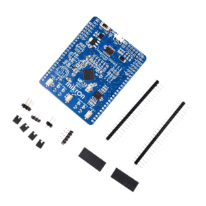

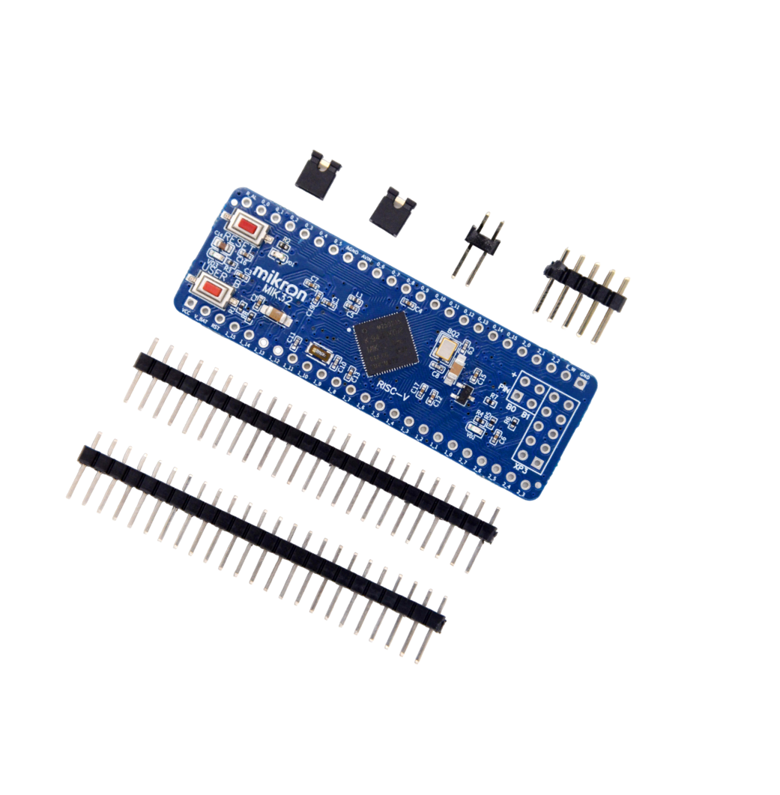

###### Рисунок 1.1 — Отладочные платы производства АО «Микрон» СТАРТ-MIK32 (слева) и DIP-MIK32 (справа)

Плата ELBEAR ACE-UNO выполнена в форм-факторе, близком к Arduino UNO, и может использоваться с Arduino-совместимыми модулями расширения [6]. Это делает ее удобной для экспериментов, так как многие периферийные устройства можно подключать через стандартные разъемы. Однако встроенных средств ввода на самой плате немного: пользовательская кнопка и светодиод. Стоимость платы в интернет-магазине Arduino54 составляет 8 400 руб. [6]. Внешний вид платы представлен на рисунке 1.2.

Плата RADIANT MIK32 также ориентирована на разработку и эксперименты с MIK32. В ее руководстве указаны пользовательские кнопки, светодиоды, Arduino UNO-совместимый разъем и выводы GPIO [7]. Это решение ближе к учебной отладочной плате, чем минимальные модули, однако и оно не содержит развитого набора органов управления. Для большинства лабораторных работ по пользовательскому вводу все равно потребуется отдельный модуль или внешняя макетная сборка. Стоимость составляет 9 060 руб. [7].

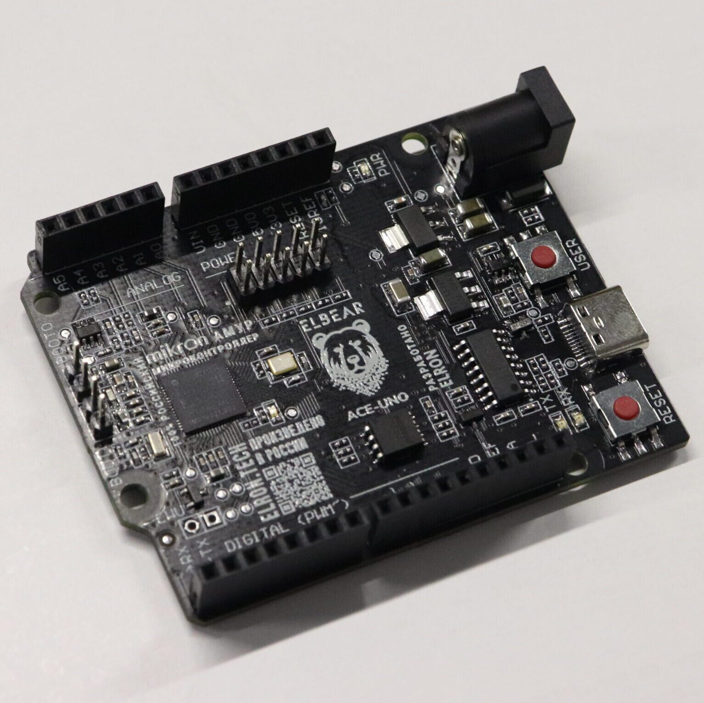

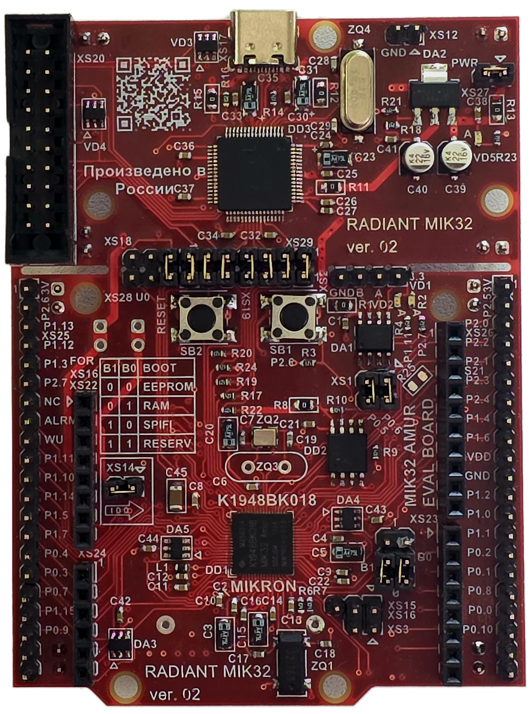

###### Рисунок 1.2 — Отладочные платы сторонних производителей ELBEAR ACE-UNO (слева) и RADIANT MIK32 (справа)

Следовательно, доступные платы на базе MIK32 решают задачу запуска и отладки программ, но не закрывают задачу готового лабораторного макета пользовательского ввода. Они предоставляют микроконтроллер и интерфейсы подключения, однако набор встроенных органов управления слишком мал для системного изучения устройств ввода. Одну из рассмотренных плат можно использовать как часть лабораторного макета. В этом случае не потребуется заново разрабатывать программатор, схему питания и минимальную обвязку микроконтроллера.

## 1.6 Сравнение с платами на других микроконтроллерах

Для оценки ситуации полезно сравнить платы MIK32 с распространенными решениями на других МК. Такие платы широко используются в обучении и прототипировании, поэтому они позволяют понять, какие подходы уже применяются в учебной практике.

Одним из самых дешевых решений является STM32F103C8T6 Blue Pill, изображенная на рисунке 1.3. Эта отладочная плата имеет большое количество выведенных контактов ввода-вывода и низкую стоимость: на странице магазина Амперо указана цена 249-299 руб. [8]. При этом встроенных средств пользовательского ввода на плате нет.

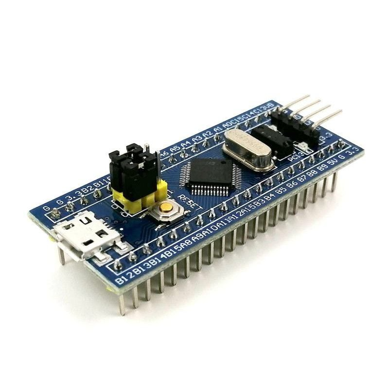

###### Рисунок 1.3 — Отладочная плата STM32F103C8T6 Blue Pill

Более удачным примером с точки зрения комплектации является Arduino Student Kit (рисунок 1.4). В него входит плата Arduino UNO, макетная плата, кнопки, потенциометры и другие компоненты для выполнения учебных заданий [9]. По составу комплект хорошо подходит для обучения, так как содержит не только микроконтроллерную плату, но и набор периферийных элементов. Однако схемы в нем необходимо каждый раз собирать на макетной плате.

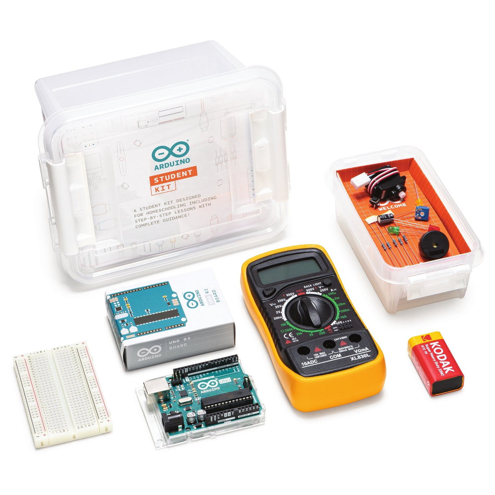

###### Рисунок 1.4 — Набор Arduino Student Kit

Хорошим примером завершенного учебного решения является MIKROE-701 UNI DS6 Development System. На странице поставщика она описана как универсальная отладочная плата, или лабораторный стенд, для изучения микроконтроллеров разных архитектур [10]. Плата содержит большое количество устройств ввода и вывода, гибкую систему коммутации, 12-разрядный внешний АЦП, температурный датчик, USB-UART мосты и разъемы для подключения внешних плат расширения. Цена платы на момент написания работы составляет 13 780 руб, что сопоставимо с ценой отладочных плат для MIK32. Такое решение хорошо показывает, каким должен быть учебный макет: студент получает готовую среду для экспериментов, а не набор отдельных элементов. При этом стенд не ориентирован на MIK32 и не может быть напрямую использован как решение задачи данной работы. Плата изображена на рисунке 1.5.

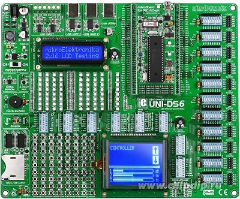

###### Рисунок 1.5 — MIKROE-701 UNI DS6

## 1.7 Сравнение с готовыми учебными лабораторными стендами

Отдельную группу решений составляют профессиональные учебные стенды для изучения микроконтроллеров. В отличие от обычных отладочных плат, такие стенды часто содержат набор тумблеров, кнопок, индикаторов, аналоговых датчиков, разъемов, клемм и методических материалов. Например, лабораторный стенд ЭЛБ-020.003.03 предназначен для изучения программирования микроконтроллеров и содержит элементы, необходимые для выполнения учебных работ [11], представлен на рисунке 1.6.


###### Рисунок 1.6 — Лабораторный стенд «Программирование микроконтроллеров» ЭЛБ-020.003.03

Преимущество таких стендов заключается в их завершенности. Студент работает с готовым оборудованием, где органы управления, индикация и измерительные точки уже размещены на панели и согласованы с учебной методикой. Это снижает количество ошибок подключения и делает лабораторные занятия более повторяемыми.

Основным недостатком готовых стендов является высокая стоимость. Например, цена стенда ЭЛБ-020.003.03 на странице поставщика составляет 392 824 руб. [11]. Такая стоимость существенно превышает стоимость большинства отладочных плат и делает стенд труднодоступным для небольших лабораторий, индивидуальной разработки и тиражирования в учебных группах. Кроме того, подобные стенды ориентированы на другие микроконтроллеры, например AVR или STM32, и не предназначены для работы с MIK32.

## 1.8 Сравнительный анализ решений

Сводное сравнение рассмотренных решений с точки зрения наличия различных устройств ввода приведено в таблице 1.1. В таблице указаны контроллеры, состав средств ввода, ориентировочная стоимость и вывод о применимости решения для задач данной работы. Стоимость приведена по открытым источникам на дату обращения и используется как ориентир для сравнения классов устройств.

Таблица 1.1 — Сравнение отладочных плат и лабораторных макетов

| Решение | Контроллер | Средства ввода | Ориентировочная стоимость | Вывод |
| --- | --- | --- | --- | --- |
| DIP-MIK32 | MIK32 АМУР | нет | 5 500 руб. [4] | Требуется внешний модуль ввода |
| СТАРТ-MIK32 | MIK32 АМУР | 1 кнопка | 7 500 руб. [4] | Требуется внешний модуль ввода |
| ELBEAR ACE-UNO | MIK32 АМУР | 1 кнопка | 8 400 руб. [6] | Требуется внешний модуль ввода |
| RADIANT MIK32 | MIK32 АМУР | 2 кнопки | 9 060 руб. [7] | Требуется внешний модуль ввода |
| Blue Pill | STM32F103 | нет | 249-299 руб. [8] | TI EK-TM4C123GXL LaunchPad |
| Arduino Student Kit | ATmega328P | 5 кнопок, 2 потенциометра 10 кОм, набор популярных датчиков | $79.75 [9], около 6000 руб. | Хорошая комплектация, но схемы нужно собирать |
| MIKROE-701 UNI DS6 | PIC, AVR, 8051, ARM, PSoC, dsPIC | десятки кнопок и рычажковых переключателей, внешний АЦП, датчик температуры | 13 780 руб. [10] | Хороший пример лабораторного макета, но не на MIK32 |
| ЭЛБ-020.003.03 | AVR | 8 тумблеров, 2 кнопки, внешний АЦП | 392 824 руб. [11] | Достаточный функционал, но очень высокая стоимость |

Из таблицы видно, что платы на базе MIK32 находятся в ценовом диапазоне, приемлемом для отладочных средств, однако они не содержат развитого набора пользовательского ввода. Платы на других микроконтроллерах демонстрируют ту же особенность: они удобны для программирования и подключения внешних модулей, но штатных кнопок, переключателей и аналоговых органов управления у них мало. Учебные комплекты и профессиональные стенды лучше подходят для лабораторной работы, однако они либо построены на другой аппаратной платформе, либо имеют высокую стоимость.

## 1.9 Актуальность работы и постановка задачи разработки

Проведенный анализ показывает, что задача разработки лабораторного макета для MIK32 АМУР в целом и средств пользовательского ввода для него в частности является актуальной, поскольку существующие решения не закрывают ряд требований, важных для учебного применения.

На рынке отсутствует доступный и функционально полный учебный макет на базе MIK32, ориентированный именно на изучение пользовательского ввода. Существующие платы позволяют познакомиться с микроконтроллером, но не предоставляют достаточного набора органов управления для проведения полноценных лабораторных работ.

В доступных платах на базе MIK32 отсутствует развитый набор средств пользовательского ввода. DIP-MIK32, СТАРТ-MIK32, ELBEAR ACE-UNO и RADIANT MIK32 подходят для запуска и отладки программ, но в них мало встроенных кнопок, переключателей и аналоговых регуляторов. Для учебного макета этого недостаточно, так как студенту необходимо изучать не один отдельный вход, а несколько типов пользовательского воздействия: дискретные сигналы, клавиатурный ввод, аналоговое напряжение и импульсные сигналы энкодера.

Сравнение с другими платами и стендами показывает разрыв между дешевыми отладочными платами и дорогими профессиональными учебными стендами. Недорогие платы имеют мало встроенных средств ввода, а функционально богатые стенды стоят значительно дороже. Решение на подобие MIKROE-701 UNI DS6 будет оптимальным с точки зрения соотношения цены и практичности.

Для MIK32 доступно меньше готовых примеров программ, чем для более распространенных платформ, таких как Arduino или STM32. Это означает, что для лабораторного макета недостаточно разработать только аппаратную часть. Необходимо также подготовить алгоритмы опроса кнопок и переключателей, обработки клавиатуры, определения направления вращения энкодера и считывания аналоговых значений. Без такой программной части макет будет менее полезен в учебном процессе.

Таким образом, актуальность работы определяется тем, что в существующих продуктах отсутствует сочетание свойств, необходимых для учебного макета на базе MIK32: отечественный микроконтроллер, развитый набор устройств пользовательского ввода, умеренная стоимость, возможность отключения отдельных блоков, удобство измерений и наличие программных примеров для лабораторных работ.

В связи с этим в работе ставится задача разработки средств пользовательского ввода для лабораторного макета микроконтроллера MIK32 АМУР. Разрабатываемое решение должно включать аппаратную часть, обеспечивающую подключение кнопок, переключателей, клавиатуры, энкодера и аналоговых регуляторов, а также программные примеры для их опроса и обработки. В следующих разделах рассматриваются схемотехнические варианты подключения устройств ввода, особенности их программной обработки и проверка работоспособности разработанного решения.

# 2 Разработка дискретных средств ввода

Данный раздел посвящен разработке дискретных средств пользовательского ввода, предназначенных для формирования логических сигналов, обрабатываемых микроконтроллером. Рассматриваются требования к кнопкам и переключателям, способы подключения клавиатуры 4x3, методы расширения числа входов и алгоритмы программной обработки дискретных сигналов.

## 2.1 Требования к дискретным устройствам ввода

Дискретные устройства ввода предназначены для формирования логических сигналов, по которым программа микроконтроллера определяет действия пользователя. В разрабатываемом лабораторном макете используются два типа таких устройств: тактовые кнопки для кратковременных команд и рычажковые переключатели для задания устойчивых состояний. Для макета требуется подключить 12 кнопок, например цифры от 0 до 9, ВВОД и ОТМЕНА, которые можно рассматривать как клавиатуру 4x3, и 8 рычажковых переключателей.

Для макета принято решение использовать рычажковые переключатели как наиболее простые дискретные устройства ввода. Их состояние можно считать непосредственно из регистра GPIO без настройки внешнего интерфейса и сложной схемы опроса. Это удобно для начальных лабораторных работ, где необходимо показать связь между положением элемента управления и логическим уровнем на входе микроконтроллера.

Для большого количества кнопок используется клавиатура 4x3. В отличие от отдельных переключателей, клавиатура содержит группу однотипных кнопок, число которых в дальнейшем может быть увеличено, например при переходе к клавиатуре 4x4 или панели функциональных клавиш. Поэтому способ подключения клавиатуры должен сохранять общий принцип считывания группы кнопок и по возможности не приводить к пропорциональному росту числа занятых выводов микроконтроллера.

При выборе способа подключения необходимо учитывать временные характеристики пользовательского ввода и минимизировать расход ресурсов контроллера, в первую очередь количество занятых GPIO.

## 2.2 Временные параметры опроса кнопок и переключателей

Для определения временных параметров пользовательского воздействия была проведена серия из 10 экспериментов с быстрым нажатием кнопки и переключением переключателя. [12] В макете используются переключатели DIP Switch 2.54 mm Regular Type производства CONNFLY [13] и тактовые кнопки серии KLS7-TS6601 6x6 [14]. По результатам измерений наименьшая продолжительность нажатия составила около 40 мс, продолжительность отпускания тоже около 40 мс. Для переключателей минимальная длительность одного состояния около 300 мс.

Эти значения рассматриваются как предельные условия работы, полученные при намеренно быстром нажатии на кнопку; при обычной эксплуатации лабораторного макета такие режимы, как правило, достигаться не будут.

Длительность дребезга кнопки, использованной в макете, не превысила 1 мс и, как правило, составляла около 50 мкс, как видно на осциллограмме на рисунке 2.1. На рисунке ниже приведена осциллограмма дребезга данной модели кнопки. Для рычажковых переключателей длительность дребезга не превысила 5 мс.

Продолжительность состояния и дребезга кнопок и переключателей приведена в диаграмме на рисунке 2.2.

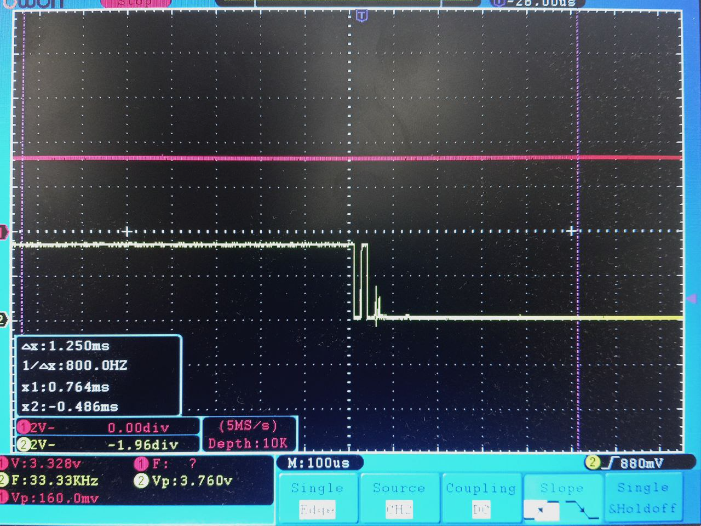

###### Рисунок 2.1 — Один из тестов длительности дребезга кнопки. Кнопка подключена ко второму каналу осциллографа


###### Рисунок 2.2 — Временные характеристики нажатия кнопки и переключателя: максимальная длительность дребезга, минимальная продолжительность состояний "0" и "1"

На основании этих измерений система опроса должна иметь запас и надежно регистрировать нажатия длительностью не менее 40 мс. Алгоритм обработки должен определять текущее состояние и его смену, подавлять дребезг контактов, при условии что будет выбран аппаратный способ борьбы с дребезгом, и сохранять возможность обработки нескольких входов в пределах одного цикла опроса. Период опроса должен быть выбран так, чтобы программа успевала обнаруживать самые быстрые действия пользователя и при этом не тратила лишние вычислительные ресурсы.

Для лабораторного макета важно сохранить компромисс между надежностью и отзывчивостью. Слишком малое время фильтрации может пропускать дребезг и приводить к ложным срабатываниям, а слишком большое - ухудшать реакцию на быстрые нажатия.

Период опроса должен быть в несколько раз меньше длительности одного состояния, например 10 мс для кнопок и 70 мс для переключателей, так в худшем случае на одно состояние придется 3 опроса. При этом итоговая задержка реакции складывается из периода опроса и выбранного времени фильтрации.

## 2.3 Подключение рычажковых переключателей

Рычажковый переключатель задает устойчивое логическое состояние, которое сохраняется после воздействия пользователя. Поэтому он подходит для выбора режима работы, задания начальных условий программы или имитации простого датчика с дискретным выходом. В разрабатываемом макете используется 8 рычажковых переключателей, подключенных напрямую к выводам GPIO микроконтроллера. Каждый переключатель остается независимым входом, поэтому его состояние можно считывать как при периодическом опросе, так и при обработке прерывания по изменению уровня.

Дискретные входы должны быть согласованы с логическими уровнями МИК32 АМУР. Согласно информационному листу микроконтроллера, напряжение питания составляет 3,3 В ±10 % [2], то есть допустимый диапазон питания основного домена составляет 2,97-3,63 В. В проектируемой схеме логический «0» должен формироваться уровнем, близким к GND, а логическая «1» - уровнем, близким к VCC 3,3 В. Подача на входы сигналов уровня 5 В не допускается.

При прямом подключении один контакт переключателя соединяется с линией питания, а второй подключается к входу микроконтроллера. Чтобы вход не оставался в неопределенном состоянии, используется подтягивающий резистор. В выбранной схеме подтяжка выполнена к земле: при разомкнутом контакте на входе формируется логический «0», а при замыкании переключателя вход соединяется с питанием и формируется логическая «1». Подтяжка реализована внешним резистором для каждого переключателя. Схема подключения представлена на рисунке 2.3.

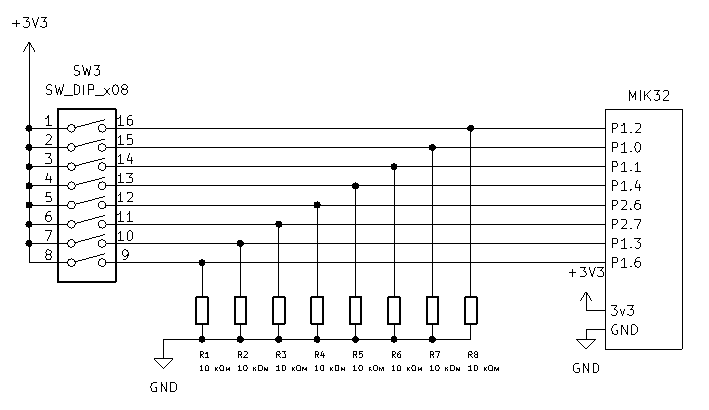

Рисунок 2.3 — Схема подключения рычажковых переключателей

Для определения состояния переключателя достаточно настроить нужный вход МК на вход и прочитать бит из соответствующего регистра. Фрагмент примера из приложения А:

GPIO_1->DIRECTION_IN = GPIO_PIN_2;

uint8_t lever_state = (GPIO_1->STATE & GPIO_PIN_2) != 0;

При изменении положения контакты переключателя не переходят из одного состояния в другое мгновенно. Как и у кнопок, у них возникает дребезг контактов, из-за которого микроконтроллер может зафиксировать несколько быстрых изменений уровня вместо одного переключения. Вопрос подавления дребезга рассматривается далее в отдельном подразделе.

## 2.4 Подключение клавиатуры 4x3 напрямую

Самый простой способ заключается в соединении каждой кнопки с отдельным входом микроконтроллера. В этом случае 12 кнопок требуют 12 GPIO. Один контакт кнопки подключается к линии питания, а второй - к входу микроконтроллера, аналогично с переключателями в подраздела 2.3. Прямое подключение клавиатуры 4x3 рассматривается как базовый вариант, с которым далее сравниваются другие способы подключения.

Преимущество прямого подключения заключается в простоте схемы и программы. Состояние каждой кнопки можно считать напрямую из регистра GPIO, а обработка нажатий сводится к сравнению текущего и предыдущего состояния входа. При таком подходе легко поддерживать одновременные нажатия, поскольку каждая кнопка имеет собственный входной канал. Кроме того, прямое подключение позволяет использовать внешние прерывания GPIO для реакции на изменение состояния кнопки без постоянного циклического опроса всех входов. Можно добавить аппаратное средство борьбы с дребезгом.

Программный код для прямого подключения клавиатуры аналогичен коду для рычажковых переключателей: для каждой кнопки настраивается вход GPIO, после чего программа считывает соответствующий бит регистра состояния порта. Отличие состоит только в количестве входов.

Недостаток прямого подключения состоит в большом расходе выводов микроконтроллера. Только клавиатура 4x3 занимает 12 GPIO, а с учетом 8 рычажковых переключателей суммарно требуется уже 20 цифровых входов, не считая энкодера, аналоговых ручек и других сигналов макета. Для лабораторного стенда выводы микроконтроллера являются одним из наиболее ценных ресурсов. Поэтому прямое подключение не является оптимальным решением для итоговой платы.

## 2.5 Подключение клавиатуры 4x3 матрицей

Матричное подключение уменьшает число занятых выводов за счет объединения кнопок в строки и столбцы. Для клавиатуры 4x3 требуется 7 линий: 4 строки и 3 столбца. При сканировании программа поочередно активирует строки и считывает состояние столбцов. Если при активной строке на одном из столбцов обнаруживается изменение уровня, программа определяет нажатую кнопку по номеру строки и столбца.

По сравнению с прямым подключением матрица позволяет сэкономить 5 выводов микроконтроллера: вместо 12 GPIO используются 7. Однако такая схема требует более сложного алгоритма опроса. Необходимо последовательно переключать строки, выдерживать время установления уровней и выполнять чтение столбцов для каждой строки. Период полного опроса клавиатуры зависит от числа строк и задержек в алгоритме сканирования. В отличие от прямого подключения, матрица не позволяет назначить независимое прерывание на каждую кнопку. Алгоритм сканирования матрицы включает несколько этапов:

Перевести одну строку в активное состояние.

Выдержать небольшую задержку для установления уровней.

Считать уровни на линиях столбцов.

Определить нажатые кнопки для текущей строки.

Повторить действия для остальных строк.

Дополнительная проблема матричной клавиатуры возникает при одновременном нажатии нескольких кнопок. В некоторых сочетаниях возможно появление фантомных срабатываний, когда программа определяет нажатой кнопку, которая фактически не нажималась. Для устранения этой проблемы применяют диоды [15], включенные последовательно с кнопками, но это увеличивает количество компонентов и усложняет монтаж: для клавиатуры 4x3 требуется 12 диодов и 3 резистора. Схема подключения клавиатуры 4х4 изображена на рисунке 2.4, для клавиатуры 4х3 схема аналогична за исключением отсутствия левого столбца кнопок.

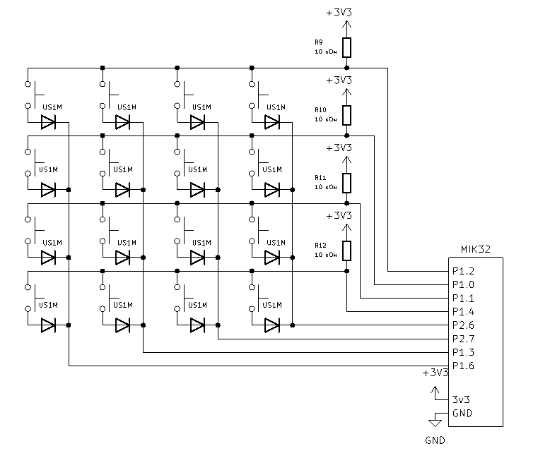

###### Рисунок 2.4 — Схема подключения клавиатуры 4 на 4

Матричное подключение экономит GPIO, но добавляет схемотехнические и усложняет ПО.

## 2.6 Подключение кнопок через сдвиговые регистры 74HC165

Третий вариант заключается в подключении кнопок к параллельным входам сдвигового регистра, например 74HC165. 74HC165 является распространенным решением: микросхема выпускается разными производителями и представлена в каталогах поставщиков в значительных количествах [16-18]. Один 74HC165 имеет 8 параллельных входов, поэтому для 12 кнопок достаточно двух микросхем. Оставшиеся входы могут быть зарезервированы для дальнейшего расширения, например для кнопки на ручке энкодера. Подключение 74HC165 занимает 3 выхода МК [12].

При работе с 74HC165 микроконтроллер сначала формирует сигнал загрузки параллельных входов, после чего последовательно считывает биты состояния. Несколько микросхем можно каскадировать: последовательный выход одной микросхемы подключается к последовательному входу следующей, и вся цепочка считывается как один более длинный сдвиговый регистр. Это делает решение хорошо расширяемым: увеличение числа кнопок требует добавления микросхемы, но почти не увеличивает число линий микроконтроллера. Недостатком такого подхода является невозможность получить отдельное прерывание от каждой кнопки: микроконтроллер видит не отдельные входы, а последовательный поток данных, поэтому состояние кнопок определяется периодическим считыванием регистра.

Считывание 74HC165 можно выполнить двумя способами. Первый способ - программное управление линиями GPIO. В этом случае тактовые импульсы формируются средствами программы, а данные считываются по одному биту после каждого импульса. Такой подход не требует настройки аппаратного SPI, но расходует процессорное время и делает обмен зависимым от задержек в программе.

Второй способ - подключение 74HC165 к аппаратному интерфейсу SPI. В этом случае тактовый сигнал формируется периферийным блоком SPI, а данные считываются через вход MISO. Дополнительная линия GPIO используется для загрузки параллельного состояния в регистр. Такой вариант уменьшает программную нагрузку, используя стандартную периферию микроконтроллера.

Готовых примеров работы с 74HC165 для MIK32 найти не удалось, поэтому для макета был написан собственный драйвер. Он формирует сигнал загрузки состояний кнопок, считывает данные по SPI и преобразует полученное значение в битовую маску. При проверке аппаратного SPI на MIK32 были обнаружены две практические особенности: сигнал CS инвертирован, поэтому им приходится управлять вручную, а линия CLK после завершения обмена не сразу возвращается к нулю и устанавливается в низкий уровень только через несколько миллисекунд. Эти особенности не нарушили целостность считывания, но были учтены при настройке обмена и отладке программы.

Штатный способ расширения числа входов - каскадирование регистров, при котором последовательный выход Q7 одного регистра подключается к последовательному входу DS следующего; такая возможность прямо указана в описании 74HC165 [18]. Если необходимо подключить к той же SPI-шине другие устройства, нужно обеспечить, чтобы в каждый момент времени линию MISO формировало только одно устройство. Это важно при совместном использовании выбранной SPI-шины несколькими внешними устройствами. Для обычных SPI-устройств это выполняется сигналом CS, переводящим невыбранное устройство в высокоимпедансное состояние. Для 74HC165 такой функции нет, поэтому возможны несколько решений: подключить выход цепочки 74HC165 к MISO через внешний буфер с третьим состоянием, например 74HC125, использовать отдельную линию MISO/отдельный SPI-интерфейс для регистров или включить последовательный резистор 1 кОм между выходом Q7 последнего 74HC165 и общей линией MISO. В работе был протестирован 3 вариант, в качестве второго ведомого устройства выступала плата Arduino Leonardo, посылающая возрастающие байты при подаче логической “1” на входе CS. Схема подключения представлена на рисунке 2.5

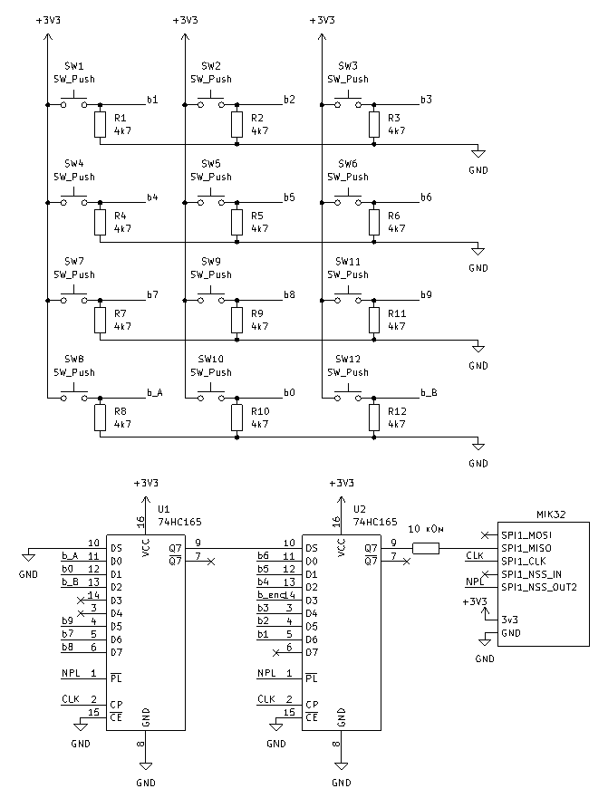

###### Рисунок 2.5 — Схема подключения клавиатуры,через регистр 74HC165

## 2.7 Сравнение способов подключения клавиатуры 4x3

Для выбора схемы подключения были рассмотрены три варианта: прямое подключение кнопок к GPIO, матричная клавиатура 4x3 и подключение через сдвиговые регистры 74HC165. Основным критерием выбора стало количество занятых выводов микроконтроллера, поскольку GPIO являются наиболее ограниченным ресурсом лабораторного макета.

При выборе способа построения модуля пользовательского ввода необходимо учитывать не только работоспособность отдельной схемы, но и ее пригодность для всего лабораторного макета. Один и тот же набор органов управления может быть подключен разными способами, каждый из которых имеет преимущества и ограничения. Для сравнения вариантов используются следующие критерии:

количество занятых выводов микроконтроллера;

затрачиваемая память МК

сложность программного алгоритма;

возможность обработки одновременных действий пользователя;

стоимость и доступность компонентов;

возможность дальнейшего расширения;

Затраты памяти для рассмотренных вариантов имеют один порядок, поскольку во всех случаях программа хранит текущее состояние кнопок, предыдущее состояние и служебные данные для фильтрации дребезга.

Стоимость также имеет один порядок, 100-200 рублей, это несравнимо ниже цены отладочной платы и не окажет заметного эффекта на итоговую стоимость макета. Отличия подходов описаны в таблице 2.1

Таблица 2.1 — Сравнение подходов подключения клавиатуры к МК

| Способ подключения | GPIO для 12 кнопок | Дополнительные компоненты | Программная сложность | Масштабирование |
| --- | --- | --- | --- | --- |
| Прямое подключение | 12 | 12 резисторов 10 кОм | низкая | плохое, каждая новая кнопка требует GPIO |
| Матрица 4x3 | 7 | 3 резистора 10 кОм, 12 диодов | низкая | среднее, кол-во выходов для матрицы M на N составляет M+N |

Продолжение таблицы 2.1

| каскад 74HC165 | 3 | 2 74HC165, 12 резисторов 10 кОм | средняя | хорошее, добавление входов каскадированием |
| --- | --- | --- | --- | --- |

При прямом подключении клавиатура 4x3 занимает 12 выводов. Этот вариант имеет минимальную программную и аппаратную сложность, но плохо масштабируется. При добавлении 8 рычажковых переключателей расход GPIO становится слишком большим.

Матричное подключение уменьшает число линий до 7, что заметно лучше прямого варианта. Допустимый вариант для макета.

Подключение через 74HC165 требует минимального числа дополнительных линий микроконтроллера и хорошо расширяется каскадированием микросхем, но программная и аппаратная реализация сложнее, чем другие варианты.

Для итоговой реализации выбран вариант подключения кнопок через сдвиговые регистры 74HC165 с чтением данных по SPI. Такое решение обеспечивает приемлемую сложность схемы, экономит выводы микроконтроллера и хорошо масштабируется, а также позволяет изучить работу с интерфейсами связи.

## 2.8 Дребезг контактов кнопок и переключателей

Механические кнопки и рычажковые переключатели не формируют идеальный одиночный переход между логическими уровнями. При замыкании и размыкании контактов возникает дребезг: в течение короткого времени вход микроконтроллера может несколько раз переключаться между «0» и «1». Если не учитывать этот эффект, одно нажатие кнопки может быть ошибочно обработано как несколько нажатий, а изменение положения переключателя - как серия быстрых переключений. В разделе 2.2 были получены значения длительности дребезга: для кнопки до 1 мс, для рычажковых переключателей до 5 мс.

В работе были рассмотрены и проверены три варианта защиты от дребезга: специализированная микросхема MC14490, RC-фильтр и программная фильтрация. Эти варианты отличаются числом дополнительных компонентов, задержкой, стоимостью и влиянием на программную часть.

MC14490 является специализированной микросхемой подавления дребезга. Она удобна тем, что не требует отдельной программной обработки и не занимает дополнительные выводы микроконтроллера для каждого канала. Одна микросхема содержит 6 каналов, поэтому для 8 переключателей потребовались бы две микросхемы, а для переключателей и кнопок 4 микросхемы. Схема подключение переключателей приведена на рисунке 2.6.

RC-фильтр является простым аппаратным способом сглаживания дребезга [19]. Он дешев и может быть собран из распространенных компонентов, однако для большого количества входов требует значительного числа элементов. Для каждого канала необходимы как минимум резистивно-емкостная цепь и желательно формирователь с четким порогом переключения, например вход с триггером Шмитта [19]. На печатной плате такое решение может быть приемлемым, но при макетировании оно усложняет монтаж и увеличивает вероятность ошибок соединения.

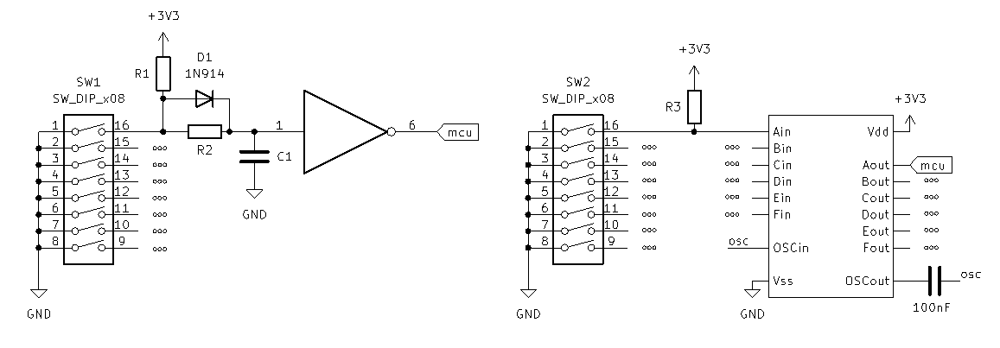

###### Рисунок 2.6 — Схемы аппаратного подавления дребезга контактов

Программная фильтрация не требует дополнительных компонентов и позволяет изменять параметры подавления дребезга без переделки схемы. Суть метода состоит в том, что изменение состояния входа принимается не сразу, а только после того, как новое значение сохраняется в течение заданного времени или подтверждается несколькими последовательными измерениями. Сравнение способов подавления дребезга для блока из 8 переключателей приведено в таблице 2.2.

Таблица 2.2 — Сравнение способов подавления дребезга контактов

| Способ | Примерная цена | Доступность | Сложность монтажа | Сложность программирования |
| --- | --- | --- | --- | --- |
| MC14490 | ~300 руб | низкая, срок доставки около 6 недель | средняя | низкая |
| RC-фильтр | ~500 руб | высокая | высокая | низкая |
| Программная фильтрация | - | - | - | средняя |

По результатам проверки для макета выбрана программная защита от дребезга. Она не увеличивает стоимость и сложность платы, не требует дополнительных микросхем и позволяет подобрать время фильтрации с учетом измеренных условий работы. Такой вариант удобен для лабораторного макета, где важно иметь возможность изменять алгоритм обработки и сравнивать разные параметры фильтрации программно.

## 2.9 Программная обработка кнопок и переключателей

Программная обработка дискретных входов выполняется в несколько этапов. Сначала микроконтроллер получает сырые состояния входов: для кнопок они считываются из цепочки 74HC165 по SPI, а для рычажковых переключателей - непосредственно из регистров GPIO. Затем программа сравнивает новое состояние с предыдущим и определяет события: нажатие, отпускание или изменение положения переключателя.

Для защиты от дребезга используется программная фильтрация по времени. При первом обнаружении изменения входа программа не принимает его немедленно, а запускает проверку стабильности. Новое состояние считается действительным только после того, как оно сохраняется без изменений в течение заданного интервала. Такой алгоритм позволяет отделить реальное действие пользователя от кратковременных колебаний контактов.

В итоговой реализации для рычажковых переключателей используется опрос с периодом 30 мс. Переключение фиксируется только в том случае, если новое состояние сохраняется при следующем опросе. Для кнопок, подключенных через 74HC165, применяется более короткий интервал подтверждения: состояние кнопки принимается только при сохранении в течение 10 мс. Такие параметры согласуются с измеренной длительностью дребезга и не создают заметной задержки при обычной работе пользователя.

Для кнопок, подключенных через 74HC165, фильтрация естественно совмещается с периодическим опросом регистров. Для каждого входа хранится сырое состояние, подтвержденное состояние и время последнего изменения. Для рычажковых переключателей, подключенных напрямую к GPIO, возможны два режима: периодический опрос или прерывание по изменению уровня с последующей программной проверкой состояния после интервала подавления дребезга.

# 3 Разработка аналоговых и импульсных средств ввода

Данный раздел посвящен разработке аналоговых и импульсных средств пользовательского ввода. Рассматриваются подключение поворотного энкодера и аналоговых ручек вращения, а также особенности программной обработки сигналов АЦП и импульсных последовательностей.

## 3.1 Назначение поворотных органов управления

Поворотные органы управления применяются в лабораторных макетах для задания числовых параметров, выбора режимов работы и демонстрации обработки изменяющихся входных сигналов. В данной работе рассматриваются два типа таких устройств: инкрементальный поворотный энкодер и аналоговые ручки вращения на основе потенциометров.

Аналоговая ручка вращения, выполненная на потенциометре, формирует абсолютное значение. Ее положение соответствует определенному уровню напряжения, который считывается микроконтроллером с помощью АЦП. Такой ввод удобен для задания уровня, коэффициента, порога срабатывания или другого параметра, который должен изменяться плавно.

Работа с потенциометром в ходе ЛР позволит студентам изучить взаимодействие с АЦП и обработку аналоговых сигналов.

Энкодер используется для ввода относительного изменения положения. В отличие от потенциометра, механический инкрементальный энкодер не задает абсолютное напряжение. При вращении он формирует последовательность импульсов, по которым программа определяет количество шагов и направление вращения. Такой орган управления удобен для изменения числовых параметров, выбора пунктов меню и работы с величинами, которые могут увеличиваться или уменьшаться без ограничения полного угла поворота. Получение данных с энкодера требует соблюдение строгих требований к частоте опроса и длительности обработки результата в ПО.

## 3.2 Подключение поворотного энкодера

На начальном этапе предполагалось сравнить несколько модулей поворотных энкодеров. Однако модуль KY-040 на основе механического инкрементального энкодера серии EC11 после первичной проверки удовлетворил требованиям макета, поэтому дальнейшее сравнение модулей не потребовалось. KY-040 является распространенным и недорогим модулем, представлен в продаже как готовый модуль с ручкой [20, 21]. Типовой механический инкрементальный энкодер имеет два сигнальных канала A и B. Сигналы этих каналов сдвинуты по фазе. Если при вращении сначала изменяется канал A, а затем канал B, программа определяет одно направление. Если порядок изменений обратный, определяется противоположное направление. Такой способ называется квадратурным кодированием.

Каналы A и B подключаются к цифровым входам микроконтроллера, следует использовать входы P0.11 и P0.12, так как они являются входом 16-битного таймера MIK32, который имеет режим декодирования [1]. Как и для кнопок, входы не должны оставаться в неопределенном состоянии, поэтому применяются подтягивающие резисторы к питанию. Модуль KY-040 уже содержит элементы аппаратной фильтрации сигналов энкодера, что упрощает подключение к входам микроконтроллера. На этапе разработки модуль установлен целиком; в дальнейшем его компоненты решения могут быть перенесены непосредственно на общую лабораторную плату. При вращении энкодера механические контакты поочередно замыкаются и размыкаются, формируя последовательность логических уровней. Энкодер имеет встроенную кнопку, она подключается как часть клавиатуры из 2. Схема подключения представлена на рисунке 3.1.

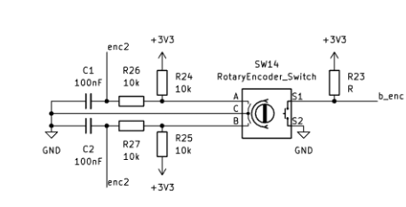

###### Рисунок 3.1 — Схема подключения энкодера

Энкодер удобен для лабораторного макета тем, что позволяет демонстрировать сразу несколько задач: считывание двух цифровых входов, анализ последовательности переходов, обработку внешних событий, работу с прерываниями или таймером в режиме декодирования или захвата.

## 3.3 Алгоритм обработки энкодера

Для обработки энкодера программа хранит предыдущее состояние каналов A и B и сравнивает его с текущим. Каждое состояние можно представить двумя битами. При нормальном вращении состояния изменяются в определенной последовательности, а направление определяется порядком переходов.

Готовый драйвер энкодера для MIK32 найти не удалось, поэтому обработка входного сигнала реализована самостоятельно. Пример программы считывает два цифровых входа, определяет допустимость перехода между состояниями и изменяет счетчик положения в зависимости от направления вращения.

Общий алгоритм обработки энкодера включает следующие шаги:

Считать текущие уровни каналов A и B.

Сформировать двухбитное состояние энкодера.

Сравнить текущее состояние с предыдущим.

Определить, соответствует ли переход допустимому шагу вращения.

Увеличить или уменьшить счетчик положения в зависимости от направления.

Отбросить некорректные переходы, связанные с дребезгом, пропуском импульса или слишком быстрым вращением.

Допустимые переходы соответствуют повороту на один шаг. Если переход невозможен для нормальной квадратурной последовательности, он может быть связан с дребезгом, пропуском импульса или ошибкой считывания. Поэтому алгоритм не должен реагировать на любое изменение входов как на реальный шаг. Он должен учитывать только те изменения, которые соответствуют допустимой последовательности состояний.

Период опроса влияет на максимальную скорость вращения, которую может корректно обработать программа. Если энкодер вращается быстрее, чем программа успевает считывать изменения, часть переходов будет пропущена. В результате может возникнуть ошибка подсчета шагов или неправильное определение направления. Поэтому при программном опросе необходимо выбирать период считывания с запасом относительно максимальной частоты сигналов энкодера. Пример ПО для взаимодействия с энкодером приведен в приложении А.

## 3.4 Дребезг и фильтрация сигналов энкодера

Механические контакты энкодера, как и контакты кнопок, подвержены дребезгу. Однако в случае энкодера дребезг влияет не на один сигнал, а на последовательность переходов двух каналов. Из-за этого возможны ложные шаги, изменение направления на один отсчет или появление некорректных состояний.

Особенность фильтрации энкодера состоит в необходимости сохранить быстрые полезные импульсы. Если применить слишком сильную фильтрацию, программа может потерять часть переходов при быстром вращении. Если фильтрация будет недостаточной, дребезг может быть принят за реальные изменения положения. Поэтому параметры фильтрации для энкодера должны выбираться с учетом максимальной скорости вращения и фактической длительности дребезга контактов.

Аппаратная фильтрация может выполняться с помощью RC-цепей или входов с триггером Шмитта. Такой подход сглаживает быстрые колебания до поступления сигнала на микроконтроллер, но добавляет элементы в схему и может ограничить максимальную частоту сигналов. В выбранном модуле KY-040 аппаратная фильтрация уже предусмотрена на плате модуля.

Для многофункционального вывода MIK32 в цифровом режиме технические условия задают входное напряжение низкого уровня UIL в диапазоне от 0 до 0,35*Ucc, а входное напряжение высокого уровня UIH - в диапазоне от 0,65*Ucc до Ucc [22, табл. 3]. При номинальном питании Ucc = 3,3 В это соответствует напряжению до 1,16 В для гарантированного логического нуля и от 2,15 В для гарантированной логической единицы. Поэтому под уровнем логической единицы в данном случае понимается достижение входного порога UIH микроконтроллера, то есть минимального входного напряжения, которое гарантированно воспринимается как логическая «1».

Для лабораторного макета важно не только получить работоспособный алгоритм, но и показать влияние фильтрации на результат. Поэтому при экспериментальной проверке необходимо измерить сигналы каналов энкодера, оценить максимальную частоту при быстром вращении и проверить, не приводит ли выбранный фильтр к потере полезных импульсов. Для оценки предельного режима энкодер вращался между двумя ладонями: такой способ позволяет получить скорость выше обычного поворота ручки пальцами и проверить, при какой скорости фронты после RC-фильтра становятся слишком растянутыми, а отдельные переходы начинают теряться. Осциллограмма приведена на рисунке 3.2.

При проверке RC-фильтра модуля было установлено, что он справляется с подавлением дребезга при ручном вращении энкодера. Время перехода сигнала от уровня логического нуля до уровня логической единицы составило около 2 мс.


###### Рисунок 3.2 — Осциллограмма сигналов энкодера при быстром вращении

Проведенные тесты показали, что аппаратная фильтрация модуля KY-040 достаточна для работы макета: при полном обороте примерно за 500 мс программа не теряла состояния и корректно определяла направление вращения. Такая скорость выше обычного вращения пальцами, поэтому для лабораторного макета выбранная фильтрация и период опроса являются достаточными.

## 3.5 Подключение аналоговых ручек вращения

Аналоговые устройства ввода применяются для задания плавно изменяющихся параметров. Наиболее простой вариант такого устройства - потенциометр. В выбранной реализации применен Bourns PTV09A-4225F-B103, 10 кОм [23]. Нижний крайний вывод потенциометра подключается к земле, верхний крайний вывод получает питание от линии 3,3 В через резистор 20 кОм, а средний вывод подключается непосредственно к аналоговому входу микроконтроллера. Левый потенциометр подключается к первому каналу АЦП, правый - ко второму.

При подключении потенциометра необходимо согласовать диапазон напряжений с допустимым диапазоном входа АЦП. Для MIK32 АМУР диапазон входного сигнала АЦП составляет от 0,015 до UREF, где UREF находится в пределах от 1,1 до 1,3 В и имеет номинальное значение 1,2 В [1]. Поскольку сопротивление потенциометра составляет 10 кОм, резистор 20 кОм между питанием 3,3 В и верхним выводом потенциометра образует делитель напряжения. В результате напряжение на верхнем выводе потенциометра составляет около 1,1 В, а напряжение на среднем выводе изменяется в диапазоне примерно от 0 до 1,1 В в зависимости от положения ручки. Схема подключения представлена на рисунке 3.3.

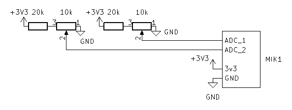

###### Рисунок 3.3 — Схема подключения потенциометров

## 3.6 Программная обработка аналоговых значений

MIK32 АМУР содержит один многоканальный АЦП, к входу которого сигналы подключаются через внутренний аналоговый коммутатор [24]. Поэтому при работе с двумя потенциометрами программа не измеряет оба канала одновременно, а последовательно выбирает нужный канал и запускает преобразование.

При переключении каналов необходимо учитывать задержку коммутации. В статье с экспериментальной проверкой АЦП MIK32 отмечается, что после выбора нового канала полезно выполнить холостое преобразование, так как первое измерение после переключения может относиться к переходному процессу [24]. Этот подход использован в программе: после выбора канала выполняется первое одиночное преобразование, его результат отбрасывается, затем выполняется второе преобразование, и только оно используется как текущее значение потенциометра.

Для проверки работы потенциометров был подготовлен простой пример. В нем настраивается АЦП MIK32 и периодически опрашиваются два аналоговых канала: канал 1 для левой ручки и канал 2 для правой ручки. Полученное значение АЦП является безразмерным кодом. В примере оно переводится в милливольты по опорному напряжению АЦП и дополнительно масштабируется в проценты от полного диапазона. Такой вывод удобен при отладке: сырое значение позволяет видеть фактический код АЦП, значение в милливольтах - проверить соответствие электрической схеме, а проценты - оценить положение ручки в форме, удобной для прикладной программы.

Даже при неподвижной ручке результат АЦП может немного изменяться из-за шумов и внутренних особенностей преобразователя. В статье также отмечаются дрейф и разброс показаний при длительном измерении постоянного напряжения [24]. Для лабораторного макета это не является критичным, так как потенциометры используются как органы плавного задания параметра, а не как точный измерительный прибор. В примере из приложения А применяется экспоненциальное сглаживание - один из наиболее простых алгоритмов сглаживания последовательности измерений [25]. Новое измерение вносит одну восьмую результата, а семь восьмых сохраняются от предыдущего значения. Такая фильтрация уменьшает мелкие колебания показаний и сохраняет достаточно быструю реакцию на поворот ручки.

# 4 Монтаж и отладка платы пользовательского ввода

Данный раздел посвящен практической реализации разработанных схемотехнических и программных решений. Рассматриваются монтаж платы пользовательского ввода, разработка библиотеки для работы с устройствами ввода, экспериментальная проверка работоспособности отдельных узлов и возможность применения платы в составе лабораторного макета.

## 4.1 Монтаж платы пользовательского ввода

На текущем этапе плата пользовательского ввода выполнена как самостоятельный модуль размером примерно 7x9 см и подключается к отладочной плате с микроконтроллером проводами-перемычками. Все органы управления установлены на одной плате и припаяны, поэтому при выполнении лабораторных работ не требуется каждый раз собирать кнопки, переключатели, энкодер и потенциометры на макетной плате. Это уменьшает время подготовки, повышает повторяемость экспериментов и снижает вероятность ошибок подключения. Внешний вид получившейся платы представлен на рисунке 4.1.

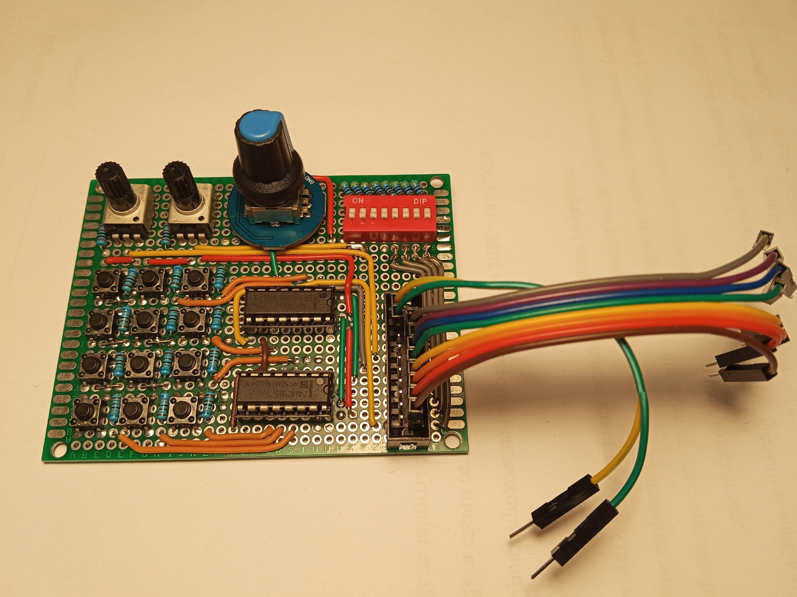

###### Рисунок 4.1 — Внешний вид платы пользовательского ввода

Полная электрическая схема платы пользовательского ввода приведена на рисунке 4.2

.

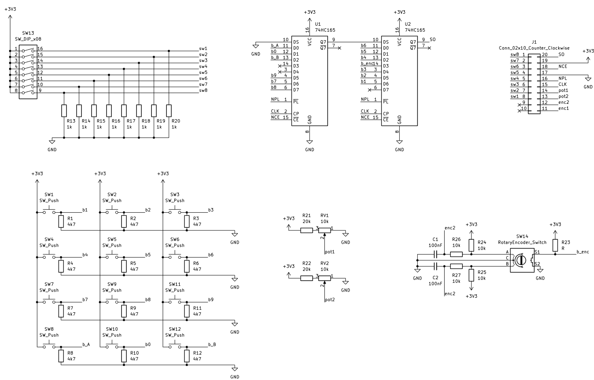

###### Рисунок 4.2 — Схема платы пользовательского ввода

В дальнейшем модуль пользовательского ввода будет перенесен на единую лабораторную плату и объединен с устройствами вывода, индикацией, цепями питания, разъемами расширения и другими узлами учебного стенда.

Для подключения модуля к отладочной плате используется распределение выводов, приведенное в таблице 4.1. В нем выбраны такие линии микроконтроллера, при которых кнопки, переключатели, энкодер и аналоговые ручки работают независимо и не используют одни и те же входы. В библиотеке, которая будет рассмотрена в следующем подразделе программно заданы именно эти входы/выходы МК.

Таблица 4.1 — Сопоставление входов/выходов MIK32 и разработанной платы

| Номер выхода на плате пользовательского ввода. | Вход/выход MIK32 |
| --- | --- |
| 1 | P1.8 |
| 2 | P1.9 |
| 3 | P1.1 |
| 4 | P1.4 |
| 5 | P2.6 |
| 6 | P2.7 |
| 7 | P1.3 |
| 8 | P1.6 |
| 11 | P0.8 (Timer16_1_in1) |
| 12 | P0.9 (Timer16_1_in2) |
| 13 | P1.7 (ADC_1) |
| 14 | P0.2 (ADC_2) |
| 15 | P1.2 (SPI1_clk) |
| 16 | P1.5 (SPI1_n_ss_out_1) |
| 17 | Gnd |
| 18 | Gnd |
| 19 | Vcc |
| 20 | P1.0 (SPI1_MISO) |

## 4.2 Библиотека для работы с устройствами ввода

Для упрощения использования платы была разработана библиотека lab_input.h (Приложение Б). Она скрывает низкоуровневую настройку периферии и предоставляет простой программный интерфейс для учебных и проектных работ, включая лабораторные, курсовые, выпускные квалификационные и самостоятельные разработки. Инициализация выполняется функцией li_init(), а регулярный опрос устройств - функцией li_update(), которую необходимо вызывать с периодом 1 мс. Внутри библиотеки выполняется опрос энкодера, чтение кнопок через сдвиговые регистры 74HC165 по SPI, считывание аналоговых ручек через АЦП и хранение текущих состояний.

Библиотека предоставляет функции получения состояний устройств ввода: li_get_keyboard_bitmask() для кнопочной клавиатуры, li_get_button_state() для отдельной кнопки, li_get_levers_bitmask() для рычажковых переключателей, li_get_enc_counter() для счетчика энкодера и li_get_pot_value_mv() для значений потенциометров в милливольтах. Благодаря этому в учебных программах можно использовать готовые органы управления без повторной настройки GPIO, SPI и АЦП. Пример использования всех возможностей библиотеки находится в приложении А.

Такой подход особенно полезен для работ, которые направлены не на изучение самих устройств ввода, а на другие темы: обработка данных с внешних датчиков, взаимодействие с устройствами вывода и так далее. В этих случаях кнопки, переключатели, энкодер и потенциометры нужны как источник команд и параметров, а библиотека позволяет подключить их к программе с минимальным количеством служебного кода.

## 4.3 Тестирование и экспериментальная проверка

Разработанная плата и библиотека были проверены в различных пользовательских сценариях.

Был проведен тест многократного нажатия всех кнопок и смены состояния переключателей. Программой было верно определено количество нажатий.

Поворотный энкодер проверялся при обычном ручном вращении, при полном обороте примерно за 500 мс и в предельном режиме вращения между двумя ладонями. Эти испытания позволили оценить корректность определения направления и влияние аппаратной фильтрации на форму сигналов. Потенциометры проверялись через АЦП: программа считывала оба канала, масштабировала значения в милливольты и позволяла наблюдать изменение результата при повороте ручек. Стоит обратить внимание, что передача состояний всех устройств через UART нарушает частоту вызова функции li_update(), из-за этого в примере из приложения А, энкодер может пропускать шаги.

В результате проверки подтверждено, что все устройства ввода опрашиваются и работают в типовых сценариях использования: нажатие отдельных и нескольких кнопок, изменение положения переключателей, вращение энкодера в обе стороны и плавное изменение положения аналоговых ручек. Это подтверждает пригодность разработанной платы для использования в составе лабораторного макета MIK32 АМУР.

## 4.4 Плата пользовательского ввода как часть лабораторного макета

Следующим этапом развития лабораторного макета должна стать разработка объединенной платы, которая совместит в себе устройства пользовательского ввода, устройства вывода и систему питания. Такая плата позволит избежать использования десятков проводов-перемычек между отдельными платами и значительно упростит выполнение ЛР.

При проектировании объединенной платы рекомендуется сохранить возможность ручной коммутации сигналов. Для этого на всех входах и выходах пользовательского ввода следует предусмотреть перемычки-мосты. Они позволят отключать отдельные органы управления от микроконтроллера, менять назначение линий, подключать внешние устройства и проводить лабораторные работы, в которых требуется самостоятельно выбирать способ соединения узлов макета. Наличие перемычек также упрощает поиск неисправностей, поскольку каждую функциональную часть можно временно изолировать от остальных цепей.

Для удобства измерений на каждой сигнальной линии рекомендуется установить отдельный штыревой контакт формата DIP. Такие контрольные точки позволяют быстро подключать щуп осциллографа или логического анализатора к линиям кнопок, переключателей, клавиатуры, энкодера, сдвиговых регистров, аналоговых входов и устройств вывода. Контрольные контакты следует располагать рядом с соответствующими перемычками и подписывать на шелкографии теми же обозначениями, которые используются на электрической схеме.

Возможное расположение компонентов объединенной платы и рекомендуемая схема шелкографии приведены на рисунке 4.3.

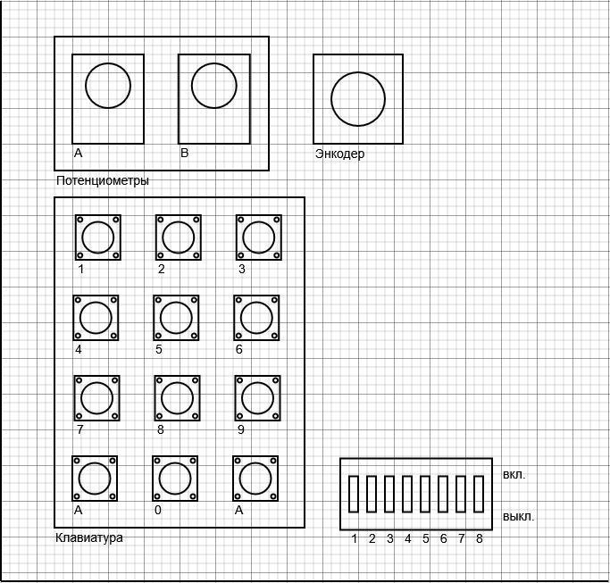

###### Рисунок 4.3 - Возможное расположение компонентов и рекомендуемая схема шелкографии объединенной лабораторной платы

# 5 Безопасность жизнедеятельности

Данный раздел посвящен анализу условий применения платы пользовательского ввода и оценке факторов, которые могут влиять на безопасность при разработке, отладке и эксплуатации макета. Рассматриваются возможные опасные и вредные факторы, а также мероприятия, направленные на снижение риска при работе с лабораторным оборудованием.

## 5.1 Общая характеристика условий применения

Выпускная квалификационная работа посвящена разработке платы пользовательского ввода для лабораторного макета на базе микроконтроллера MIK32 АМУР. Разрабатываемый модуль предназначен для применения в учебной лаборатории при выполнении лабораторных и самостоятельных работ.

Основными пользователями макета являются студенты, работающие с платой под руководством преподавателя. Разработанная плата используется не как промышленное изделие, а как учебное техническое средство. Жизненный цикл разработки включает несколько этапов: анализ требований, проектирование электрической схемы, разработку программного обеспечения, монтаж опытного образца, пайку компонентов, экспериментальную проверку, эксплуатацию в учебной лаборатории, хранение и возможную доработку платы. На этапе проектирования и программирования основная работа выполняется за персональным компьютером с использованием системы автоматизированного проектирования, среды разработки, текстового редактора и технической документации. На этапах изготовления и отладки применяются паяльное оборудование, лабораторные источники питания, отладочная плата с микроконтроллером, мультиметр и осциллограф.

Разрабатываемая плата относится к низковольтным электронным устройствам. Основные рабочие напряжения сигнальных цепей составляют 3,3 В, а аналоговые сигналы, поступающие на входы АЦП, дополнительно ограничиваются до диапазона, допустимого для микроконтроллера. При штатной эксплуатации такие уровни напряжения не представляют самостоятельной опасности поражения электрическим током. Однако плата используется совместно с сетевым оборудованием: персональным компьютером, блоком питания, осциллографом, паяльной станцией и другой лабораторной аппаратурой. Поэтому требования безопасности должны рассматриваться не только для самой платы, но и для всей системы «пользователь — лабораторное оборудование — макет — программное обеспечение».

Особенностью учебного применения является то, что с макетом работают пользователи с разным уровнем подготовки. Студенты могут ошибиться при подключении питания, перепутать линии VCC и GND, подать на вход микроконтроллера недопустимый уровень напряжения, случайно замкнуть соседние контакты щупом осциллографа или неправильно использовать программный пример. Такие ситуации, как правило, не создают прямой угрозы жизни из-за низких рабочих напряжений платы, но могут привести к нагреву элементов, повреждению микроконтроллера, отказу лабораторного оборудования и нарушению учебного процесса. Следовательно, при разработке необходимо обеспечить допустимый уровень риска за счет схемотехнических, программных и организационных мер.

## 5.2 Идентификация опасных и вредных факторов

Идентификация опасных и вредных факторов выполняется с учетом классификации, приведенной в ГОСТ 12.0.003–2015 [26]. Для данной разработки наиболее значимыми являются физические, химические и психофизиологические факторы. Биологические факторы для рассматриваемого макета не являются существенными, так как работа не связана с биологическими материалами, микроорганизмами или источниками биологического воздействия.

К физическим факторам относятся опасность поражения электрическим током при использовании сетевого оборудования, возможность короткого замыкания в низковольтных цепях, нагрев элементов при ошибочном подключении, воздействие высокой температуры при пайке, недостаточная освещенность рабочего места, электромагнитные помехи и вероятность механического повреждения элементов платы. Несмотря на то что сама плата работает с напряжением 3,3 В, лабораторный комплекс включает устройства, подключаемые к сети 220 В. Поэтому неисправность блока питания, паяльной станции, компьютера или измерительного прибора может привести к появлению опасного напряжения на доступных частях оборудования.

Отдельный риск связан с ошибками коммутации. На этапе отладки плата подключается к отладочной плате проводами-перемычками. При большом количестве сигнальных линий возможно неверное соединение контактов, подача питания обратной полярности, замыкание питания на землю, соединение выхода одного устройства с выходом другого устройства или подача на вход MIK32 сигнала с недопустимым уровнем. Для цифровых входов микроконтроллера допустимыми являются уровни, согласованные с питанием 3,3 В; подача уровня 5 В на входы не допускается. Для аналоговых входов опасность отказа дополнительно связана с превышением допустимого диапазона АЦП. Поэтому в схеме потенциометров используется делитель напряжения, ограничивающий максимальное напряжение на входе микроконтроллера примерно до 1,1 В.

При монтаже платы появляется фактор повышенной температуры. Жало паяльника и нагретые выводы компонентов могут вызвать ожог. Кроме того, при пайке выделяются дым и пары флюса, которые относятся к химическим факторам и могут раздражать органы дыхания. В штатной учебной эксплуатации платы химические факторы практически отсутствуют, однако на этапе изготовления и ремонта они должны учитываться.

Пожарная опасность для разрабатываемого макета невелика из-за низкой мощности устройства, но полностью не исключается. Короткое замыкание, длительная перегрузка источника питания, использование неисправного кабеля или оставленная без присмотра паяльная станция могут привести к локальному нагреву, оплавлению изоляции или повреждению печатной платы. Поэтому вопросы пожарной безопасности должны рассматриваться совместно с требованиями к электробезопасности и организации рабочего места.

Психофизиологические факторы связаны с характером труда разработчика и пользователя макета. При проектировании схемы, написании программы и отладке кода работа выполняется преимущественно сидя, с длительным зрительным напряжением и статической нагрузкой на мышцы спины, шеи, плечевого пояса и кистей. При работе с документацией, исходным кодом, осциллограммами и мелкими элементами платы возникает перенапряжение зрительного анализатора. Нервно-эмоциональная нагрузка может проявляться при поиске труднообнаруживаемых ошибок во время выполнения ЛР.

Особое внимание следует уделить программному обеспечению. В работе разработана библиотека lab_input.h, предназначенная для опроса устройств ввода и предоставления пользователю простого программного интерфейса. Ошибки в программной части не создают прямой опасности для человека, поскольку библиотека не управляет силовыми исполнительными механизмами. Однако неправильная настройка GPIO, нарушение периода вызова функции опроса, ошибочная обработка энкодера, отсутствие подавления дребезга или неверное масштабирование значений АЦП могут привести к ложной интерпретации действий пользователя, неверным результатам лабораторной работы и, в отдельных случаях, к конфликту сигналов на выводах микроконтроллера.

## 5.3 Мероприятия по снижению риска

Обеспечение допустимого уровня риска при разработке и использовании платы пользовательского ввода должно основываться на сочетании нормативных, конструктивных, программных и организационных мер. Общие требования к безопасности процессов проектирования, изготовления, испытания и эксплуатации технических средств должны соответствовать ГОСТ 12.3.002–2014 [27]. Идентификация факторов риска выполняется по ГОСТ 12.0.003–2015 [26], а подход к снижению риска должен включать выявление опасности, оценку возможных последствий, выбор мер защиты и контроль их выполнения.

В части электробезопасности необходимо учитывать требования ГОСТ 12.1.019–2017 [28], Правил устройства электроустановок [29], а также общие требования безопасности к электротехническим изделиям по ГОСТ 12.2.007.0–75 [30]. Лабораторные источники питания, измерительные приборы и оборудование для управления и измерений должны соответствовать требованиям ГОСТ IEC 61010-1-2014 «Безопасность электрических контрольно-измерительных приборов и лабораторного оборудования. Часть 1. Общие требования» [31]. Поскольку макет применяется в учебной лаборатории, при организации занятий также следует учитывать требования ГОСТ 12.4.113–82 к учебным лабораторным работам [32].

Сама плата пользовательского ввода должна подключаться только к низковольтным цепям отладочной платы или лабораторного источника питания. Студенты не должны выполнять операции, связанные с доступом к цепям сетевого напряжения. Все сетевые устройства, используемые совместно с макетом, должны иметь исправные корпуса, неповрежденные кабели питания и применяться в соответствии с инструкциями изготовителя. Перед началом работы необходимо проверить отсутствие видимых повреждений платы, разъемов, проводов и измерительных щупов.

Для снижения риска короткого замыкания питание макета следует подавать только после проверки соединений. Перестановку проводов, изменение положения перемычек и подключение измерительных щупов необходимо выполнять при отключенном питании. При лабораторной отладке рекомендуется использовать источник питания с ограничением тока. Это позволяет уменьшить вероятность перегрева дорожек и компонентов при ошибочном соединении цепей питания. Линии питания VCC и GND должны иметь понятную маркировку на схеме и плате, а подключение внешних устройств должно выполняться только после проверки совместимости логических уровней.

В разработанной схеме реализован ряд решений, снижающих вероятность отказа микроконтроллера и ошибок пользователя. Дискретные входы согласованы с логическими уровнями MIK32 и рассчитаны на работу от питания 3,3 В. Контакты разъемов и контактные площадки промаркированы шелкографией. Контакты питания и земли разнесены друг от друга на расстояние не менее 5 мм, чтобы уменьшить вероятность их замыкания щупом осциллографа.

При пайке платы паяльная станция использовалась только на термостойкой поверхности и была установлена штатную подставку для паяльника. Для снижения воздействия паров флюса рабочее место было оборудовано местной вытяжкой. После пайки были удалены остатки флюса, так как загрязнения могут ухудшать изоляционные свойства поверхности платы, затруднять визуальный контроль и повышать вероятность нестабильной работы высокоомных цепей.

Пожарная безопасность должна обеспечиваться в соответствии с ГОСТ 12.1.004–91 [33] и требованиями технического регламента о пожарной безопасности [34]. В учебной лаборатории должны использоваться исправные розетки, кабели и удлинители, соответствующие мощности подключенного оборудования. Запрещается использовать поврежденные провода, перегружать сетевые фильтры и оставлять включенное оборудование без контроля. В помещении должны быть предусмотрены первичные средства пожаротушения, пригодные для электрооборудования, а пользователи должны быть ознакомлены с порядком отключения питания и действиями при возникновении запаха гари, задымления или перегрева элементов.

Организация рабочего места должна снижать статические и зрительные нагрузки. При длительной работе за персональным компьютером и осциллографом следует учитывать требования ГОСТ 12.2.032–78 к рабочему месту при выполнении работ сидя [35], а также эргономические рекомендации ГОСТ Р ИСО 9241-5–2009 и ГОСТ Р ИСО 9241-11–2010 [36; 37]. Монитор должен располагаться на удобном расстоянии, клавиатура, мышь, плата и измерительные приборы должны находиться в зоне досягаемости без необходимости постоянного наклона корпуса. Мелкие монтажные операции следует выполнять при достаточном освещении. При продолжительной работе необходимо делать перерывы, так как утомление повышает вероятность ошибок подключения и неверной интерпретации результатов измерений.

Безопасность ПО является отдельным элементом снижения риска. Разработанная библиотека lab_input.h относится к прикладному программному обеспечению для микроконтроллерной системы. По ГОСТ Р ИСО/МЭК ТО 12182–2002 [38] ее можно отнести к программным средствам микропроцессорного управления малого масштаба предназначенным для учебного применения. Критичность данного ПО является низкой, так как оно не управляет силовыми механизмами и не связано с непосредственной угрозой жизни человека. Тем не менее к нему предъявляются требования по надежности, завершенности и устойчивости к ошибкам пользователя, поскольку неправильная работа библиотеки может привести к ложным срабатываниям, неверным результатам лабораторной работы и повреждению низковольтных цепей при ошибочной настройке выводов.

В программной части реализованы меры, направленные на снижение риска ложного считывания входных сигналов. Для кнопок и переключателей используется программное подавление дребезга, счетчик положения изменяется только при допустимых переходах, соответствующих нормальной квадратурной последовательности. Некорректные переходы, которые могут возникнуть из-за дребезга, пропуска импульсов или слишком быстрого вращения, отбрасываются. Для аналоговых входов после переключения канала АЦП выполняется холостое преобразование, результат которого не используется. Такой прием уменьшает влияние переходного процесса при коммутации каналов.

В учебных примерах следует явно указывать, что изменение низкоуровневых настроек GPIO, SPI и АЦП допускается только после проверки схемы подключения. Перед разработкой ПО были проведены тесты и установлены предельные режимы работы макета: наибольшее время дребезга, наименьшая длительность состояния кнопок и переключателей, максимальная скорость вращения энкодера.

Таким образом, допустимый уровень риска при разработке и эксплуатации платы пользовательского ввода обеспечивается за счет применения низковольтных цепей, согласования уровней сигналов с MIK32, ограничения напряжения на аналоговых входах, использования подтягивающих и защитных резисторов, подавления дребезга, проверки корректности переходов энкодера, организации безопасной пайки, соблюдения требований к лабораторному оборудованию и документирования правил работы с программным обеспечением. В результате разработанный модуль может использоваться в учебной лаборатории при условии соблюдения инструкций по подключению, ограничению токов, отключению питания перед перекоммутацией и регулярной проверки исправности оборудования.

# ЗАКЛЮЧЕНИЕ

В ходе работы были разработаны аппаратные и программные средства пользовательского ввода для лабораторного макета на базе микроконтроллера MIK32 АМУР. Анализ доступных отладочных плат и учебных стендов показал, что существующие решения либо не имеют развитого набора органов управления, либо дороги и ориентированы на другие платформы. Поэтому разработка лабораторного макета и платы пользовательского ввода в частности для MIK32 является обоснованным решением.

В аппаратную часть включены 8 рычажковых переключателей, кнопочная клавиатура 4x3 подключенная через сдвиговый регистр 74HC165, поворотный энкодер KY-040 и два потенциометра.

Разработанная плата выполнена как самостоятельный модуль пользовательского ввода размером примерно 7x9 см. Для работы с ней подготовлена библиотека, которая позволяет использовать плату в учебных программах без повторной настройки низкоуровневой периферии.

Работоспособность решений проверена экспериментально: подтверждено считывание клавиатуры через каскадированные 74HC165, обработка переключателей и кнопок с учетом дребезга, определение направления вращения энкодера и получение аналоговых значений с потенциометров. Цель работы достигнута: получен модуль пользовательского ввода и программные средства для его применения в лабораторном макете MIK32 АМУР. Дальнейшее развитие работы связано с объединенной лабораторной платой, включающей ввод, вывод, питание, перемычки и контрольные контакты для измерений.

# СПИСОК ИСПОЛЬЗОВАННЫХ ИСТОЧНИКОВ

Техническое описание К1948ВК018, К1948ВК015: MIK32 АМУР. Версия 2.2.3. [Электронный ресурс]. — URL: https://docs.mikron.ru/wiki/_attachments/mik32_datasheet_v2_2_3.pdf (дата обращения: 28.04.2026).

Информационный лист MIK32 АМУР. Версия 1.2. [Электронный ресурс]. — URL: https://docs.mikron.ru/wiki/_attachments/Information_AMUR_MIK32_r1_2.pdf (дата обращения: 28.04.2026).

DIP-MIK32: руководство пользователя. Версия 1.4. [Электронный ресурс]. — URL: https://docs.mikron.ru/wiki/_attachments/DIP-MIK32-V4-MANUAL-R1.4.pdf (дата обращения: 11.05.2026).

RISC-V микроконтроллер MIK32 АМУР: страница заказа. [Электронный ресурс]. — URL: https://www.mcu.mikron.ru/mik32-order (дата обращения: 11.05.2026).

Старт-MIK32. [Электронный ресурс]. — URL: https://tellur-el.ru/catalog/razrabotka_i_konstruirovanie_1/otladochnye_platy_1/328685/ (дата обращения: 11.05.2026).

Плата ELBEAR ACE-UNO AC VER Flash 32 Мб. [Электронный ресурс]. — URL: https://arduino54.ru/catalog/platy-mikrokompyutery/arduino/elbear-ace-uno-ac-ver-flash-32-mb/ (дата обращения: 11.05.2026).

RADIANT MIK32: руководство пользователя. [Электронный ресурс]. — URL: https://tellur-el.ru/upload/iblock/683/vf01f8cuoblf7f9xdsvoab582c1hciqu/797126be_fe7e_11ef_b2d6_000c29da4576_3ddd7085_219b_11f0_aed8_0050568bb3a7.pdf (дата обращения: 11.05.2026).

STM32F103C8T6, отладочная плата STM32. [Электронный ресурс]. — URL: https://ampero.ru/stm32f103c8t6-otladochnaya-plata-stm32.html (дата обращения: 11.05.2026).

Arduino Education Student Kit. [Электронный ресурс]. — URL: https://www.pitsco.com/products/arduino-education-student-kit (дата обращения: 11.05.2026).

MIKROE-701, UNI DS6 Development System, полнофункциональная универсальная отладочная плата для изучения МК 7 различных архитектур. [Электронный ресурс]. — URL: https://www.npfatlas.ru/catalog/8349/84083/ (дата обращения: 19.05.2026).

Лабораторный стенд «Программирование микроконтроллеров» ЭЛБ-020.003.03: техническое описание. [Электронный ресурс]. — URL: https://profistend.info/upload/iblock/af8/hr68wuobehwzibgbtikw2khs5ajwbcis/elb_020.003.03.pdf (дата обращения: 28.04.2026).

Буянов М.Ю., Бондаренко П.Н. "РАЗРАБОТКА СРЕДСТВ ПОЛЬЗОВАТЕЛЬСКОГО ВВОДА ДЛЯ ЛАБОРАТОРНОГО МАКЕТА МИКРОКОНТРОЛЛЕРА MIK32 АМУР" // Аллея науки — 2026. — № 5.

2.54 mm DIP Switch Regular Type .[Электронный ресурс]. — URL: https://www.connfly.com/static/upload/file/pdf/DS1040.pdf (дата обращения: 18.05.2026).

KLS7-TS6601 6x6 Tact Switch Series. [Электронный ресурс]. — URL: https://www.klsconnector.com/wp-content/uploads/20180516141731L-KLS7-TS6601.pdf (дата обращения: 18.05.2026).

Lewis J. Arduino Keyboard Matrix Code and Hardware Tutorial [Электронный ресурс]. — URL: https://www.baldengineer.com/arduino-keyboard-matrix-tutorial.html (дата обращения: 11.05.2026).

LCSC. [Электронный ресурс]. — URL: https://www.lcsc.com/search?q=74HC165 (дата обращения: 18.05.2026).

DigiKey. [Электронный ресурс]. — URL: https://www.digikey.com/en/products/filter/logic/shift-registers/712?s=N4IgTCBcDaIIwA4BsBaAjABgGwKxIDkAREAXQF8g (дата обращения: 18.05.2026).

74HC165; 74HCT165: 8-bit parallel-in/serial-out shift register. [Электронный ресурс]. — URL: https://www.nexperia.com/products/analog-logic-ics/logic/flip-flops-latches-registers-counters-dividers/shift-registers/series/74HC165-74HCT165.html (дата обращения: 18.05.2026).

Ganssle J. A Guide to Debouncing. [Электронный ресурс]. — URL: https://www.ganssle.com/item/debouncing-switches-contacts-code.htm (дата обращения: 28.04.2026).

KY-040 Arduino Rotary Encoder User Manual. [Электронный ресурс]. — URL: https://components101.com/sites/default/files/component_datasheet/KY-04-Rotary-Encoder-Datasheet.pdf (дата обращения: 18.05.2026).

KY-040 Rotary Encoder Module. [Электронный ресурс]. — URL: https://www.parallax.com/product/ky-040-rotary-encoder-module/ (дата обращения: 18.05.2026).

Микросхема интегральная К1948ВК018: технические условия АДКБ.431290.418ТУ. [Электронный ресурс]. — URL: https://mikron.ru/upload/iblock/45e/355xt0p7s7r23t5qepfng40q5oyw66nl.pdf (дата обращения: 18.05.2026).

Bourns. PTV09 Series: 9 mm Potentiometer. [Электронный ресурс]. — URL: https://static.chipdip.ru/lib/325/DOC005325862.pdf (дата обращения: 18.05.2026).

Тестирование встроенного АЦП (ADC) на MIK32 AMUR (К1948ВК018) [Электронный ресурс]. — 2024. — URL: https://habr.com/ru/articles/836796/ (дата обращения: 19.05.2026).

Экспоненциальное сглаживание [Электронный ресурс]. URL: http://www.machinelearning.ru/wiki/index.php?title=Экспоненциальное_сглаживание (дата обращения: 01.05.2026).

ГОСТ 12.0.003-2015. Система стандартов безопасности труда. Опасные и вредные производственные факторы. Классификация. — Москва : Стандартинформ, 2016.

ГОСТ 12.3.002-2014. Система стандартов безопасности труда. Процессы производственные. Общие требования безопасности. — Москва : Стандартинформ, 2016.

ГОСТ 12.1.019-2017. Система стандартов безопасности труда. Электробезопасность. Общие требования и номенклатура видов защиты. – Москва : Стандартинформ, 2019.

Правила устройства электроустановок. – 7-е изд., с изм. – Москва : Деан, 2004.

ГОСТ 12.2.007.0–75. Система стандартов безопасности труда. Изделия электротехнические. Общие требования безопасности. — Москва : Стандартинформ, 2008.

ГОСТ 12.2.091–2012. Система стандартов безопасности труда. Безопасность электрического оборудования для измерения, управления и лабораторного применения. Часть 1. Общие требования. — Москва : Стандартинформ, 2014.

ГОСТ 12.4.113–82. Система стандартов безопасности труда. Работы учебные лабораторные. Общие требования безопасности. — Москва : Издательство стандартов, 1983.

ГОСТ 12.1.004–91. Система стандартов безопасности труда. Пожарная безопасность. Общие требования. — Москва : Стандартинформ, 2006.

Федеральный закон № 123-ФЗ. Технический регламент о требованиях пожарной безопасности. — 22 июля 2008 г.

ГОСТ 12.2.032–78. Система стандартов безопасности труда. Рабочее место при выполнении работ сидя. Общие эргономические требования. — Москва : Издательство стандартов, 1981.

ГОСТ Р ИСО 9241-5–2009. Эргономические требования к проведению офисных работ с использованием видеодисплейных терминалов. Часть 5. Требования к расположению рабочей станции и осанке оператора. — Москва : Стандартинформ, 2010.

ГОСТ Р ИСО 9241-11–2010. Эргономические требования к проведению офисных работ с использованием видеодисплейных терминалов. Часть 11. Руководство по обеспечению пригодности использования. — Москва : Стандартинформ, 2011.

ГОСТ Р ИСО/МЭК ТО 12182–2002. Информационная технология. Классификация программных средств. — Москва : ИПК Издательство стандартов, 2002.

# ПРИЛОЖЕНИЕ А

# Код примеров взаимодействия с средствами ввода и работы с библиотекой lab_input.h

```c
/*
* ====================================
* File: main.c
* ====================================
*/
/*
* main.c
* Demo program for the lab_input library. It initializes the input board,
* polls all input devices periodically, and prints their states over UART.
*/
#include "riscv_csr_encoding.h"
#include "scr1_csr_encoding.h"
#include "mcu32_memory_map.h"
#include <power_manager.h>
#include "pad_config.h"
#include <gpio_irq.h>
#include <epic.h>
#include <csr.h>
#include <gpio.h>
#include "lab_input.h"
#include "mik32_hal_spi.h"
#include "mik32_hal_pcc.h"
#include "mik32_hal_gpio.h"
#include "mik32_hal_scr1_timer.h"
#include "uart_lib.h"
#include "xprintf.h"
void xputc(char c) // this function is weak-defined in uart_lib.c and uses uart_0
{
    UART_WriteByte(UART_1, c);
    UART_WaitTransmission(UART_1);
}

void main()
{
    const uint32_t delay_1ms = 32000000 / 1000 / 15;
    uint32_t counter = 0;
    PM->CLK_APB_P_SET = PM_CLOCK_APB_P_GPIO_0_M
        | PM_CLOCK_APB_P_GPIO_1_M
        | PM_CLOCK_APB_P_GPIO_2_M
        | PM_CLOCK_APB_P_GPIO_IRQ_M;
    PM->CLK_APB_M_SET = PM_CLOCK_APB_M_PAD_CONFIG_M
        | PM_CLOCK_APB_M_WU_M
        | PM_CLOCK_APB_M_PM_M
        | PM_CLOCK_APB_M_EPIC_M;
    PM->CLK_AHB_SET |= PM_CLOCK_AHB_SPIFI_M;
    UART_Init(UART_1, (32000000 / 57600), UART_CONTROL1_TE_M | UART_CONTROL1_M_8BIT_M, 0, 0);
    GPIO_0->DIRECTION_OUT = (1 << 10) | (1 << 9);
    GPIO_0->OUTPUT = 0;
    li_init();
    while (1)
    {
        for (volatile int i = 0; i < delay_1ms / 2; i++);
        counter++;
        li_update();
        // blink red LED
        if (counter % 400 == 0) {
            GPIO_0->OUTPUT ^= 1 << 10;
        }
        uint16_t left_pot_mv = li_get_pot_value_mv(Left);
        uint16_t right_pot_mv = li_get_pot_value_mv(Right);
        uint16_t levers_bitmask = li_get_levers_bitmask();
        uint16_t keyboard_bitmask = li_get_keyboard_bitmask();
        char levers_str[9] = {0};
        for (int i = 0; i < 8; i++) {
            levers_str[i] = ((levers_bitmask >> i) & 1) ? '1' : '0';
        }
        char keyboard_str[17] = {0};
        for (int i = 0; i < 16; i++) {
            keyboard_str[i] = ((keyboard_bitmask >> i) & 1) ? '1' : '0';
        }
        int32_t enc_counter = li_get_enc_counter();
        // too slow, causes encoder to miss steps
        if (counter % 200 == 0) {
            xprintf("tick: %d;\tleft pot: %d (mv);\tright pot: %d (mv);\tlevers: %s;\tkeyboard: %s;\tenc: %d \n\r", counter, left_pot_mv, right_pot_mv, levers_str, keyboard_str, enc_counter);
        }
    }
}

/*
* ====================================
* File: encoder_simple_example.c
* ====================================
*/
/*
* encoder_simple_example.c
* Reads a quadrature rotary encoder directly through GPIO pins and prints
* the accumulated position counter over UART.
*/
#include "mcu32_memory_map.h"
#include <power_manager.h>
#include <gpio.h>
#include "uart_lib.h"
#include "xprintf.h"
#define ENC_A_PORT GPIO_0
#define ENC_B_PORT GPIO_0
#define ENC_A_PIN 1
#define ENC_B_PIN 3

void xputc(char c)
{
    UART_WriteByte(UART_1, c);
    UART_WaitTransmission(UART_1);
}

static void delay_ms(uint32_t ms)
{
    const uint32_t delay_1ms = 32000000 / 1000 / 15;
    while (ms--) {
        for (volatile uint32_t i = 0; i < delay_1ms; i++);
    }
}

static void encoder_init(void)
{
    ENC_A_PORT->DIRECTION_IN |= 1 << ENC_A_PIN;
    ENC_B_PORT->DIRECTION_IN |= 1 << ENC_B_PIN;
}

static uint8_t encoder_read_state(void)
{
    uint8_t a = (ENC_A_PORT->STATE >> ENC_A_PIN) & 1;
    uint8_t b = (ENC_B_PORT->STATE >> ENC_B_PIN) & 1;
    return (a << 1) | b;
}

void main(void)
{
    int32_t counter = 0;
    uint8_t previous_state;
    PM->CLK_APB_P_SET = PM_CLOCK_APB_P_GPIO_0_M;
    UART_Init(UART_1, (32000000 / 57600),
        UART_CONTROL1_TE_M | UART_CONTROL1_M_8BIT_M, 0, 0);
    encoder_init();
    previous_state = encoder_read_state();
    while (1) {
        uint8_t current_state = encoder_read_state();
        if (current_state != previous_state) {
            if (((previous_state == 0) && (current_state == 2)) ||
                ((previous_state == 2) && (current_state == 3)) ||
                ((previous_state == 3) && (current_state == 1)) ||
                ((previous_state == 1) && (current_state == 0))) {
                counter++;
            } else if (((previous_state == 0) && (current_state == 1)) ||
                ((previous_state == 1) && (current_state == 3)) ||
                ((previous_state == 3) && (current_state == 2)) ||
                ((previous_state == 2) && (current_state == 0))) {
                counter--;
            }
            previous_state = current_state;
            xprintf("encoder: %d\n\r", counter);
        }
        delay_ms(1);
    }
}

/*
* ====================================
* File: keyboard_bitbang_example.c
* ====================================
*/
/*
* keyboard_bitbang_example.c
* Reads the button keyboard through cascaded 74HC165 shift registers using
* manually toggled GPIO lines instead of the SPI peripheral.
*/
#include "mcu32_memory_map.h"
// Example based on the working project code, but this file was not tested separately.

#include <power_manager.h>
#include "pad_config.h"
#include <gpio.h>
#include "uart_lib.h"
#include "xprintf.h"
#define HC165_DATA_PORT GPIO_1
#define HC165_CLK_PORT GPIO_1
#define HC165_LOAD_PORT GPIO_1
#define HC165_DATA_PIN 0
#define HC165_CLK_PIN 2
#define HC165_LOAD_PIN 6
static const uint8_t button_map[13] = {
    10, // 0
    7, // 1
    6, // 2
    5, // 3
    3, // 4
    2, // 5
    1, // 6
    15, // 7
    0, // 8
    14, // 9
    11, // A
    9, // B
    8 // encoder button
};

void xputc(char c)
{
    UART_WriteByte(UART_1, c);
    UART_WaitTransmission(UART_1);
}

static void delay_ms(uint32_t ms)
{
    const uint32_t delay_1ms = 32000000 / 1000 / 15;
    while (ms--) {
        for (volatile uint32_t i = 0; i < delay_1ms; i++);
    }
}

static void delay_us(uint32_t us)
{
    while (us--) {
        for (volatile uint32_t i = 0; i < 20; i++);
    }
}

static void pin_high(GPIO_TypeDef *port, uint32_t pin)
{
    port->OUTPUT |= 1 << pin;
}

static void pin_low(GPIO_TypeDef *port, uint32_t pin)
{
    port->OUTPUT &= ~(1 << pin);
}

static uint8_t pin_read(GPIO_TypeDef *port, uint32_t pin)
{
    return (port->STATE >> pin) & 1;
}

static void keyboard_init(void)
{
    HC165_DATA_PORT->DIRECTION_IN |= 1 << HC165_DATA_PIN;
    HC165_CLK_PORT->DIRECTION_OUT |= 1 << HC165_CLK_PIN;
    HC165_LOAD_PORT->DIRECTION_OUT |= 1 << HC165_LOAD_PIN;
    pin_low(HC165_CLK_PORT, HC165_CLK_PIN);
    pin_high(HC165_LOAD_PORT, HC165_LOAD_PIN);
}

static uint16_t keyboard_read_raw(void)
{
    uint16_t data = 0;
    pin_low(HC165_LOAD_PORT, HC165_LOAD_PIN);
    delay_us(1);
    pin_high(HC165_LOAD_PORT, HC165_LOAD_PIN);
    delay_us(1);
    for (uint8_t i = 0; i < 16; i++) {
        data |= pin_read(HC165_DATA_PORT, HC165_DATA_PIN) << i;
        pin_high(HC165_CLK_PORT, HC165_CLK_PIN);
        delay_us(1);
        pin_low(HC165_CLK_PORT, HC165_CLK_PIN);
        delay_us(1);
    }
    return data;
}

static uint16_t keyboard_read_buttons(void)
{
    uint16_t raw = keyboard_read_raw();
    uint16_t buttons = 0;
    for (uint8_t i = 0; i < 13; i++) {
        buttons |= ((raw >> button_map[i]) & 1) << i;
    }
    return buttons;
}

void main(void)
{
    PM->CLK_APB_P_SET = PM_CLOCK_APB_P_GPIO_0_M
        | PM_CLOCK_APB_P_GPIO_1_M
        | PM_CLOCK_APB_P_GPIO_2_M;
    PM->CLK_APB_M_SET = PM_CLOCK_APB_M_PAD_CONFIG_M;
    UART_Init(UART_1, (32000000 / 57600),
        UART_CONTROL1_TE_M | UART_CONTROL1_M_8BIT_M, 0, 0);
    keyboard_init();
    while (1) {
        uint16_t buttons = keyboard_read_buttons();
        xprintf("keyboard: 0:%d 1:%d 2:%d 3:%d 4:%d 5:%d 6:%d 7:%d 8:%d 9:%d A:%d B:%d ENC:%d\n\r",
            (buttons >> 0) & 1,
            (buttons >> 1) & 1,
            (buttons >> 2) & 1,
            (buttons >> 3) & 1,
            (buttons >> 4) & 1,
            (buttons >> 5) & 1,
            (buttons >> 6) & 1,
            (buttons >> 7) & 1,
            (buttons >> 8) & 1,
            (buttons >> 9) & 1,
            (buttons >> 10) & 1,
            (buttons >> 11) & 1,
            (buttons >> 12) & 1);
        delay_ms(100);
    }
}

/*
* ====================================
* File: keyboard_simple_example.c
* ====================================
*/
/*
* keyboard_simple_example.c
* Reads the button keyboard through cascaded 74HC165 shift registers using
* SPI1 and prints the decoded button bitmask over UART.
*/
#include "mcu32_memory_map.h"
// Example based on the working project code, but this file was not tested separately.

#include <power_manager.h>
#include "mik32_hal_spi.h"
#include "uart_lib.h"
#include "xprintf.h"
static SPI_HandleTypeDef hspi;
static const uint8_t button_map[13] = {
    10, // 0
    7, // 1
    6, // 2
    5, // 3
    3, // 4
    2, // 5
    1, // 6
    15, // 7
    0, // 8
    14, // 9
    11, // A
    9, // B
    8 // encoder button
};

void xputc(char c)
{
    UART_WriteByte(UART_1, c);
    UART_WaitTransmission(UART_1);
}

static void delay_ms(uint32_t ms)
{
    const uint32_t delay_1ms = 32000000 / 1000 / 15;
    while (ms--) {
        for (volatile uint32_t i = 0; i < delay_1ms; i++);
    }
}

static void keyboard_init(void)
{
    hspi.Instance = SPI_1;
    hspi.Init.SPI_Mode = HAL_SPI_MODE_MASTER;
    hspi.Init.CLKPhase = SPI_PHASE_ON;
    hspi.Init.CLKPolarity = SPI_POLARITY_HIGH;
    hspi.Init.ThresholdTX = 4;
    hspi.Init.BaudRateDiv = SPI_BAUDRATE_DIV256;
    hspi.Init.Decoder = SPI_DECODER_NONE;
    hspi.Init.ManualCS = SPI_MANUALCS_ON;
    hspi.Init.ChipSelect = SPI_CS_2;
    if (HAL_SPI_Init(&hspi) != HAL_OK) {
        while (1);
    }
}

static uint16_t keyboard_read_raw(void)
{
    uint16_t data = 0;
    HAL_SPI_Enable(&hspi);
    HAL_SPI_CS_Disable(&hspi);
    if (HAL_SPI_Exchange(&hspi, (uint8_t *)&data, (uint8_t *)&data,
        2, SPI_TIMEOUT_DEFAULT) != HAL_OK) {
        while (1);
    }
    HAL_SPI_CS_Enable(&hspi, SPI_CS_2);
    HAL_SPI_Disable(&hspi);
    return data;
}

static uint16_t keyboard_read_buttons(void)
{
    uint16_t raw = keyboard_read_raw();
    uint16_t buttons = 0;
    for (uint8_t i = 0; i < 13; i++) {
        buttons |= ((raw >> button_map[i]) & 1) << i;
    }
    return buttons;
}

void main(void)
{
    PM->CLK_APB_P_SET = PM_CLOCK_APB_P_GPIO_0_M
        | PM_CLOCK_APB_P_GPIO_1_M
        | PM_CLOCK_APB_P_GPIO_2_M;
    PM->CLK_APB_M_SET = PM_CLOCK_APB_M_PAD_CONFIG_M;
    UART_Init(UART_1, (32000000 / 57600),
        UART_CONTROL1_TE_M | UART_CONTROL1_M_8BIT_M, 0, 0);
    keyboard_init();
    while (1) {
        uint16_t buttons = keyboard_read_buttons();
        xprintf("keyboard: 0:%d 1:%d 2:%d 3:%d 4:%d 5:%d 6:%d 7:%d 8:%d 9:%d A:%d B:%d ENC:%d\n\r",
            (buttons >> 0) & 1,
            (buttons >> 1) & 1,
            (buttons >> 2) & 1,
            (buttons >> 3) & 1,
            (buttons >> 4) & 1,
            (buttons >> 5) & 1,
            (buttons >> 6) & 1,
            (buttons >> 7) & 1,
            (buttons >> 8) & 1,
            (buttons >> 9) & 1,
            (buttons >> 10) & 1,
            (buttons >> 11) & 1,
            (buttons >> 12) & 1);
        delay_ms(100);
    }
}

/*
* ====================================
* File: keypad_matrix_example.c
* ====================================
*/
/*
* keypad_matrix_example.c
* Scans a directly connected matrix keypad by driving columns one by one and
* reading row states through GPIO inputs.
*/
#include "mcu32_memory_map.h"
// Example based on the working project code, but this file was not tested separately.

#include <power_manager.h>
#include <gpio.h>
#include "uart_lib.h"
#include "xprintf.h"

/*
* Matrix keypad example for the pins used in the diploma text.
*
* Inputs are pulled up to 3.3 V:
* P1.2, P1.0, P1.1, P1.4
*
* Outputs are high by default and are driven low one by one:
* P2.6, P2.7, P1.3, P1.6
*
* With the listed pins this is a 4x4 matrix.
*/
#define MATRIX_ROWS 4
#define MATRIX_COLS 4
static GPIO_TypeDef *const row_ports[MATRIX_ROWS] = {
    GPIO_1, GPIO_1, GPIO_1, GPIO_1
};
static const uint8_t row_pins[MATRIX_ROWS] = {
    2, 0, 1, 4
};
static GPIO_TypeDef *const col_ports[MATRIX_COLS] = {
    GPIO_2, GPIO_2, GPIO_1, GPIO_1
};
static const uint8_t col_pins[MATRIX_COLS] = {
    6, 7, 3, 6
};

void xputc(char c)
{
    UART_WriteByte(UART_1, c);
    UART_WaitTransmission(UART_1);
}

static void delay_ms(uint32_t ms)
{
    const uint32_t delay_1ms = 32000000 / 1000 / 15;
    while (ms--) {
        for (volatile uint32_t i = 0; i < delay_1ms; i++);
    }
}

static void delay_us(uint32_t us)
{
    while (us--) {
        for (volatile uint32_t i = 0; i < 20; i++);
    }
}

static void pin_high(GPIO_TypeDef *port, uint8_t pin)
{
    port->OUTPUT |= 1 << pin;
}

static void pin_low(GPIO_TypeDef *port, uint8_t pin)
{
    port->OUTPUT &= ~(1 << pin);
}

static uint8_t pin_read(GPIO_TypeDef *port, uint8_t pin)
{
    return (port->STATE >> pin) & 1;
}

static void keypad_init(void)
{
    for (uint8_t row = 0; row < MATRIX_ROWS; row++) {
        row_ports[row]->DIRECTION_IN |= 1 << row_pins[row];
    }
    for (uint8_t col = 0; col < MATRIX_COLS; col++) {
        col_ports[col]->DIRECTION_OUT |= 1 << col_pins[col];
        pin_high(col_ports[col], col_pins[col]);
    }
}

static uint16_t keypad_scan(void)
{
    uint16_t keys = 0;
    for (uint8_t col = 0; col < MATRIX_COLS; col++) {
        pin_low(col_ports[col], col_pins[col]);
        delay_us(5);
        for (uint8_t row = 0; row < MATRIX_ROWS; row++) {

            /*
            * Rows are pulled up, so pressed key reads as 0
            * when the selected column is driven low.
            */
            if (!pin_read(row_ports[row], row_pins[row])) {
                keys |= 1 << (col * MATRIX_ROWS + row);
            }
        }
        pin_high(col_ports[col], col_pins[col]);
    }
    return keys;
}

void main(void)
{
    PM->CLK_APB_P_SET = PM_CLOCK_APB_P_GPIO_0_M
        | PM_CLOCK_APB_P_GPIO_1_M
        | PM_CLOCK_APB_P_GPIO_2_M;
    PM->CLK_APB_M_SET = PM_CLOCK_APB_M_PAD_CONFIG_M;
    UART_Init(UART_1, (32000000 / 57600),
        UART_CONTROL1_TE_M | UART_CONTROL1_M_8BIT_M, 0, 0);
    keypad_init();
    while (1) {
        uint16_t keys = keypad_scan();
        xprintf("matrix: %04x\n\r", keys);
        delay_ms(100);
    }
}

/*
* ====================================
* File: levers_simple_example.c
* ====================================
*/
/*
* levers_simple_example.c
* Reads eight lever switches through GPIO inputs with pull-up configuration
* and prints their state bitmask over UART.
*/
#include "mcu32_memory_map.h"
#include <power_manager.h>
#include "pad_config.h"
#include <gpio.h>
#include "uart_lib.h"
#include "xprintf.h"
#define SW1_PORT GPIO_1
#define SW2_PORT GPIO_1
#define SW3_PORT GPIO_1
#define SW4_PORT GPIO_1
#define SW5_PORT GPIO_2
#define SW6_PORT GPIO_2
#define SW7_PORT GPIO_1
#define SW8_PORT GPIO_1
#define SW1_PIN 2
#define SW2_PIN 0
#define SW3_PIN 1
#define SW4_PIN 4
#define SW5_PIN 6
#define SW6_PIN 7
#define SW7_PIN 3
#define SW8_PIN 6

void xputc(char c)
{
    UART_WriteByte(UART_1, c);
    UART_WaitTransmission(UART_1);
}

static void delay_ms(uint32_t ms)
{
    const uint32_t delay_1ms = 32000000 / 1000 / 15;
    while (ms--) {
        for (volatile uint32_t i = 0; i < delay_1ms; i++);
    }
}

static void levers_init(void)
{
    SW1_PORT->DIRECTION_IN |= 1 << SW1_PIN;
    SW2_PORT->DIRECTION_IN |= 1 << SW2_PIN;
    SW3_PORT->DIRECTION_IN |= 1 << SW3_PIN;
    SW4_PORT->DIRECTION_IN |= 1 << SW4_PIN;
    SW5_PORT->DIRECTION_IN |= 1 << SW5_PIN;
    SW6_PORT->DIRECTION_IN |= 1 << SW6_PIN;
    SW7_PORT->DIRECTION_IN |= 1 << SW7_PIN;
    SW8_PORT->DIRECTION_IN |= 1 << SW8_PIN;
    PAD_CONFIG->PORT_1_PUPD |= 1 << (SW1_PIN * 2 + 1);
    PAD_CONFIG->PORT_1_PUPD |= 1 << (SW2_PIN * 2 + 1);
    PAD_CONFIG->PORT_1_PUPD |= 1 << (SW3_PIN * 2 + 1);
    PAD_CONFIG->PORT_1_PUPD |= 1 << (SW4_PIN * 2 + 1);
    PAD_CONFIG->PORT_2_PUPD |= 1 << (SW5_PIN * 2 + 1);
    PAD_CONFIG->PORT_2_PUPD |= 1 << (SW6_PIN * 2 + 1);
    PAD_CONFIG->PORT_1_PUPD |= 1 << (SW7_PIN * 2 + 1);
    PAD_CONFIG->PORT_1_PUPD |= 1 << (SW8_PIN * 2 + 1);
}

static uint8_t levers_read(void)
{
    uint8_t state = 0;
    state |= ((SW1_PORT->STATE >> SW1_PIN) & 1) << 0;
    state |= ((SW2_PORT->STATE >> SW2_PIN) & 1) << 1;
    state |= ((SW3_PORT->STATE >> SW3_PIN) & 1) << 2;
    state |= ((SW4_PORT->STATE >> SW4_PIN) & 1) << 3;
    state |= ((SW5_PORT->STATE >> SW5_PIN) & 1) << 4;
    state |= ((SW6_PORT->STATE >> SW6_PIN) & 1) << 5;
    state |= ((SW7_PORT->STATE >> SW7_PIN) & 1) << 6;
    state |= ((SW8_PORT->STATE >> SW8_PIN) & 1) << 7;
    return state;
}

void main(void)
{
    PM->CLK_APB_P_SET = PM_CLOCK_APB_P_GPIO_0_M
        | PM_CLOCK_APB_P_GPIO_1_M
        | PM_CLOCK_APB_P_GPIO_2_M;
    PM->CLK_APB_M_SET = PM_CLOCK_APB_M_PAD_CONFIG_M;
    UART_Init(UART_1, (32000000 / 57600),
        UART_CONTROL1_TE_M | UART_CONTROL1_M_8BIT_M, 0, 0);
    levers_init();
    while (1) {
        uint8_t levers = levers_read();
        xprintf("levers: %d%d%d%d%d%d%d%d\n\r",
            (levers >> 0) & 1,
            (levers >> 1) & 1,
            (levers >> 2) & 1,
            (levers >> 3) & 1,
            (levers >> 4) & 1,
            (levers >> 5) & 1,
            (levers >> 6) & 1,
            (levers >> 7) & 1);
        delay_ms(100);
    }
}

/*
* ====================================
* File: potentiometers_simple_example.c
* ====================================
*/
/*
* potentiometers_simple_example.c
* Reads two potentiometers through the MIK32 ADC, filters the measurements,
* and prints raw, millivolt, and percentage values over UART.
*/
#include "mcu32_memory_map.h"
#include <power_manager.h>
#include "mik32_hal_adc.h"
#include "mik32_hal_gpio.h"
#include "uart_lib.h"
#include "xprintf.h"
#define POT_LEFT_CHANNEL 1
#define POT_RIGHT_CHANNEL 2
#define ADC_MAX_VALUE 4095
#define ADC_REF_MV 1300
static ADC_HandleTypeDef hadc;

void xputc(char c)
{
    UART_WriteByte(UART_1, c);
    UART_WaitTransmission(UART_1);
}

static void delay_ms(uint32_t ms)
{
    const uint32_t delay_1ms = 32000000 / 1000 / 15;
    while (ms--) {
        for (volatile uint32_t i = 0; i < delay_1ms; i++);
    }
}

static void adc_init(void)
{
    hadc.Instance = ANALOG_REG;
    hadc.Init.Sel = ADC_CHANNEL0;
    hadc.Init.EXTRef = ADC_EXTREF_OFF;
    hadc.Init.EXTClb = ADC_EXTCLB_ADCREF;
    HAL_ADC_Init(&hadc);
}

static uint16_t adc_read_channel(uint8_t channel)
{
    ADC_SEL_CHANNEL(hadc.Instance, channel);
    HAL_ADC_SINGLE(hadc.Instance);
    HAL_ADC_WaitValid(&hadc);
    HAL_ADC_SINGLE(hadc.Instance);
    return HAL_ADC_WaitAndGetValue(&hadc);
}

static uint16_t filter_adc(uint16_t previous, uint16_t current)
{
    return (previous * 7 + current) / 8;
}

static uint16_t adc_to_mv(uint16_t value)
{
    return (uint32_t)value * ADC_REF_MV / (ADC_MAX_VALUE + 1);
}

static uint8_t adc_to_percent(uint16_t value)
{
    return (uint32_t)value * 100 / ADC_MAX_VALUE;
}

void main(void)
{
    uint16_t left_filtered = 0;
    uint16_t right_filtered = 0;
    PM->CLK_APB_P_SET = PM_CLOCK_APB_P_GPIO_0_M
        | PM_CLOCK_APB_P_GPIO_1_M;
    UART_Init(UART_1, (32000000 / 57600),
        UART_CONTROL1_TE_M | UART_CONTROL1_M_8BIT_M, 0, 0);
    adc_init();
    left_filtered = adc_read_channel(POT_LEFT_CHANNEL);
    right_filtered = adc_read_channel(POT_RIGHT_CHANNEL);
    while (1) {
        uint16_t left_raw = adc_read_channel(POT_LEFT_CHANNEL);
        uint16_t right_raw = adc_read_channel(POT_RIGHT_CHANNEL);
        left_filtered = filter_adc(left_filtered, left_raw);
        right_filtered = filter_adc(right_filtered, right_raw);
        xprintf("left: raw=%d, %d mV, %d%%; right: raw=%d, %d mV, %d%%\n\r",
            left_filtered,
            adc_to_mv(left_filtered),
            adc_to_percent(left_filtered),
            right_filtered,
            adc_to_mv(right_filtered),
            adc_to_percent(right_filtered));
        delay_ms(50);
    }
}

void HAL_ADC_MspInit(ADC_HandleTypeDef *hadc)
{
    GPIO_InitTypeDef GPIO_InitStruct = {0};
    __HAL_PCC_ANALOG_REGS_CLK_ENABLE();
    GPIO_InitStruct.Mode = HAL_GPIO_MODE_ANALOG;
    GPIO_InitStruct.Pull = HAL_GPIO_PULL_NONE;
    GPIO_InitStruct.Pin = GPIO_PIN_7;
    HAL_GPIO_Init(GPIO_1, &GPIO_InitStruct);
    GPIO_InitStruct.Pin = GPIO_PIN_2;
    HAL_GPIO_Init(GPIO_0, &GPIO_InitStruct);
}
```

# ПРИЛОЖЕНИЕ Б

# Код библиотеки lab_input.h

```c
/*
* user_input.h
*
*/
#ifndef USER_INPUT_H_

#define USER_INPUT_H_

#include <stdint.h>
#include "mik32_hal_adc.h"
#include "mik32_hal_gpio.h"
#include "mik32_hal_spi.h"
#define LI_SW1_PORT GPIO_1
#define LI_SW2_PORT GPIO_1
#define LI_SW3_PORT GPIO_1
#define LI_SW4_PORT GPIO_1
#define LI_SW5_PORT GPIO_2
#define LI_SW6_PORT GPIO_2
#define LI_SW7_PORT GPIO_1
#define LI_SW8_PORT GPIO_1
#define LI_SW1_PIN 8
#define LI_SW2_PIN 9
#define LI_SW3_PIN 1
#define LI_SW4_PIN 4
#define LI_SW5_PIN 6
#define LI_SW6_PIN 7
#define LI_SW7_PIN 3
#define LI_SW8_PIN 6
#define LI_ENC0_PORT GPIO_0
#define LI_ENC1_PORT GPIO_0
#define LI_ENC0_PIN 8
#define LI_ENC1_PIN 9
#define LI_SPI_CS SPI_CS_1
#define MIK32V2
#define LI_BTN0_BIT
// must be called at 1 kHz
void li_update();
// must be called once
void li_init();

enum LI_ButtonIndexes {
    B_0,
    B_1,
    B_2,
    B_3,
    B_4,
    B_5,
    B_6,
    B_7,
    B_8,
    B_9,
    B_A,
    B_B,
    B_ENC
};
static const uint32_t li_buttons_map[] = {
    10, // B_0
    7, // B_1
    6,
    5,
    3,
    2,
    1,
    15,
    0,
    14,
    11, // B_A
    9, // B_B
    8 // B_ENC TODO value is likely wrong
};
uint8_t li_get_button_state(enum LI_ButtonIndexes button);
static uint32_t li_update_counter = 0;
static uint32_t li_buttons_state_bitmask = 0; // b0, ... b9, bA, bB, bEnc
static uint32_t li_levers_state_bitmask = 0;
static uint32_t li_pot_value_left = 0;
static uint32_t li_pot_value_right = 0;
static int32_t li_enc_counter = 0;
static ADC_HandleTypeDef hadc;
static SPI_HandleTypeDef hspi;

static void li_poll_encoder()
{
    static uint8_t p0 = 0, p1 = 0; // encoder last state
    uint8_t e0 = (LI_ENC0_PORT->STATE >> LI_ENC0_PIN) & 1;
    uint8_t e1 = (LI_ENC1_PORT->STATE >> LI_ENC1_PIN) & 1;
    if (p0 ^ p1 ^ e0 ^ e1) {
        (p1 ^ e0) ? li_enc_counter++ : li_enc_counter--;
        p0 = e0;
        p1 = e1;
    }
}
// https://habr.com/ru/articles/836796/

static void li_poll_potentiometers()
{

    /* Получение значения с разных каналов */
    ADC_SEL_CHANNEL(hadc.Instance, 1); // set ch1 (P1.7)
    HAL_ADC_SINGLE(hadc.Instance); // Первое измерение для переключение на канал 0.
    HAL_ADC_WaitValid(&hadc);
    HAL_ADC_SINGLE_AND_SET_CH(hadc.Instance, 1); // read ch1 (P1.7), then set channel to 2
    li_pot_value_left = HAL_ADC_WaitAndGetValue(&hadc);
    HAL_ADC_SINGLE_AND_SET_CH(hadc.Instance, 2); // read ch2 (P0.2)
    li_pot_value_right = HAL_ADC_WaitAndGetValue(&hadc);
}

uint8_t li_get_button_state(enum LI_ButtonIndexes button)
{
    return (li_buttons_state_bitmask & (1 << button)) ? 1 : 0;
}

static void li_poll_levers()
{
    li_levers_state_bitmask = 0;
    li_levers_state_bitmask |= ((LI_SW1_PORT->STATE >> LI_SW1_PIN) & 1) << 0;
    li_levers_state_bitmask |= ((LI_SW2_PORT->STATE >> LI_SW2_PIN) & 1) << 1;
    li_levers_state_bitmask |= ((LI_SW3_PORT->STATE >> LI_SW3_PIN) & 1) << 2;
    li_levers_state_bitmask |= ((LI_SW4_PORT->STATE >> LI_SW4_PIN) & 1) << 3;
    li_levers_state_bitmask |= ((LI_SW5_PORT->STATE >> LI_SW5_PIN) & 1) << 4;
    li_levers_state_bitmask |= ((LI_SW6_PORT->STATE >> LI_SW6_PIN) & 1) << 5;
    li_levers_state_bitmask |= ((LI_SW7_PORT->STATE >> LI_SW7_PIN) & 1) << 6;
    li_levers_state_bitmask |= ((LI_SW8_PORT->STATE >> LI_SW8_PIN) & 1) << 7;
}

uint32_t li_get_keyboard_bitmask()
{
    return li_buttons_state_bitmask;
}
//// https://habr.com/ru/articles/832228/

static void li_poll_keyboard()
{
    uint16_t data = 0;

    /* Начало передачи в ручном режиме управления CS */
    if (hspi.Init.ManualCS == SPI_MANUALCS_ON)
    {
        HAL_SPI_Enable(&hspi);
        HAL_SPI_CS_Disable(&hspi);
    }

    /* Передача и прием данных */
    HAL_StatusTypeDef SPI_Status = HAL_SPI_Exchange(&hspi, (uint8_t*)&data, (uint8_t*)&data, 2, SPI_TIMEOUT_DEFAULT); // sending data doesnt do anything
    if (SPI_Status != HAL_OK) {
        // ignore error
        while (1);
    }

    /* Конец передачи в ручном режиме управления CS */
    if (hspi.Init.ManualCS == SPI_MANUALCS_ON)
    {
        HAL_SPI_CS_Enable(&hspi, LI_SPI_CS);
        HAL_SPI_Disable(&hspi);
    }
    li_buttons_state_bitmask = 0;
    li_buttons_state_bitmask |= (((data >> li_buttons_map[B_0]) & 1) << B_0);
    li_buttons_state_bitmask |= (((data >> li_buttons_map[B_1]) & 1) << B_1);
    li_buttons_state_bitmask |= (((data >> li_buttons_map[B_2]) & 1) << B_2);
    li_buttons_state_bitmask |= (((data >> li_buttons_map[B_3]) & 1) << B_3);
    li_buttons_state_bitmask |= (((data >> li_buttons_map[B_4]) & 1) << B_4);
    li_buttons_state_bitmask |= (((data >> li_buttons_map[B_5]) & 1) << B_5);
    li_buttons_state_bitmask |= (((data >> li_buttons_map[B_6]) & 1) << B_6);
    li_buttons_state_bitmask |= (((data >> li_buttons_map[B_7]) & 1) << B_7);
    li_buttons_state_bitmask |= (((data >> li_buttons_map[B_8]) & 1) << B_8);
    li_buttons_state_bitmask |= (((data >> li_buttons_map[B_9]) & 1) << B_9);
    li_buttons_state_bitmask |= (((data >> li_buttons_map[B_A]) & 1) << B_A);
    li_buttons_state_bitmask |= (((data >> li_buttons_map[B_B]) & 1) << B_B);
    li_buttons_state_bitmask |= (((data >> li_buttons_map[B_ENC]) & 1) << B_ENC);
}

void li_update()
{
    li_update_counter++;
    // 1 KHz
    li_poll_encoder();
    // 100 Hz
    if (li_update_counter % 10 == 0) {
        li_poll_keyboard();
    }
    // 33 Hz
    if (li_update_counter % 30 == 0) {
        // li_poll_levers();
    }
    if (li_update_counter % 10 == 0) {
        li_poll_potentiometers();
    }
}

void li_init_levers()
{
    LI_SW1_PORT->DIRECTION_IN |= 1 << LI_SW1_PIN;
    LI_SW2_PORT->DIRECTION_IN |= 1 << LI_SW2_PIN;
    LI_SW3_PORT->DIRECTION_IN |= 1 << LI_SW3_PIN;
    LI_SW4_PORT->DIRECTION_IN |= 1 << LI_SW4_PIN;
    LI_SW5_PORT->DIRECTION_IN |= 1 << LI_SW5_PIN;
    LI_SW6_PORT->DIRECTION_IN |= 1 << LI_SW6_PIN;
    LI_SW7_PORT->DIRECTION_IN |= 1 << LI_SW7_PIN;
    LI_SW8_PORT->DIRECTION_IN |= 1 << LI_SW8_PIN;
    PAD_CONFIG->PORT_1_PUPD |= 1 << (LI_SW1_PIN * 2 + 1);
    PAD_CONFIG->PORT_1_PUPD |= 1 << (LI_SW2_PIN * 2 + 1);
    PAD_CONFIG->PORT_1_PUPD |= 1 << (LI_SW3_PIN * 2 + 1);
    PAD_CONFIG->PORT_1_PUPD |= 1 << (LI_SW4_PIN * 2 + 1);
    PAD_CONFIG->PORT_2_PUPD |= 1 << (LI_SW5_PIN * 2 + 1);
    PAD_CONFIG->PORT_2_PUPD |= 1 << (LI_SW6_PIN * 2 + 1);
    PAD_CONFIG->PORT_1_PUPD |= 1 << (LI_SW7_PIN * 2 + 1);
    PAD_CONFIG->PORT_1_PUPD |= 1 << (LI_SW8_PIN * 2 + 1);
}

void li_init()
{
    // TODO pins should not be hardcoded but passed as config struct
    // TODO lever pin are swapped on schematics (1 to 8 instead of 8 to 1)
    // li_init_levers();
    hadc.Instance = ANALOG_REG;
    hadc.Init.Sel = ADC_CHANNEL0;
    hadc.Init.EXTRef = ADC_EXTREF_OFF; /* Выбор источника опорного напряжения: «1» - внешний; «0» - встроенный */
    hadc.Init.EXTClb = ADC_EXTCLB_ADCREF; /* Выбор источника внешнего опорного напряжения: «1» - внешний вывод; «0» - настраиваемый ОИН */
    HAL_ADC_Init(&hadc);
    hspi.Instance = SPI_1;

    /* Режим SPI */
    hspi.Init.SPI_Mode = HAL_SPI_MODE_MASTER;

    /* Настройки */
    hspi.Init.CLKPhase = SPI_PHASE_ON;
    hspi.Init.CLKPolarity = SPI_POLARITY_HIGH;
    hspi.Init.ThresholdTX = 4;

    /* Настройки для ведущего */
    hspi.Init.BaudRateDiv = SPI_BAUDRATE_DIV256;
    hspi.Init.Decoder = SPI_DECODER_NONE;
    hspi.Init.ManualCS = SPI_MANUALCS_ON;
    hspi.Init.ChipSelect = LI_SPI_CS;
    if (HAL_SPI_Init(&hspi) != HAL_OK)
        while (1);
    LI_ENC0_PORT->DIRECTION_IN |= 1 << LI_ENC0_PIN;
    LI_ENC1_PORT->DIRECTION_IN |= 1 << LI_ENC1_PIN;
}

uint32_t li_get_levers_bitmask()
{
    return li_levers_state_bitmask;
}

int32_t li_get_enc_counter()
{
    return li_enc_counter;
}

enum LI_Pot {
    Left = 0,
    Right = 1
};

uint16_t li_get_pot_value_mv(uint8_t pot)
{
    return pot ? (li_pot_value_right * 1300 / 4096) : (li_pot_value_left * 1300 / 4096);
}

void HAL_ADC_MspInit(ADC_HandleTypeDef *hadc)
{
    GPIO_InitTypeDef GPIO_InitStruct = {0};
    __HAL_PCC_ANALOG_REGS_CLK_ENABLE();
    if ((hadc->Init.EXTClb == ADC_EXTCLB_ADCREF) && (hadc->Init.EXTRef == ADC_EXTREF_ON))
    {
#ifdef MIK32V0
        GPIO_InitStruct.Pin = GPIO_PIN_10;
#endif
#ifdef MIK32V2
        GPIO_InitStruct.Pin = GPIO_PIN_11;
#endif
    }
    GPIO_InitStruct.Mode = HAL_GPIO_MODE_ANALOG;
    GPIO_InitStruct.Pull = HAL_GPIO_PULL_NONE;
    HAL_GPIO_Init(GPIO_1, &GPIO_InitStruct);

    /* Настройка выводов АЦП */
    GPIO_InitStruct.Pin = GPIO_PIN_7;
    HAL_GPIO_Init(GPIO_1, &GPIO_InitStruct);
    GPIO_InitStruct.Pin = GPIO_PIN_2;
    HAL_GPIO_Init(GPIO_0, &GPIO_InitStruct);
}
#endif /* USER_INPUT_H_ */
```
