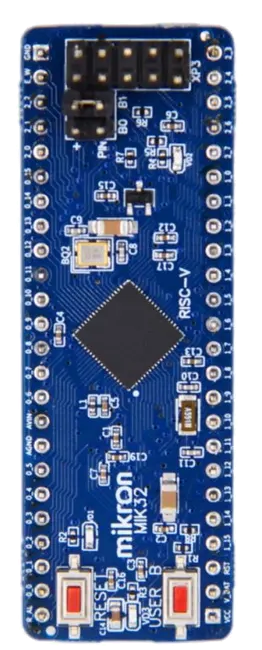
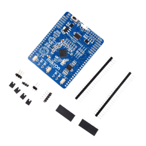
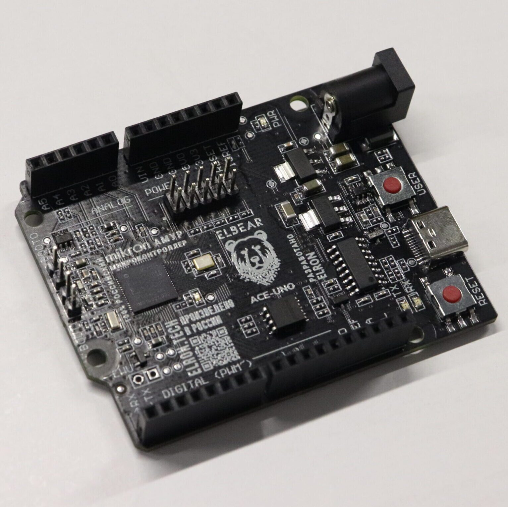
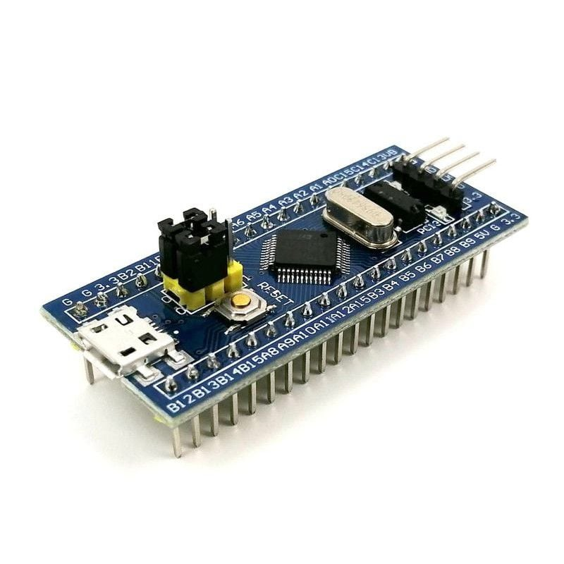
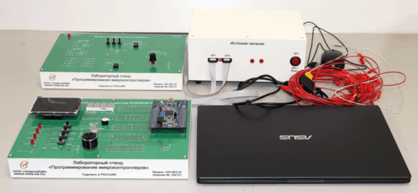
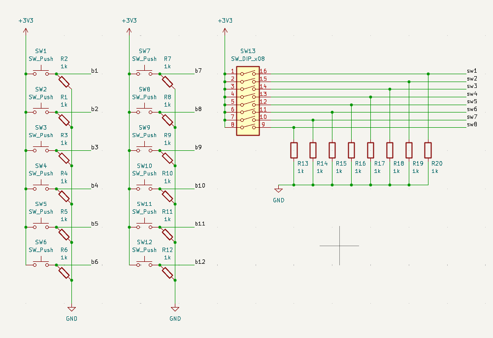
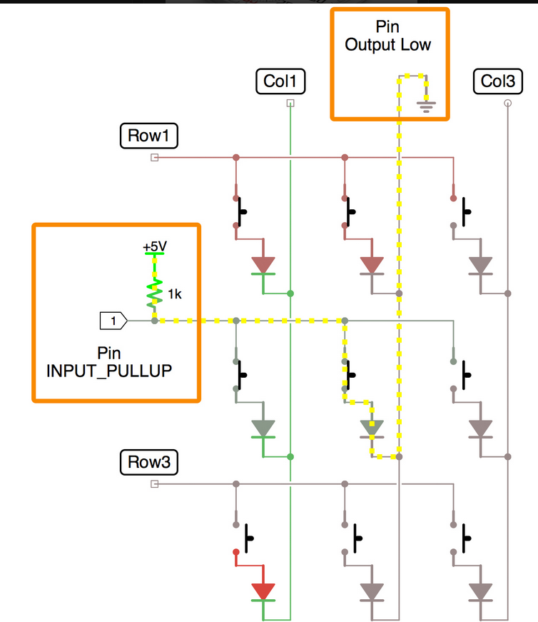
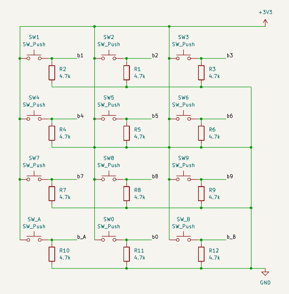
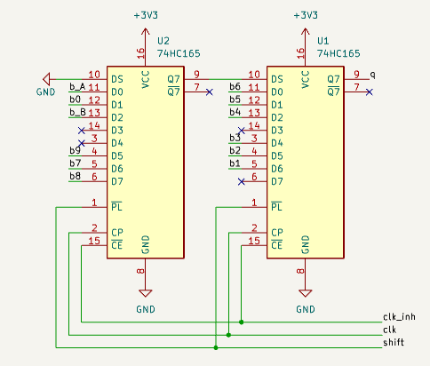
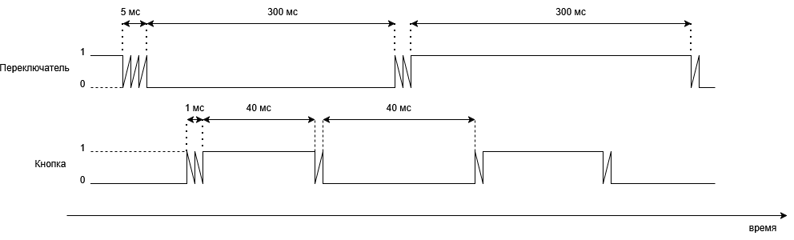

# ВЫПУСКНАЯ КВАЛИФИКАЦИОННАЯ РАБОТА БАКАЛАВРА
### Тема: Средства пользовательского ввода для лабораторного макета микроконтроллера
### Студент: Буянов Михаил Юрьевич

## Введение

Лабораторные макеты микроконтроллеров используются для изучения архитектуры вычислительных устройств и отработки практических навыков разработки встраиваемых систем. Для таких макетов необходимы удобные средства пользовательского ввода: кнопки, переключатели, энкодеры и потенциометры. Они позволяют формировать управляющие воздействия, проверять работу программ, исследовать цифровые интерфейсы и отлаживать обработку внешних событий.

Актуальность работы связана с разработкой компактного модуля ввода для учебного стенда на базе микроконтроллера МИК32 АМУР. Этот микроконтроллер относится к отечественной элементной базе, поэтому его применение в лабораторном макете помогает накапливать практический опыт работы с российскими аппаратными платформами, средствами разработки и периферийными блоками. Такой стенд может использоваться для изучения дискретных и аналоговых входов, сдвиговых регистров, подавления дребезга и программной обработки пользовательских событий.

При разработке модуля важно оптимизировать ресурсы контроллера: число занятых выводов, использование внутренних периферийных устройств и вычислительные затраты на опрос входов. Поэтому в работе сравниваются разные способы подключения кнопок и переключателей, а также оцениваются требования к таймингам, фильтрации дребезга и обработке событий.

Целью выпускной квалификационной работы является разработка средств пользовательского ввода для лабораторного макета микроконтроллера, включающих аппаратную часть, программное обеспечение для опроса устройств ввода и методику проверки работоспособности.

Для достижения поставленной цели необходимо решить следующие задачи:

* определить требования к составу и характеристикам модуля ввода для лабораторного макета;
* сравнить способы подключения клавиатуры 4x3 и дискретных переключателей к микроконтроллеру;
* рассмотреть и проверить способы подавления дребезга механических контактов;
* выбрать элементную базу для подключения кнопок, переключателей, энкодера и аналоговых регуляторов;
* разработать электрическую схему платы пользовательского ввода;
* реализовать программный алгоритм опроса устройств ввода для микроконтроллера МИК32 АМУР;
* провести испытания разработанного решения и оценить его работоспособность.

Объектом исследования являются средства пользовательского ввода в микроконтроллерных системах. Предметом исследования являются аппаратные и программные методы подключения и обработки сигналов от механических и аналоговых устройств ввода в составе лабораторного макета.

В первой главе проводится анализ существующих отладочных плат и лабораторных макетов, формулируется проблема отсутствия доступного учебного макета на базе MIK32 с развитым набором средств пользовательского ввода. Во второй главе рассматриваются кнопки и рычажковые переключатели, включая сравнение вариантов подключения клавиатуры 4x3. В третьей главе рассматриваются поворотные энкодеры и аналоговые ручки вращения. В четвертой главе приводятся вопросы безопасности жизнедеятельности при работе с лабораторным оборудованием.

# Глава 1. Анализ существующих лабораторных макетов и постановка задачи разработки

Данная глава посвящена анализу существующих решений, которые могут использоваться при обучении работе с микроконтроллерами. Основное внимание уделяется тому, насколько доступные отладочные платы и учебные стенды подходят для изучения пользовательского ввода: кнопок, переключателей, клавиатур, энкодеров и аналоговых регуляторов. По результатам анализа формулируется проблема, решаемая в выпускной квалификационной работе: отсутствие доступного и удобного лабораторного макета на базе MIK32 АМУР с развитым набором средств пользовательского ввода.

## 1.1 Роль лабораторного макета в обучении работе с микроконтроллерами

Лабораторный макет микроконтроллерной системы предназначен не только для запуска демонстрационных программ, но и для формирования практических навыков разработки встроенных устройств. При работе с таким макетом обучающийся должен иметь возможность настраивать порты ввода-вывода, обрабатывать внешние события, использовать прерывания, таймеры, аналого-цифровой преобразователь и интерфейсы обмена. Поэтому учебная плата должна предоставлять не только сам микроконтроллер и разъемы расширения, но и набор физических органов управления, с которыми можно выполнять лабораторные задания.

Средства пользовательского ввода являются важной частью учебного макета, так как они позволяют сформировать понятную связь между действием пользователя, электрическим сигналом и программной реакцией микроконтроллера. Например, нажатие кнопки может использоваться для изучения дискретного входа и подавления дребезга контактов, переключатель - для задания режима работы программы, энкодер - для обработки импульсных сигналов и определения направления вращения, а потенциометр - для работы с АЦП и фильтрации аналоговых измерений.

Если на плате отсутствуют встроенные органы ввода, студент вынужден каждый раз собирать внешнюю схему на макетной плате. Такой подход полезен при изучении схемотехники, но он увеличивает время подготовки лабораторной работы, повышает вероятность ошибок подключения и затрудняет массовое использование макета в учебной аудитории. Поэтому для лабораторного стенда важно иметь готовый, повторяемый и надежный модуль пользовательского ввода.

## 1.2 Особенности MIK32 АМУР как основы учебного макета

В данной работе в качестве целевой аппаратной платформы рассматривается микроконтроллер MIK32 АМУР. Согласно техническому описанию, MIK32 АМУР является 32-разрядным микроконтроллером на архитектуре RISC-V [8]. Использование такого микроконтроллера в учебном макете представляет интерес по нескольким причинам. Во-первых, он относится к отечественной элементной базе, что делает его актуальным для образовательных и прикладных проектов, ориентированных на российские аппаратные решения. Во-вторых, архитектура RISC-V является открытой и широко применяется в современных встраиваемых системах. В-третьих, наличие цифровых и аналоговых периферийных блоков позволяет строить на его основе полноценные лабораторные задания.

На базе MIK32 можно выполнять лабораторные работы, связанные как с дискретным, так и с аналоговым вводом. Кнопки, клавиатуры и переключатели позволяют изучать работу GPIO, внешних прерываний и программной фильтрации дребезга. Потенциометры дают возможность исследовать работу АЦП и обработку плавно изменяющихся величин. Поворотный энкодер позволяет рассмотреть обработку импульсных сигналов, определение направления вращения и измерение временных интервалов с использованием таймеров. Таким образом, MIK32 подходит для построения учебного макета, однако сам микроконтроллер не решает задачу удобного пользовательского ввода без соответствующей внешней аппаратной части.

## 1.3 Обзор доступных отладочных плат на базе MIK32

На момент выполнения работы доступны несколько отладочных плат и модулей на базе MIK32. Они позволяют познакомиться с микроконтроллером, загрузить программу и подключить внешние устройства, однако их возможности с точки зрения готового пользовательского ввода ограничены.

DIP-MIK32 представляет собой компактный модуль с микроконтроллером MIK32, разъемами и минимальной необходимой обвязкой [14]. Такое исполнение удобно для прототипирования и установки на макетную плату. Однако развитых средств пользовательского ввода на нем нет: для выполнения лабораторных работ с кнопками, переключателями, клавиатурой, энкодером или потенциометрами требуется собирать дополнительную схему. Стоимость DIP-MIK32 на странице заказа Микрона составляет 5 500 руб. [15], что приемлемо для отдельной отладочной платы, но не включает полноценный учебный интерфейс.

_рис.1. Отладочная плата DIP-MIK32._

Плата СТАРТ-MIK32 является более готовым решением для запуска программ, так как содержит внешнюю flash-память и программатор [15, 16]. Это облегчает первое знакомство с микроконтроллером и снижает порог входа при отладке программ. Тем не менее, с точки зрения лабораторных работ по пользовательскому вводу ее возможности также ограничены. Встроенный набор органов управления не позволяет полноценно изучать разные варианты подключения кнопок, тумблеров, матричной клавиатуры, энкодера и аналоговых регуляторов. Стоимость платы на странице заказа составляет 7 500 руб. [15].

_рис.2. Отладочная плата СТАРТ-MIK32._

Плата ELBEAR ACE-UNO выполнена в форм-факторе, близком к Arduino UNO, и может использоваться с Arduino-совместимыми модулями расширения [17]. Это делает ее удобной для экспериментов, так как многие периферийные устройства можно подключать через стандартные разъемы. Однако встроенных средств ввода на самой плате немного: пользовательская кнопка и светодиод не заменяют лабораторный набор из клавиатуры, переключателей, энкодера и аналоговых ручек. Стоимость платы в Arduino54 составляет 8 400 руб. [17].

_рис.3. Плата ELBEAR ACE-UNO на базе MIK32 АМУР._

Плата RADIANT MIK32 также ориентирована на разработку и эксперименты с MIK32. В ее руководстве указаны пользовательские кнопки, светодиоды, Arduino UNO-совместимый разъем и выводы GPIO [18]. Это решение ближе к учебной отладочной плате, чем минимальные модули, однако и оно не содержит развитого набора органов управления. Для большинства лабораторных работ по пользовательскому вводу все равно потребуется отдельный модуль или внешняя макетная сборка.

Следовательно, доступные платы на базе MIK32 решают задачу запуска и отладки программ, но не закрывают задачу готового лабораторного макета пользовательского ввода. Они предоставляют микроконтроллер и интерфейсы подключения, однако набор встроенных органов управления слишком мал для системного изучения дискретного, импульсного и аналогового ввода.

## 1.4 Сравнение с платами на других микроконтроллерах

Для оценки ситуации полезно сравнить платы MIK32 с распространенными решениями на других микроконтроллерах. Такие платы широко используются в обучении и прототипировании, поэтому они позволяют понять, какие подходы уже применяются в учебной практике.

Одним из самых дешевых решений является STM32F103C8T6 Blue Pill. Эта плата имеет большое количество выведенных контактов ввода-вывода и низкую стоимость: на странице магазина Амперо указана цена 249-299 руб. [19]. При этом встроенных средств пользовательского ввода на плате практически нет. Она хорошо подходит для недорогого прототипирования, но не является самостоятельным лабораторным стендом: кнопки, переключатели, потенциометры и другие элементы необходимо подключать отдельно.

_рис.4. Отладочная плата STM32F103C8T6 Blue Pill._

Платы семейства STM32 Nucleo являются более промышленно оформленными отладочными средствами. Например, NUCLEO-F401RE содержит микроконтроллер STM32F401RE, встроенный отладчик-программатор и Arduino-совместимые разъемы расширения [20]. Однако штатный пользовательский ввод на такой плате также минимален: обычно это одна пользовательская кнопка, кнопка сброса и один пользовательский светодиод. Для изучения сложных вариантов ввода, таких как клавиатура, набор тумблеров или энкодер, требуются дополнительные модули.

Еще одним примером является TI EK-TM4C123GXL LaunchPad. Эта плата построена на микроконтроллере TM4C123GH6PM и содержит встроенный отладчик, пользовательские кнопки и RGB-светодиод [21]. По сравнению с минимальными платами она лучше подходит для начальных лабораторных работ, однако набор средств ввода остается ограниченным. Плата позволяет изучать отдельные события от кнопок, но не заменяет специализированный учебный макет с большим числом органов управления.

Более удачным примером с точки зрения учебной комплектации является Arduino Student Kit. В него входит плата Arduino UNO, макетная плата, кнопки, потенциометры и другие компоненты для выполнения учебных заданий [22]. Такой комплект показывает, что для обучения важно иметь не только микроконтроллерную плату, но и готовый набор периферийных элементов. Однако данный комплект построен на другой аппаратной платформе и не решает задачу подготовки лабораторного макета на базе MIK32.

_рис.5. Набор Arduino Student Kit._

## 1.5 Сравнение с готовыми учебными лабораторными стендами

Отдельную группу решений составляют профессиональные учебные стенды для изучения микроконтроллеров. В отличие от обычных отладочных плат, такие стенды часто содержат набор тумблеров, кнопок, индикаторов, аналоговых задатчиков, разъемов, клемм и методических материалов. Например, лабораторный стенд ЭЛБ-020.003.01 предназначен для изучения программирования микроконтроллеров и содержит элементы, необходимые для выполнения учебных работ [6].

_рис.6. Лабораторный стенд «Программирование микроконтроллеров» ЭЛБ-020.003.03._

Преимущество таких стендов заключается в их завершенности. Студент работает с готовым оборудованием, где органы управления, индикация и измерительные точки уже размещены на панели и согласованы с учебной методикой. Это снижает количество ошибок подключения и делает лабораторные занятия более повторяемыми.

Основным недостатком готовых стендов является высокая стоимость и ориентация на конкретную учебную платформу. Например, цена стенда ЭЛБ-020.003.03 на странице поставщика составляет 392 824 руб. [23]. Такая стоимость существенно превышает стоимость большинства отладочных плат и делает стенд труднодоступным для небольших лабораторий, индивидуальной разработки и тиражирования в учебных группах. Кроме того, подобные стенды обычно ориентированы на другие микроконтроллеры, например AVR или STM32, и не предназначены для работы с MIK32.

Таким образом, между дешевыми отладочными платами и дорогими профессиональными стендами существует заметный разрыв. Отладочные платы доступны, но имеют мало встроенных органов ввода. Готовые стенды функциональны, но дороги и не ориентированы на MIK32. Это подтверждает необходимость разработки отдельного доступного модуля пользовательского ввода для лабораторного макета на базе MIK32.

## 1.6 Сравнительный анализ решений

Сводное сравнение рассмотренных решений приведено в таблице 1.1. В таблице указаны контроллеры, состав средств ввода, ориентировочная стоимость и вывод о применимости решения для задач данной работы. Стоимость приведена по открытым источникам на дату обращения и используется как ориентир для сравнения классов устройств.

Таблица 1.1 - Сравнение отладочных плат и лабораторных макетов

| Решение | Контроллер | Средства ввода на плате/в комплекте | Ориентировочная стоимость | Вывод для работы |
| --- | --- | --- | --- | --- |
| DIP-MIK32 | MIK32 АМУР | Выводы GPIO, JTAG, светодиоды; развитых органов ввода нет | 5 500 руб. [15] | Требуется внешний модуль ввода |
| СТАРТ-MIK32 | MIK32 АМУР | Минимальная обвязка, программатор, внешняя flash; развитых органов ввода нет | 7 500 руб. [15] | Хороша для старта, но не заменяет лабораторный макет ввода |
| ELBEAR ACE-UNO | MIK32 АМУР | 1 пользовательская кнопка, 1 пользовательский светодиод, Arduino-совместимые разъемы | 8 400 руб. [17] | Ввод ограничен, расширение требует внешних модулей |
| RADIANT MIK32 | MIK32 АМУР | 2 кнопки, 2 светодиода, Arduino UNO-разъем, GPIO на разъемах | Цена зависит от поставщика | Ближе к учебной плате, но средств ввода все еще мало |
| STM32F103C8T6 Blue Pill | STM32F103 | GPIO выведены на разъемы, встроенных органов ввода почти нет | 249-299 руб. [19] | Дешевая плата, но не лабораторный стенд |
| STM32 Nucleo-F401RE | STM32F401RE | 1 пользовательская кнопка, 1 reset, 1 пользовательский светодиод | Цена зависит от поставщика | Удобная отладка, но мало пользовательского ввода |
| TI EK-TM4C123GXL LaunchPad | TM4C123GH6PM | Пользовательские кнопки и RGB-светодиод | Цена зависит от поставщика | Хороший пример платы с другим контроллером, но ввод ограничен |
| Arduino Student Kit | ATmega328P / Arduino UNO | 5 кнопок, 2 потенциометра 10 кОм, ручки потенциометров, макетная плата | $79.75 [22] | Хороший пример учебного комплекта, но не на MIK32 |
| ЭЛБ-020.003.01/03 | AVR | 8 тумблеров, 2 кнопки, аналоговый задатчик 0...5 В, индикация | ЭЛБ-020.003.03: 392 824 руб. [23] | Функционально богатый, но дорогой и не на MIK32 |

Из таблицы видно, что платы на базе MIK32 находятся в ценовом диапазоне, приемлемом для отладочных средств, однако они не содержат развитого набора пользовательского ввода. Платы на других микроконтроллерах демонстрируют ту же особенность: они удобны для программирования и подключения внешних модулей, но штатных кнопок, переключателей и аналоговых органов управления у них мало. Учебные комплекты и профессиональные стенды лучше подходят для лабораторной работы, однако они либо построены на другой аппаратной платформе, либо имеют высокую стоимость.

## 1.7 Постановка задачи разработки

Проведенный анализ показывает, что на рынке отсутствует доступный лабораторный макет на базе MIK32 АМУР, который одновременно удовлетворял бы нескольким требованиям: использовал отечественный микроконтроллер, имел развитый набор средств пользовательского ввода, позволял изучать разные способы подключения и не относился к дорогим профессиональным стендам. Существующие платы на базе MIK32 требуют внешних модулей для выполнения лабораторных работ по пользовательскому вводу, а готовые стенды не ориентированы на MIK32 и имеют высокую стоимость.

В связи с этим в работе ставится задача разработки средств пользовательского ввода для лабораторного макета микроконтроллера MIK32 АМУР. Разрабатываемое решение должно обеспечить подключение достаточного числа дискретных и аналоговых органов управления, быть пригодным для учебного применения и позволять исследовать аппаратные и программные способы обработки входных сигналов.

К разрабатываемому модулю пользовательского ввода предъявляются следующие требования:

1. наличие дискретных органов управления для формирования логических сигналов;
2. наличие клавиатурного блока для изучения матричного или альтернативного подключения кнопок;
3. наличие рычажковых переключателей для задания устойчивых состояний;
4. наличие поворотного энкодера для изучения импульсного ввода и определения направления вращения;
5. наличие аналоговых ручек для работы с АЦП микроконтроллера;
6. экономное использование выводов MIK32;
7. возможность проверки работы модуля в лабораторных условиях;
8. умеренная стоимость и доступность элементной базы.

Дальнейшие главы работы посвящены выбору схемотехнических решений, сравнению способов подключения кнопок и переключателей, обработке сигналов энкодера и аналоговых ручек, а также экспериментальной проверке разработанного модуля.

# Глава 2. Кнопки и рычажковые переключатели

## 2.1 Требования к дискретным устройствам ввода

Дискретные устройства ввода предназначены для формирования логических сигналов, по которым программа микроконтроллера определяет действия пользователя. В разрабатываемом лабораторном макете используются два типа таких устройств: тактовые кнопки для кратковременных команд и рычажковые переключатели для задания устойчивых состояний. Для макета требуется подключить 12 кнопок, которые можно рассматривать как клавиатуру 4x3, и 8 рычажковых переключателей.

Дискретные входы должны быть согласованы с логическими уровнями МИК32 АМУР. Согласно информационному листу микроконтроллера, напряжение питания составляет 3,3 В ±10 % [9], то есть допустимый диапазон питания основного домена составляет 2,97-3,63 В. В проектируемой схеме логический «0» должен формироваться уровнем, близким к GND, а логическая «1» - уровнем, близким к VCC 3,3 В. Подача на входы сигналов уровня 5 В не допускается.

При выборе способа подключения необходимо учитывать временные характеристики пользовательского ввода и минимизировать расход ресурсов контроллера: GPIO, память, процессорное время. 

## 2.2 Подключение клавиатуры 4x3 напрямую к выводам микроконтроллера

Самый простой способ подключения клавиатуры 4x3 заключается в соединении каждой кнопки с отдельным входом микроконтроллера. В этом случае 12 кнопок требуют 12 GPIO. Один контакт кнопки подключается к линии питания, а второй - к входу микроконтроллера. Для формирования низкого уровня в разомкнутом состоянии используются подтягивающие резисторы к земле. Нажатие кнопки формирует на входе логическую «1».

_рис.7. Схема подключения кнопок и рычажков напрямую_

Преимущество прямого подключения заключается в простоте схемы и программы. Состояние каждой кнопки можно считать напрямую из регистра GPIO, а обработка нажатий сводится к сравнению текущего и предыдущего состояния входа. При таком подходе легко поддерживать одновременные нажатия, поскольку каждая кнопка имеет собственный входной канал. Кроме того, прямое подключение позволяет использовать внешние прерывания GPIO для реакции на изменение состояния кнопки без постоянного циклического опроса всех входов. Можно легко добавить аппаратное средство борьбы с дребезгом.

Недостаток прямого подключения состоит в большом расходе выводов микроконтроллера. Только клавиатура 4x3 занимает 12 GPIO, а с учетом 8 рычажковых переключателей суммарно требуется уже 20 цифровых входов, не считая энкодера, аналоговых ручек и других сигналов макета. Для лабораторного стенда выводы микроконтроллера являются одним из наиболее ценных ресурсов. Поэтому прямое подключение удобно для небольшой проверки, но не является оптимальным решением для итоговой платы.

## 2.3 Подключение клавиатуры 4x3 матрицей

Матричное подключение уменьшает число занятых выводов за счет объединения кнопок в строки и столбцы. Для клавиатуры 4x3 требуется 7 линий: 4 строки и 3 столбца. При сканировании программа поочередно активирует строки и считывает состояние столбцов. Если при активной строке на одном из столбцов обнаруживается изменение уровня, программа определяет нажатую кнопку по номеру строки и столбца. Если подключать переключатели, как часть матрицы, то выйдет 4х5 матрица, потребуется 9 GPIO и 20 диодов.

По сравнению с прямым подключением матрица позволяет сэкономить 5 выводов микроконтроллера: вместо 12 GPIO используются 7. Однако такая схема требует более сложного алгоритма опроса. Необходимо последовательно переключать строки, выдерживать время установления уровней и выполнять чтение столбцов для каждой строки. Период полного опроса клавиатуры зависит от числа строк и задержек в алгоритме сканирования. В отличие от прямого подключения, матрица не позволяет просто назначить независимое прерывание на каждую кнопку: прерывание может использоваться только как дополнительный сигнал пробуждения или признак изменения, а определение конкретной кнопки все равно требует сканирования.

Дополнительная проблема матричной клавиатуры возникает при одновременном нажатии нескольких кнопок. В некоторых сочетаниях возможно появление фантомных срабатываний, когда программа определяет нажатой кнопку, которая фактически не нажималась. Для устранения этой проблемы применяют диоды [13], включенные последовательно с кнопками, но это увеличивает количество компонентов и усложняет монтаж. В рассматриваемом макете желательно сохранить возможность корректной обработки нескольких входов и не усложнять схему без необходимости, поэтому матричное подключение является промежуточным вариантом: оно экономит GPIO, но добавляет схемотехнические и программные ограничения.

_рис.8. Схема подключения кнопок матрицей_
TODO нарисовать схему самому, включить рычажки и обозначить, что куда подключено.

## 2.4 Подключение кнопок через сдвиговые регистры 74HC165

Третий вариант заключается в подключении кнопок к параллельным входам сдвигового регистра 74HC165. Эта микросхема считывает несколько параллельных логических сигналов и передает их в микроконтроллер последовательно. Один 74HC165 имеет 8 параллельных входов, поэтому для 12 кнопок достаточно двух микросхем. Оставшиеся входы могут быть использованы для части рычажковых переключателей или зарезервированы для дальнейшего расширения (например для кнопки на ручке энкодера).

При работе с 74HC165 микроконтроллер сначала формирует сигнал загрузки параллельных входов, после чего последовательно считывает биты состояния. Несколько микросхем можно каскадировать: последовательный выход одной микросхемы подключается к последовательному входу следующей, и вся цепочка считывается как один более длинный сдвиговый регистр. Это делает решение хорошо расширяемым: увеличение числа кнопок требует добавления микросхемы, но почти не увеличивает число линий микроконтроллера. Недостатком такого подхода является невозможность получить отдельное прерывание от каждой кнопки без дополнительной логики: микроконтроллер видит не отдельные входы, а последовательный поток данных, поэтому состояние кнопок определяется периодическим считыванием регистра.

TODO добавить сюда части кода для обоих способов и сравнить

Считывание 74HC165 можно выполнить двумя способами. Первый способ - программное управление линиями GPIO, или bit-banging. В этом случае программа вручную формирует тактовые импульсы и считывает бит данных после каждого импульса. Такой подход не требует настройки аппаратного SPI, но расходует процессорное время и делает обмен зависимым от задержек в программе.

Второй способ - подключение 74HC165 к аппаратному интерфейсу SPI. В этом случае тактовый сигнал формируется периферийным блоком SPI, а данные считываются через вход MISO. Дополнительная линия GPIO используется для загрузки параллельного состояния в регистр. Такой вариант уменьшает программную нагрузку, использует стандартную периферию микроконтроллера и позволяет быстро считывать несколько каскадированных микросхем.

TODO не очень понятно написано, надо переписать + добавить резисторы на MISO в схематике и на плате.

TODO провести тест: подключить к той же шине SPI arduino и передавать данные, проверить что все работает ок.

Штатный способ расширения числа входов - каскадирование регистров, при котором последовательный выход QH/Q7 одного регистра подключается к последовательному входу SER/DS следующего; такая возможность прямо указана в описании 74HC165. Если необходимо подключить к той же SPI-шине другие устройства, нужно обеспечить, чтобы в каждый момент времени линию MISO формировало только одно устройство. Это особенно важно для контроллера МИК32, который имеет всего 1 аппаратный SPI. Для обычных SPI-устройств это выполняется сигналом CS, переводящим невыбранное устройство в высокоимпедансное состояние. Для 74HC165 такой функции нет, поэтому возможны несколько решений: подключить выход цепочки 74HC165 к MISO через внешний буфер с третьим состоянием, например 74HC125, использовать отдельную линию MISO/отдельный SPI-интерфейс для регистров или включить последовательный резистор между выходом Q7 последнего 74HC165 и общей линией MISO.

TODO одной картинкой

_рис.9. Схема подключения кнопок через регистр 74HC165_

## 2.5 Сравнение способов подключения клавиатуры 4x3

Для выбора схемы подключения были рассмотрены три варианта: прямое подключение кнопок к GPIO, матричная клавиатура 4x3 и подключение через сдвиговые регистры 74HC165. Основным критерием выбора стало количество занятых выводов микроконтроллера, поскольку GPIO являются наиболее ограниченным ресурсом лабораторного макета.

TODO написать программу для всех 3 варинтов и сравнить память/процессорное время
| Способ подключения | GPIO для 12 кнопок | Дополнительные компоненты | Программная сложность | Прерывания от кнопок | Масштабирование |
| --- | ---: | --- | --- | --- | --- |
| Прямое подключение | 12 | подтягивающие резисторы или внутренние подтяжки | низкая | возможно для каждой кнопки | плохое, каждая новая кнопка требует GPIO |
| Матрица 4x3 | 7 | возможно диоды для корректной обработки одновременных нажатий | средняя | нет независимых прерываний от каждой кнопки, требуется сканирование | среднее |
| 74HC165 через SPI | 2 линии SPI + 1 GPIO загрузки | сдвиговые регистры 74HC165, подтяжки | средняя | нет независимых прерываний от каждой кнопки, требуется считывание регистра | хорошее, добавление входов каскадированием |

При прямом подключении клавиатура 4x3 занимает 12 выводов. Этот вариант имеет минимальную программную сложность и хорошо подходит для проверки отдельных кнопок, но плохо масштабируется. При добавлении 8 рычажковых переключателей расход GPIO становится слишком большим.

Матричное подключение уменьшает число линий до 7, что заметно лучше прямого варианта. Однако матрица требует сканирования строк, усложняет обработку одновременных нажатий и при необходимости надежной поддержки нескольких нажатых кнопок требует установки диодов. Для учебного макета это решение менее удобно, так как часть сложности связана не с исследованием микроконтроллера, а с особенностями самой клавиатурной матрицы.

Подключение через 74HC165 требует минимального числа дополнительных линий микроконтроллера и хорошо расширяется каскадированием микросхем. При использовании SPI для обмена задействуется аппаратная периферия, а программная часть сводится к загрузке состояния входов и чтению одного или нескольких байтов. Однако из-за отсутствия у 74HC165 входа CS и высокоимпедансного состояния выхода его нельзя без учета электрического конфликта подключать к общей линии MISO параллельно с другими устройствами. В выбранной реализации это ограничение учитывается двумя способами: все регистры 74HC165 объединены в одну цепочку, а выход Q7 последнего регистра подключен к MISO через резистор 1 кОм. Это позволяет освободить GPIO для других лабораторных задач, сохранить возможность увеличения числа дискретных входов и использовать общую SPI-шину совместно с другими устройствами.

Таким образом, для итоговой реализации выбран вариант подключения кнопок через сдвиговые регистры 74HC165 с чтением данных по SPI. Такое решение обеспечивает приемлемую сложность схемы, экономит выводы микроконтроллера, хорошо масштабируется и позволяет сравнить работу аппаратного SPI с программным bit-banging в рамках экспериментальной части.

## 2.6 Подключение рычажковых переключателей

Рычажковые переключатели отличаются от кнопок характером использования. Кнопка формирует кратковременное событие, а переключатель задает устойчивое состояние, которое может сохраняться длительное время. Поэтому для переключателей важно не только определить момент изменения положения, но и в любой момент иметь возможность считать их текущее состояние.

В разрабатываемом макете используется 8 рычажковых переключателей. В отличие от кнопок клавиатуры, они подключены напрямую к выводам GPIO микроконтроллера. Такое решение расходует больше выводов, чем подключение через 74HC165, но сохраняет важное преимущество: каждый переключатель остается независимым входом микроконтроллера, для которого можно использовать прерывание по изменению уровня. Это позволяет исследовать не только циклический опрос входов, но и событийную обработку внешних сигналов. Также чтение состояния переключателя напрямую будет полезно для более простых лабораторных работ.

При прямом подключении один контакт переключателя соединяется с линией питания, а второй подключается к входу микроконтроллера. Для формирования низкого уровня в одном из положений используется подтяжка к земле. Подтяжка реализована внешним резистором для каждого переключателя.

Возможным альтернативным вариантом было подключение переключателей к входам сдвиговых регистров 74HC165 вместе с кнопками. Это позволило бы дополнительно сократить число используемых GPIO, однако в таком случае микроконтроллер получал бы состояние переключателей только при очередном считывании регистра. Отдельные прерывания от каждого переключателя были бы недоступны без дополнительной логики. Поскольку одна из целей макета состоит в демонстрации разных способов работы с дискретными входами, прямое подключение переключателей является более полезным с учебной точки зрения.

При изменении положения его контакты также подвержены дребезгу. Поскольку переключатели подключены напрямую ко входам контроллера, имеет смысл добавить аппаратную защиту от дребезга.

## 2.7 Временные параметры опроса кнопок и переключателей

Для оценки минимальной длительности нажатия была проведена серия из 10 тестов быстрого нажатия кнопки. По результатам измерений наименьшая продолжительность уверенного нажатия составила около 40 мс. Кроме того, при быстром повторном нажатии пользователь способен формировать события с частотой до 10 Гц, что соответствует периоду около 100 мс между соседними нажатиями. Эти значения рассматриваются как предельные условия работы, полученные при намеренно быстром нажатии, ударам по кнопке, при обычной эксплуатации лабораторного макета такие режимы, как правило, достигаться не будут.

_рис.10. Один из тестов быстрого нажатия кнопки. Кнопка подключена к первому каналу осциллографа._

Длительность дребезга кнопки, использованной в макете ни разу не привысила 1 мс, и как правило состаляла около 50 мкс, на рисунке нижу осцилограмма дребезга данной модели кнопки. Для рычажковых переключателей длительность дребезга не превысила 10 мс.

_рис.11. Один из тестов длительности дребезга кнопки. Кнопка подключена ко второму каналу осциллографа._

_рис.12. Временные характеристики нажатия кнопки и переключателя: максимальная длительность дребезга, минимальная продолжительность состояний "0" и "1"._

На основании этих измерений система опроса должна иметь запас и надежно регистрировать нажатия длительностью не менее 40 мс, а также корректно обрабатывать повторные нажатия с частотой до 10 Гц. Алгоритм обработки должен определять текущее состояние и его смену, подавлять дребезг контактов и сохранять возможность обработки нескольких входов в пределах одного цикла опроса. Для переключателей максимальная частота переключения составляет около 2 Гц и длительность одного состояния около 300 мс.

Период опроса должен быть выбран так, чтобы программа успевала обнаруживать самые быстрые действия пользователя и при этом не тратила лишние вычислительные ресурсы. По результатам проведенных тестов минимальная длительность уверенного нажатия кнопки составила около 40 мс, а предельная частота повторных нажатий - до 10 Гц. Следовательно, система должна иметь запас по времени и выполнять опрос заметно чаще, чем один раз за 40 мс.

Если использовать программную фильтрацию с ориентировочным временем подтверждения 10-20 мс, период опроса должен быть меньше этого интервала. Практически удобным является опрос с периодом порядка 1-5 мс: за время дребезга программа получает несколько последовательных измерений и может подтвердить устойчивое состояние без заметной для пользователя задержки. При этом итоговая задержка реакции складывается из периода опроса и выбранного времени фильтрации. 

Для лабораторного макета важно сохранить компромисс между надежностью и отзывчивостью. Слишком малое время фильтрации может пропускать дребезг и приводить к ложным срабатываниям, а слишком большое - ухудшать реакцию на быстрые нажатия. Поэтому предварительно допустимым диапазоном фильтрации можно считать 10-20 мс, а окончательное значение должно быть выбрано после измерения дребезга конкретных кнопок и переключателей.

## 2.8 Дребезг контактов кнопок и переключателей

Механические кнопки и рычажковые переключатели не формируют идеальный одиночный переход между логическими уровнями. При замыкании и размыкании контактов возникает дребезг: в течение короткого времени вход микроконтроллера может несколько раз переключаться между «0» и «1». Если не учитывать этот эффект, одно нажатие кнопки может быть ошибочно обработано как несколько нажатий, а изменение положения переключателя - как серия быстрых переключений. В предыдущем пункте были получены значения длительности дребезга: для кнопки  до 1 мс, для рычажковых переключателей до 5 мс.

В работе были рассмотрены и проверены три варианта защиты от дребезга: специализированная микросхема MC14490, RC-фильтр и программная фильтрация. Эти варианты отличаются числом дополнительных компонентов, задержкой, стоимостью и влиянием на программную часть.

MC14490 является специализированной микросхемой подавления дребезга. Она удобна тем, что не требует отдельной программной обработки и не занимает дополнительные выводы микроконтроллера для каждого канала. Одна микросхема содержит 6 каналов, поэтому для 8 переключателей потребовались бы две микросхемы, а для переключателей и кнопок 4 микросхемы.
Рассмотрим способ подключения и проведем тесты работы микросхемы.

RC-фильтр является простым аппаратным способом сглаживания дребезга. Он дешев и может быть собран из распространенных компонентов, однако для большого количества входов требует значительного числа элементов. Для каждого канала необходимы как минимум резистивно-емкостная цепь и желательно формирователь с четким порогом переключения, например вход с триггером Шмитта. На печатной плате такое решение может быть приемлемым, но при макетировании оно усложняет монтаж и увеличивает вероятность ошибок соединения.

Программная фильтрация не требует дополнительных компонентов и позволяет изменять параметры подавления дребезга без переделки схемы. Суть метода состоит в том, что изменение состояния входа принимается не сразу, а только после того, как новое значение сохраняется в течение заданного времени или подтверждается несколькими последовательными измерениями. Такой подход хорошо подходит для кнопок, подключенных через 74HC165, поскольку их состояние в любом случае считывается периодически. Для рычажковых переключателей, подключенных напрямую к GPIO, программная фильтрация также применима: прерывание может фиксировать факт изменения входа, а окончательное состояние подтверждается после небольшой задержки или серии повторных чтений.

По результатам проверки для макета выбрана программная защита от дребезга. Она не увеличивает стоимость и сложность платы, не требует дополнительных микросхем и позволяет подобрать время фильтрации с учетом измеренных условий работы. Такой вариант особенно удобен для лабораторного макета, где важно иметь возможность изменять алгоритм обработки и сравнивать разные параметры фильтрации программно.

## 2.9 Программная обработка кнопок и переключателей

Программная обработка дискретных входов выполняется в несколько этапов. Сначала микроконтроллер получает сырые состояния входов: для кнопок они считываются из цепочки 74HC165 по SPI, а для рычажковых переключателей - непосредственно из регистров GPIO. Затем программа сравнивает новое состояние с предыдущим и определяет события: нажатие, отпускание или изменение положения переключателя.

Для защиты от дребезга используется программная фильтрация по времени. При первом обнаружении изменения входа программа не принимает его немедленно, а запускает проверку стабильности. Новое состояние считается действительным только после того, как оно сохраняется без изменений в течение заданного интервала. Такой алгоритм позволяет отделить реальное действие пользователя от кратковременных колебаний контактов.

В качестве предварительного ориентира для выбора времени фильтрации можно использовать опубликованные измерения дребезга механических переключателей. В серии экспериментов Джека Ганссла большинство исследованных переключателей имели дребезг менее 6,2 мс, среднее значение без учета двух выбросов составило около 1,6 мс, но один из переключателей показал выброс до 157 мс при размыкании контакта ([Ganssle, A Guide to Debouncing](https://www.ganssle.com/item/debouncing-switches-contacts-code.htm)). В практических рекомендациях DigiKey также приводится среднее значение около 1,6 мс и максимум 6,2 мс по измерениям Ганссла, а для консервативной фильтрации упоминается задержка порядка 20 мс ([DigiKey, Hardware Switch Debounce](https://www.digikey.com/en/articles/how-to-implement-hardware-debounce-for-switches-and-relays)). Эти значения используются как временная оценка; для итоговой версии параметры фильтрации должны быть заменены результатами измерений конкретных кнопок и переключателей макета.

Для кнопок, подключенных через 74HC165, фильтрация естественно совмещается с периодическим опросом регистров. Для каждого входа хранится сырое состояние, подтвержденное состояние и время последнего изменения. Для рычажковых переключателей, подключенных напрямую к GPIO, возможны два режима: периодический опрос или прерывание по изменению уровня с последующей программной проверкой состояния после интервала подавления дребезга.

## 2.10 Экспериментальная проверка кнопок и переключателей

План раздела:

* проверка правильности электрического подключения;
* проверка работы клавиатуры 4x3 выбранным способом;
* измерение дребезга без фильтрации;
* проверка аппаратного и программного подавления дребезга;
* сравнение скорости считывания 74HC165 через bit-banging и SPI;
* анализ полученных результатов и выводы по главе.

# Глава 3. Энкодер и аналоговые ручки вращения

## 3.1 Назначение поворотных органов управления

План раздела:

* применение энкодера в лабораторном макете;
* применение потенциометров как аналоговых ручек вращения;
* различие между относительным и абсолютным вводом;
* требования к удобству работы пользователя;
* требования к точности и скорости обработки.

## 3.2 Подключение поворотного энкодера

План раздела:

* устройство механического квадратурного энкодера;
* сигналы каналов A и B;
* подключение каналов энкодера к цифровым входам;
* использование подтягивающих резисторов;
* подключение кнопки энкодера при ее наличии;
* требования к электрической схеме и защите входов.

## 3.3 Алгоритм обработки энкодера

План раздела:

* чтение квадратурных сигналов;
* определение направления вращения;
* подсчет шагов;
* обработка пропусков и некорректных переходов;
* влияние периода опроса на максимальную скорость вращения;
* формирование событий вращения для прикладной программы.

## 3.4 Дребезг и фильтрация сигналов энкодера

План раздела:

* отличие дребезга энкодера от дребезга одиночной кнопки;
* влияние фильтрации на потерю быстрых импульсов;
* аппаратная фильтрация каналов энкодера;
* программная фильтрация переходов;
* подбор параметров фильтрации по осциллограммам;
* проверка работы энкодера на максимальной скорости вращения.

## 3.5 Подключение аналоговых ручек вращения

План раздела:

* использование потенциометров как источников аналогового напряжения;
* выбор номинала потенциометра;
* согласование диапазона напряжений с входом АЦП МИК32 АМУР;
* ограничение диапазона, например от 0 В до 1,1 В;
* защита аналогового входа;
* требования к разводке и устойчивости измерений.

## 3.6 Программная обработка аналоговых значений

План раздела:

* настройка АЦП;
* периодическое считывание значений потенциометров;
* масштабирование результата в удобный диапазон;
* подавление шумов измерения;
* обнаружение значимого изменения положения ручки;
* передача аналогового значения в прикладную программу.

## 3.7 Экспериментальная проверка энкодера и аналоговых ручек

План раздела:

* проверка правильности подключения энкодера;
* измерение максимальной частоты сигналов каналов энкодера;
* проверка устойчивости определения направления вращения;
* проверка влияния фильтра на быстрые вращения;
* проверка диапазона и стабильности показаний потенциометров;
* анализ результатов и выводы по главе.

# Глава 4. Безопасность жизнедеятельности

## 4.1 Анализ условий работы с лабораторным макетом

План раздела:

* описание рабочего места;
* используемое электрическое оборудование;
* возможные опасные и вредные факторы;
* особенности работы с макетными платами и измерительными приборами.

## 4.2 Электробезопасность при работе с низковольтными устройствами

План раздела:

* уровни напряжений в разрабатываемом устройстве;
* меры защиты от короткого замыкания;
* требования к подключению питания;
* правила безопасного подключения и отключения макета.

## 4.3 Организация рабочего места при пайке и отладке

План раздела:

* требования к освещению и вентиляции;
* безопасная работа с паяльным оборудованием;
* хранение компонентов и инструментов;
* предотвращение повреждения компонентов статическим электричеством.

## 4.4 Выводы по безопасности жизнедеятельности

План раздела:

* основные меры безопасности при работе с макетом;
* вывод о допустимости эксплуатации разработанного устройства в лабораторных условиях.

# Заключение

План раздела:

* кратко указать, что было разработано;
* перечислить основные аппаратные и программные результаты;
* оценить соответствие результата поставленной цели;
* привести основные результаты экспериментальной проверки;
* описать возможные направления развития: новая ревизия платы, улучшение фильтрации, расширение числа устройств ввода, подготовка лабораторных работ.

# Список источников
1. Подключение кнопок, дискретных сигналов к микроконтроллеру STM32F103 [Электронный ресурс] // CyberLeninka.ru. – 2018. – URL: https://cyberleninka.ru/article/n/podklyuchenie-knopok-diskretnyh-signalov-k-mikrokontrolleru-stm32f103 (дата обращения: 15.04.2026).

2. Подключение матричной клавиатуры 4×4 к микроконтроллеру PIC [Электронный ресурс] // Microkontroller.ru. – 12.07.2022. – URL: https://microkontroller.ru/pic-microcontroller-projects/podklyuchenie-matrichnoj-klaviatury-4x4-k-mikrokontrolleru-pic/ (дата обращения: 20.04.2026).

3. Микрон. Отладочная учебная плата на базе MIK32 «Амур» — описание возможностей [Электронный ресурс]. – URL: https://docs.mikron.ru/wiki/development/Mik_kit/start_kit_V1.html (дата обращения: 28.04.2026).

4. **Гузик В. Ф., Пьявченко А. О., Синютин Е. С., Беспалов Д. А., Пустовалов В. В.** Учебно‑лабораторный стенд для разработки микропроцессорной системы с применением ПЛИС‑технологии [Электронный ресурс] // *Известия Южного федерального университета. Технические науки.* — 2003. — Режим доступа: [https://cyberleninka.ru/article/n/uchebno-laboratornyy-stend-dlya-razrabotki-mikroprotsessornoy-sistemy-s-primeneniem-plis-tehnologii](https://cyberleninka.ru/article/n/uchebno-laboratornyy-stend-dlya-razrabotki-mikroprotsessornoy-sistemy-s-primeneniem-plis-tehnologii) (дата обращения: 28.04.2026).

5. **Цевух И. В., Мацкевич Н. А.** Универсальный лабораторный стенд для изучения 8‑ и 32‑разрядных микроконтроллеров [Электронный ресурс] // *МНПК «Современные информационные и электронные технологии».* — 2019. — Режим доступа: [https://old.tkea.com.ua/siet/archive/2019/19.pdf](https://old.tkea.com.ua/siet/archive/2019/19.pdf) (дата обращения: 28.04.2026).

6. **Лабораторный стенд «Программирование микроконтроллеров» ЭЛБ‑020.003.01.** Техническое описание [Электронный ресурс]. — Профистенд. — Режим доступа: [https://profistend.info/upload/iblock/af8/hr68wuobehwzibgbtikw2khs5ajwbcis/elb_020.003.01.pdf](https://profistend.info/upload/iblock/af8/hr68wuobehwzibgbtikw2khs5ajwbcis/elb_020.003.01.pdf) (дата обращения: 28.04.2026).

7. **Ермаков В. В., Пьянов М. А.** *Микропроцессорные средства и системы: практикум по лабораторным работам.* — Тольятти: ТГУ, 2011. — 72 с. (дата обращения к электронному ресурсу: 28.04.2026).

8. **АО «Микрон».** *Техническое описание К1948ВК018, К1948ВК015: MIK32 АМУР. Версия 2.2.3* [Электронный ресурс]. — Режим доступа: [https://docs.mikron.ru/wiki/_attachments/mik32_datasheet_v2_2_3.pdf](https://docs.mikron.ru/wiki/_attachments/mik32_datasheet_v2_2_3.pdf) (дата обращения: 28.04.2026).

9. **АО «Микрон».** *Информационный лист MIK32 АМУР. Версия 1.2* [Электронный ресурс]. — Режим доступа: [https://docs.mikron.ru/wiki/_attachments/Information_AMUR_MIK32_r1_2.pdf](https://docs.mikron.ru/wiki/_attachments/Information_AMUR_MIK32_r1_2.pdf) (дата обращения: 28.04.2026).

10. **Mikron Wiki.** Рекомендации по подключению [Электронный ресурс]. — Режим доступа: [https://docs.mikron.ru/wiki/general/electrical-design-tips.html](https://docs.mikron.ru/wiki/general/electrical-design-tips.html) (дата обращения: 28.04.2026).

11. **Tellur‑el.** *Демонстрационная плата с микроконтроллером К1948ВК018 АМУР: руководство по быстрому старту* [Электронный ресурс]. — 2024. — Режим доступа: [https://tellur-el.ru/upload/iblock/0c8/ryi0cyszgf8glxkok50vki2xam4uyrmf/c96c1c6c_9a86_11ee_b230_000c29da4576_52c7d096_a48b_11ee_ae7f_0050568bb3a7.pdf](https://tellur-el.ru/upload/iblock/0c8/ryi0cyszgf8glxkok50vki2xam4uyrmf/c96c1c6c_9a86_11ee_b230_000c29da4576_52c7d096_a48b_11ee_ae7f_0050568bb3a7.pdf).

12. **Ganssle J.** *A Guide to Debouncing* [Электронный ресурс]. — Режим доступа: [https://www.ganssle.com/item/debouncing-switches-contacts-code.htm](https://www.ganssle.com/item/debouncing-switches-contacts-code.htm) (дата обращения: 28.04.2026).

13. **Lewis J.** *Arduino Keyboard Matrix Code and Hardware Tutorial* [Электронный ресурс] // Bald Engineer. — 15.12.2017. — Режим доступа: [https://www.baldengineer.com/arduino-keyboard-matrix-tutorial.html](https://www.baldengineer.com/arduino-keyboard-matrix-tutorial.html) (дата обращения: 11.05.2026).

14. **АО «Микрон».** *DIP-MIK32: руководство пользователя. Версия 1.4* [Электронный ресурс]. — Режим доступа: [https://docs.mikron.ru/wiki/_attachments/DIP-MIK32-V4-MANUAL-R1.4.pdf](https://docs.mikron.ru/wiki/_attachments/DIP-MIK32-V4-MANUAL-R1.4.pdf) (дата обращения: 11.05.2026).

15. **АО «Микрон».** RISC-V микроконтроллер MIK32 АМУР: страница заказа [Электронный ресурс]. — Режим доступа: [https://www.mcu.mikron.ru/mik32-order](https://www.mcu.mikron.ru/mik32-order) (дата обращения: 11.05.2026).

16. **Tellur Electronics.** Старт-MIK32 [Электронный ресурс]. — Режим доступа: [https://tellur-el.ru/catalog/razrabotka_i_konstruirovanie_1/otladochnye_platy_1/328685/](https://tellur-el.ru/catalog/razrabotka_i_konstruirovanie_1/otladochnye_platy_1/328685/) (дата обращения: 11.05.2026).

17. **Arduino54.** Плата ELBEAR ACE-UNO AC VER Flash 32 Мб [Электронный ресурс]. — Режим доступа: [https://arduino54.ru/catalog/platy-mikrokompyutery/arduino/elbear-ace-uno-ac-ver-flash-32-mb/](https://arduino54.ru/catalog/platy-mikrokompyutery/arduino/elbear-ace-uno-ac-ver-flash-32-mb/) (дата обращения: 11.05.2026).

18. **Tellur Electronics.** *RADIANT MIK32: руководство пользователя* [Электронный ресурс]. — Режим доступа: [https://tellur-el.ru/upload/iblock/683/vf01f8cuoblf7f9xdsvoab582c1hciqu/797126be_fe7e_11ef_b2d6_000c29da4576_3ddd7085_219b_11f0_aed8_0050568bb3a7.pdf](https://tellur-el.ru/upload/iblock/683/vf01f8cuoblf7f9xdsvoab582c1hciqu/797126be_fe7e_11ef_b2d6_000c29da4576_3ddd7085_219b_11f0_aed8_0050568bb3a7.pdf) (дата обращения: 11.05.2026).

19. **Амперо.** STM32F103C8T6, отладочная плата STM32 [Электронный ресурс]. — Режим доступа: [https://ampero.ru/stm32f103c8t6-otladochnaya-plata-stm32.html](https://ampero.ru/stm32f103c8t6-otladochnaya-plata-stm32.html) (дата обращения: 11.05.2026).

20. **STMicroelectronics.** *NUCLEO-F401RE: STM32 Nucleo-64 development board* [Электронный ресурс]. — Режим доступа: [https://www.st.com/en/evaluation-tools/nucleo-f401re.html](https://www.st.com/en/evaluation-tools/nucleo-f401re.html) (дата обращения: 11.05.2026).

21. **Texas Instruments.** *EK-TM4C123GXL Evaluation Board* [Электронный ресурс]. — Режим доступа: [https://www.ti.com/tool/EK-TM4C123GXL](https://www.ti.com/tool/EK-TM4C123GXL) (дата обращения: 11.05.2026).

22. **Pitsco Education.** *Arduino Education Student Kit* [Электронный ресурс]. — Режим доступа: [https://www.pitsco.com/products/arduino-education-student-kit](https://www.pitsco.com/products/arduino-education-student-kit) (дата обращения: 11.05.2026).

23. **ЭнергияЛаб.** Лабораторный стенд «Программирование микроконтроллеров» [Электронный ресурс]. — Режим доступа: [https://vrnlab.ru/catalog_item/200127/](https://vrnlab.ru/catalog_item/200127/) (дата обращения: 11.05.2026).
