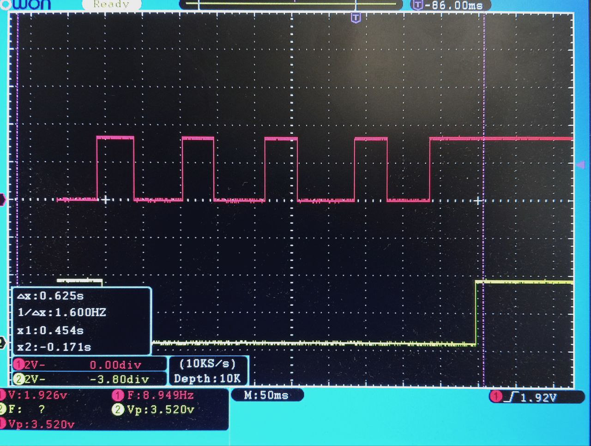

# ВЫПУСКНАЯ КВАЛИФИКАЦИОННАЯ РАБОТА БАКАЛАВРА
### Тема: Средства пользовательского ввода для лабораторного макета микроконтроллера
### Студент: Буянов Михаил Юрьевич

## Введение

Лабораторные макеты микроконтроллеров используются для изучения архитектуры вычислительных устройств и отработки практических навыков разработки встраиваемых систем. Для таких макетов необходимы удобные средства пользовательского ввода: кнопки, переключатели, энкодеры и потенциометры. Они позволяют формировать управляющие воздействия, проверять работу программ, исследовать цифровые интерфейсы и отлаживать обработку внешних событий.

Актуальность работы связана с разработкой компактного модуля ввода для учебного стенда на базе микроконтроллера МИК32 АМУР. Этот микроконтроллер относится к отечественной элементной базе, поэтому его применение в лабораторном макете помогает накапливать практический опыт работы с российскими аппаратными платформами, средствами разработки и периферийными блоками. Такой стенд может использоваться для изучения дискретных и аналоговых входов, сдвиговых регистров, подавления дребезга и программной обработки пользовательских событий.

При разработке модуля важно оптимизировать ресурсы контроллера: число занятых выводов, использование внутренних периферийных устройств и вычислительные затраты на опрос входов. Поэтому в работе сравниваются разные способы подключения кнопок и переключателей, а также оцениваются требования к таймингам, фильтрации дребезга и обработке событий.

Целью выпускной квалификационной работы является разработка средств пользовательского ввода для лабораторного макета микроконтроллера, включающих аппаратную часть, программное обеспечение для опроса устройств ввода и методику проверки работоспособности.

Для достижения поставленной цели необходимо решить следующие задачи:

* определить требования к составу и характеристикам модуля ввода для лабораторного макета;
* сравнить способы подключения клавиатуры 4x3 и дискретных переключателей к микроконтроллеру;
* рассмотреть и проверить способы подавления дребезга механических контактов;
* выбрать элементную базу для подключения кнопок, переключателей, энкодера и аналоговых регуляторов;
* разработать электрическую схему платы пользовательского ввода;
* реализовать программный алгоритм опроса устройств ввода для микроконтроллера МИК32 АМУР;
* провести испытания разработанного решения и оценить его работоспособность.

Объектом исследования являются средства пользовательского ввода в микроконтроллерных системах. Предметом исследования являются аппаратные и программные методы подключения и обработки сигналов от механических и аналоговых устройств ввода в составе лабораторного макета.

В первой главе рассматриваются основные типы устройств пользовательского ввода, особенности их подключения к микроконтроллерам, методы расширения числа входов, способы подавления дребезга контактов и подходы к программному опросу. Во второй главе рассматриваются кнопки и рычажковые переключатели, включая сравнение вариантов подключения клавиатуры 4x3. В третьей главе рассматриваются поворотные энкодеры и аналоговые ручки вращения. В четвертой главе приводятся вопросы безопасности жизнедеятельности при работе с лабораторным оборудованием.

# Глава 1. ЛИТЕРАТУРНЫЙ ОБЗОР

## 1.1 Средства пользовательского ввода в микроконтроллерных системах

План раздела:

* назначение пользовательского ввода в лабораторных и отладочных макетах;
* основные виды устройств ввода: тактовые кнопки, рычажковые переключатели, поворотные энкодеры, потенциометры;
* различия между дискретными, импульсными и аналоговыми сигналами ввода;
* требования к надежности, наглядности и удобству применения в учебном стенде.

## 1.2 Подключение дискретных устройств ввода к микроконтроллеру

План раздела:

* подключение кнопок и переключателей к GPIO;
* подтягивающие резисторы, активный уровень сигнала, защита входов;
* ограничения прямого подключения при большом количестве органов управления;
* принцип подключения клавиатурных блоков к микроконтроллеру;
* особенности чтения состояний механических контактов в цикле опроса и по прерываниям.

## 1.3 Способы подключения клавиатуры 4x3

План раздела:

* прямое подключение 12 кнопок к отдельным выводам микроконтроллера;
* матричное подключение 4x3 с использованием строк и столбцов;
* подключение кнопок через параллельно-последовательные сдвиговые регистры;
* сравнение вариантов по числу занятых выводов, сложности схемы и сложности программы;
* учет одновременных нажатий, паразитных срабатываний и необходимости диодов в матрице;
* предварительное определение критериев выбора схемы для лабораторного макета.

## 1.4 Расширение числа входов с помощью сдвиговых регистров

План раздела:

* назначение параллельно-последовательных сдвиговых регистров;
* принцип работы 74HC165 при считывании нескольких дискретных входов;
* подключение сдвиговых регистров через GPIO и через SPI;
* сравнение программного bit-banging и аппаратного SPI по сложности реализации, скорости и загрузке процессора;
* возможность каскадирования нескольких микросхем для увеличения числа входов.

## 1.5 Поворотные энкодеры как устройства пользовательского ввода

План раздела:

* принцип формирования квадратурных сигналов;
* определение направления вращения и количества шагов;
* ограничения механических энкодеров по скорости вращения и качеству контактов;
* влияние фильтрации и дребезга на корректность распознавания импульсов.

## 1.6 Аналоговые устройства ввода и работа с АЦП

План раздела:

* использование потенциометров как аналоговых регуляторов;
* согласование диапазона напряжений с входом АЦП микроконтроллера;
* разрешение, шум и стабильность измерений;
* программная фильтрация аналоговых значений.

## 1.7 Дребезг механических контактов и методы его подавления

План раздела:

* физическая природа дребезга при замыкании и размыкании контактов;
* влияние дребезга на цифровые входы, энкодеры и алгоритмы опроса;
* аппаратные методы подавления: RC-фильтры, триггеры Шмитта, специализированные микросхемы;
* специализированные решения на примере MC14490;
* программные методы подавления дребезга: задержка, счетчик стабильности, фильтрация по времени;
* сравнение аппаратных и программных методов по стоимости, задержке, числу компонентов и удобству применения.

## 1.8 Программный опрос устройств ввода

План раздела:

* циклический опрос и опрос по таймеру;
* обработка событий нажатия, отпускания и изменения положения;
* требования к периоду опроса с учетом минимальной длительности нажатия;
* хранение предыдущего состояния входов;
* формирование единого программного интерфейса для разных типов устройств ввода.

## 1.9 Выводы по литературному обзору

План раздела:

* обобщение рассмотренных способов подключения устройств ввода;
* выбор подходов, целесообразных для лабораторного макета;
* формирование критериев для выбора между прямым подключением, матрицей 4x3 и 74HC165;
* обоснование необходимости проверки разных методов подавления дребезга;
* формулировка требований, которые будут использованы в проектной части.

# Глава 2. Кнопки и рычажковые переключатели

## 2.1 Требования к дискретным устройствам ввода

Дискретные устройства ввода предназначены для формирования логических сигналов, по которым программа микроконтроллера определяет действия пользователя. В разрабатываемом лабораторном макете используются два типа таких устройств: тактовые кнопки для кратковременных команд и рычажковые переключатели для задания устойчивых состояний.

Для макета требуется подключить 12 кнопок, которые можно рассматривать как клавиатуру 4x3, и 8 рычажковых переключателей. Такое количество органов управления достаточно для задания команд, выбора режимов работы и проведения лабораторных экспериментов с цифровыми входами микроконтроллера. При этом схема подключения не должна занимать чрезмерное число выводов контроллера.

Дискретные входы должны быть согласованы с логическими уровнями МИК32 АМУР. Согласно информационному листу микроконтроллера, напряжение питания составляет 3,3 В ±10 % [9], то есть допустимый диапазон питания основного домена составляет 2,97-3,63 В. В проектируемой схеме логический «0» должен формироваться уровнем, близким к GND, а логическая «1» - уровнем, близким к VCC 3,3 В. Подача на входы сигналов уровня 5 В не допускается.

При выборе способа подключения необходимо учитывать временные характеристики пользовательского ввода. 

## 2.2 Подключение клавиатуры 4x3 напрямую к выводам микроконтроллера

Самый простой способ подключения клавиатуры 4x3 заключается в соединении каждой кнопки с отдельным входом микроконтроллера. В этом случае 12 кнопок требуют 12 независимых GPIO. Один контакт кнопки подключается к общему проводу или к линии питания, а второй - к входу микроконтроллера. Для формирования определенного уровня в разомкнутом состоянии используются подтягивающие резисторы к питанию или к земле. В зависимости от выбранной схемы нажатие кнопки формирует на входе логический «0» или логическую «1».

Преимущество прямого подключения заключается в простоте схемы и программы. Состояние каждой кнопки можно считать напрямую из регистра GPIO, а обработка нажатий сводится к сравнению текущего и предыдущего состояния входа. При таком подходе легко поддерживать одновременные нажатия, поскольку каждая кнопка имеет собственный входной канал. Кроме того, прямое подключение позволяет использовать внешние прерывания GPIO для реакции на изменение состояния кнопки без постоянного циклического опроса всех входов.

Недостаток прямого подключения состоит в большом расходе выводов микроконтроллера. Только клавиатура 4x3 занимает 12 GPIO, а с учетом 8 рычажковых переключателей суммарно требуется уже 20 цифровых входов, не считая энкодера, аналоговых ручек и других сигналов макета. Для лабораторного стенда выводы микроконтроллера являются одним из наиболее ценных ресурсов, так как они могут потребоваться для изучения интерфейсов SPI, I2C, UART, таймеров, АЦП и других периферийных устройств. Поэтому прямое подключение удобно для небольшой проверки, но не является оптимальным решением для итоговой платы.

## 2.3 Подключение клавиатуры 4x3 матрицей

Матричное подключение уменьшает число занятых выводов за счет объединения кнопок в строки и столбцы. Для клавиатуры 4x3 требуется 7 линий: 4 строки и 3 столбца. При сканировании программа поочередно активирует строки и считывает состояние столбцов. Если при активной строке на одном из столбцов обнаруживается изменение уровня, программа определяет нажатую кнопку по номеру строки и столбца.

По сравнению с прямым подключением матрица позволяет сэкономить 5 выводов микроконтроллера: вместо 12 GPIO используются 7. Однако такая схема требует более сложного алгоритма опроса. Необходимо последовательно переключать строки, выдерживать время установления уровней и выполнять чтение столбцов для каждой строки. Период полного опроса клавиатуры зависит от числа строк и задержек в алгоритме сканирования. В отличие от прямого подключения, матрица не позволяет просто назначить независимое прерывание на каждую кнопку: прерывание может использоваться только как дополнительный сигнал пробуждения или признак изменения, а определение конкретной кнопки все равно требует сканирования.

Дополнительная проблема матричной клавиатуры возникает при одновременном нажатии нескольких кнопок. В некоторых сочетаниях возможно появление фантомных срабатываний, когда программа определяет нажатой кнопку, которая фактически не нажималась. Для устранения этой проблемы применяют диоды, включенные последовательно с кнопками, но это увеличивает количество компонентов и усложняет монтаж. В рассматриваемом макете желательно сохранить возможность корректной обработки нескольких входов и не усложнять схему без необходимости, поэтому матричное подключение является промежуточным вариантом: оно экономит GPIO, но добавляет схемотехнические и программные ограничения.

## 2.4 Подключение кнопок через сдвиговые регистры 74HC165

Третий вариант заключается в подключении кнопок к параллельным входам сдвигового регистра 74HC165. Эта микросхема считывает несколько параллельных логических сигналов и передает их в микроконтроллер последовательно. Один 74HC165 имеет 8 параллельных входов, поэтому для 12 кнопок достаточно двух микросхем. Оставшиеся входы могут быть использованы для части рычажковых переключателей или зарезервированы для дальнейшего расширения.

При работе с 74HC165 микроконтроллер сначала формирует сигнал загрузки параллельных входов, после чего последовательно считывает биты состояния. Несколько микросхем можно каскадировать: последовательный выход одной микросхемы подключается к последовательному входу следующей, и вся цепочка считывается как один более длинный сдвиговый регистр. Это делает решение хорошо расширяемым: увеличение числа кнопок требует добавления микросхемы, но почти не увеличивает число линий микроконтроллера. Недостатком такого подхода является невозможность получить отдельное прерывание от каждой кнопки без дополнительной логики: микроконтроллер видит не отдельные входы, а последовательный поток данных, поэтому состояние кнопок определяется периодическим считыванием регистра.

Считывание 74HC165 можно выполнить двумя способами. Первый способ - программное управление линиями GPIO, или bit-banging. В этом случае программа вручную формирует тактовые импульсы и считывает бит данных после каждого импульса. Такой подход не требует настройки аппаратного SPI, но расходует процессорное время и делает обмен зависимым от задержек в программе.

Второй способ - подключение 74HC165 к аппаратному интерфейсу SPI. В этом случае тактовый сигнал формируется периферийным блоком SPI, а данные считываются через вход MISO. Дополнительная линия GPIO используется для загрузки параллельного состояния в регистр. Такой вариант уменьшает программную нагрузку, использует стандартную периферию микроконтроллера и позволяет быстро считывать несколько каскадированных микросхем. В итоговом макете выбран именно вариант подключения 74HC165 через SPI.

Штатный способ расширения числа входов - каскадирование регистров, при котором последовательный выход QH/Q7 одного регистра подключается к последовательному входу SER/DS следующего; такая возможность прямо указана в описании 74HC165. Если необходимо подключить к той же SPI-шине другие устройства, нужно обеспечить, чтобы в каждый момент времени линию MISO формировало только одно устройство. Для обычных SPI-устройств это выполняется сигналом CS, переводящим невыбранное устройство в высокоимпедансное состояние. Для 74HC165 такой функции нет, поэтому возможны несколько решений: подключить выход цепочки 74HC165 к MISO через внешний буфер с третьим состоянием, например 74HC125, использовать отдельную линию MISO/отдельный SPI-интерфейс для регистров или включить последовательный резистор между выходом Q7 последнего 74HC165 и общей линией MISO.

## 2.5 Сравнение способов подключения клавиатуры 4x3

Для выбора схемы подключения были рассмотрены три варианта: прямое подключение кнопок к GPIO, матричная клавиатура 4x3 и подключение через сдвиговые регистры 74HC165. Основным критерием выбора стало количество занятых выводов микроконтроллера, поскольку GPIO являются наиболее ценным ресурсом лабораторного макета.

| Способ подключения | GPIO для 12 кнопок | Дополнительные компоненты | Программная сложность | Прерывания от кнопок | Масштабирование |
| --- | ---: | --- | --- | --- | --- |
| Прямое подключение | 12 | подтягивающие резисторы или внутренние подтяжки | низкая | возможно для каждой кнопки | плохое, каждая новая кнопка требует GPIO |
| Матрица 4x3 | 7 | возможно диоды для корректной обработки одновременных нажатий | средняя | нет независимых прерываний от каждой кнопки, требуется сканирование | среднее |
| 74HC165 через SPI | 2 линии SPI + 1 GPIO загрузки | сдвиговые регистры 74HC165, подтяжки | средняя | нет независимых прерываний от каждой кнопки, требуется считывание регистра | хорошее, добавление входов каскадированием |

При прямом подключении клавиатура 4x3 занимает 12 выводов. Этот вариант имеет минимальную программную сложность и хорошо подходит для проверки отдельных кнопок, но плохо масштабируется. При добавлении 8 рычажковых переключателей расход GPIO становится слишком большим.

Матричное подключение уменьшает число линий до 7, что заметно лучше прямого варианта. Однако матрица требует сканирования строк, усложняет обработку одновременных нажатий и при необходимости надежной поддержки нескольких нажатых кнопок требует установки диодов. Для учебного макета это решение менее удобно, так как часть сложности связана не с исследованием микроконтроллера, а с особенностями самой клавиатурной матрицы.

Подключение через 74HC165 требует минимального числа дополнительных линий микроконтроллера и хорошо расширяется каскадированием микросхем. При использовании SPI для обмена задействуется аппаратная периферия, а программная часть сводится к загрузке состояния входов и чтению одного или нескольких байтов. Однако из-за отсутствия у 74HC165 входа CS и высокоимпедансного состояния выхода его нельзя без учета электрического конфликта подключать к общей линии MISO параллельно с другими устройствами. В выбранной реализации это ограничение учитывается двумя способами: все регистры 74HC165 объединены в одну цепочку, а выход Q7 последнего регистра подключен к MISO через резистор 1 кОм. Это позволяет освободить GPIO для других лабораторных задач, сохранить возможность увеличения числа дискретных входов и использовать общую SPI-шину совместно с другими устройствами.

Таким образом, для итоговой реализации выбран вариант подключения кнопок через сдвиговые регистры 74HC165 с чтением данных по SPI. Такое решение обеспечивает приемлемую сложность схемы, экономит выводы микроконтроллера, хорошо масштабируется и позволяет сравнить работу аппаратного SPI с программным bit-banging в рамках экспериментальной части.

## 2.6 Подключение рычажковых переключателей

Рычажковые переключатели отличаются от кнопок характером использования. Кнопка формирует кратковременное событие, а переключатель задает устойчивое состояние, которое может сохраняться длительное время. Поэтому для переключателей важно не только определить момент изменения положения, но и в любой момент иметь возможность считать их текущее состояние.

В разрабатываемом макете используется 8 рычажковых переключателей. В отличие от кнопок клавиатуры, они подключены напрямую к выводам GPIO микроконтроллера. Такое решение расходует больше выводов, чем подключение через 74HC165, но сохраняет важное преимущество: каждый переключатель остается независимым входом микроконтроллера, для которого можно использовать прерывание по изменению уровня. Это позволяет исследовать не только циклический опрос входов, но и событийную обработку внешних сигналов. Также чтение состояния переключателя напрямую будет полезно для более простых лабораторных работ.

При прямом подключении один контакт переключателя соединяется с общим проводом или с линией питания, а второй подключается к входу микроконтроллера. Для формирования определенного уровня в одном из положений используется подтяжка к питанию или к земле. Подтяжка может быть реализована внешним резистором или внутренним подтягивающим резистором GPIO, если его параметры подходят для выбранной схемы.

Возможным альтернативным вариантом было подключение переключателей к входам сдвиговых регистров 74HC165 вместе с кнопками. Это позволило бы дополнительно сократить число используемых GPIO, однако в таком случае микроконтроллер получал бы состояние переключателей только при очередном считывании регистра. Отдельные прерывания от каждого переключателя были бы недоступны без дополнительной логики. Поскольку одна из целей макета состоит в демонстрации разных способов работы с дискретными входами, прямое подключение переключателей является более полезным с учебной точки зрения.

Несмотря на то что переключатель задает устойчивое состояние, при изменении положения его контакты также подвержены дребезгу. Поэтому программная обработка должна учитывать не только текущее значение входа, но и момент перехода между состояниями. Для надежной работы необходимо либо фильтровать изменение программно, либо использовать аппаратные средства подавления дребезга, особенно если изменение положения переключателя обрабатывается через прерывание.

## 2.7 Временные параметры опроса кнопок и переключателей

Для оценки минимальной длительности нажатия была проведена серия из 10 тестов быстрого нажатия кнопки. По результатам измерений наименьшая продолжительность уверенного нажатия составила около 40 мс. Кроме того, при быстром повторном нажатии пользователь способен формировать события с частотой до 10 Гц, что соответствует периоду около 100 мс между соседними нажатиями. Эти значения рассматриваются как предельные условия работы, полученные при намеренно быстром нажатии, ударам по кнопке, при обычной эксплуатации лабораторного макета такие режимы, как правило, достигаться не будут.

_рис.1. Один из тестов быстрого нажатия кнопки. Кнопка подключена к первому каналу осциллографа._

На основании этих измерений система опроса должна иметь запас и надежно регистрировать нажатия длительностью не менее 40 мс, а также корректно обрабатывать повторные нажатия с частотой до 10 Гц. Алгоритм обработки также должен отличать кратковременное нажатие кнопки от устойчивого положения рычажкового переключателя, подавлять дребезг контактов и сохранять возможность обработки нескольких входов в пределах одного цикла опроса.

Период опроса должен быть выбран так, чтобы программа успевала обнаруживать самые быстрые действия пользователя и при этом не тратила лишние вычислительные ресурсы. По результатам проведенных тестов минимальная длительность уверенного нажатия кнопки составила около 40 мс, а предельная частота повторных нажатий - до 10 Гц. Следовательно, система должна иметь запас по времени и выполнять опрос заметно чаще, чем один раз за 40 мс.

Если использовать программную фильтрацию с ориентировочным временем подтверждения 10-20 мс, период опроса должен быть меньше этого интервала. Практически удобным является опрос с периодом порядка 1-5 мс: за время дребезга программа получает несколько последовательных измерений и может подтвердить устойчивое состояние без заметной для пользователя задержки. При этом итоговая задержка реакции складывается из периода опроса и выбранного времени фильтрации.

Для лабораторного макета важно сохранить компромисс между надежностью и отзывчивостью. Слишком малое время фильтрации может пропускать дребезг и приводить к ложным срабатываниям, а слишком большое - ухудшать реакцию на быстрые нажатия. Поэтому предварительно допустимым диапазоном фильтрации можно считать 10-20 мс, а окончательное значение должно быть выбрано после измерения дребезга конкретных кнопок и переключателей.

## 2.8 Дребезг контактов кнопок и переключателей

Механические кнопки и рычажковые переключатели не формируют идеальный одиночный переход между логическими уровнями. При замыкании и размыкании контактов возникает дребезг: в течение короткого времени вход микроконтроллера может несколько раз переключаться между «0» и «1». Если не учитывать этот эффект, одно нажатие кнопки может быть ошибочно обработано как несколько нажатий, а изменение положения переключателя - как серия быстрых переключений.

В работе были рассмотрены и проверены три варианта защиты от дребезга: специализированная микросхема MC14490, RC-фильтр и программная фильтрация. Эти варианты отличаются числом дополнительных компонентов, задержкой, стоимостью и влиянием на программную часть.

MC14490 является специализированной микросхемой подавления дребезга. Она удобна тем, что не требует отдельной программной обработки и не занимает дополнительные выводы микроконтроллера для каждого канала. Одна микросхема содержит 6 каналов, поэтому для 12 кнопок потребовались бы две микросхемы. Недостатками такого решения являются дополнительная стоимость и задержка срабатывания. В типовом варианте задержка может достигать десятков миллисекунд; ее можно уменьшить подбором внешних компонентов, но это требует дополнительной настройки схемы.

RC-фильтр является простым аппаратным способом сглаживания дребезга. Он дешев и может быть собран из распространенных компонентов, однако для большого количества входов требует значительного числа элементов. Для каждого канала необходимы как минимум резистивно-емкостная цепь и желательно формирователь с четким порогом переключения, например вход с триггером Шмитта. На печатной плате такое решение может быть приемлемым, но при макетировании оно усложняет монтаж и увеличивает вероятность ошибок соединения.

Программная фильтрация не требует дополнительных компонентов и позволяет изменять параметры подавления дребезга без переделки схемы. Суть метода состоит в том, что изменение состояния входа принимается не сразу, а только после того, как новое значение сохраняется в течение заданного времени или подтверждается несколькими последовательными измерениями. Такой подход хорошо подходит для кнопок, подключенных через 74HC165, поскольку их состояние в любом случае считывается периодически. Для рычажковых переключателей, подключенных напрямую к GPIO, программная фильтрация также применима: прерывание может фиксировать факт изменения входа, а окончательное состояние подтверждается после небольшой задержки или серии повторных чтений.

По результатам проверки для макета выбрана программная защита от дребезга. Она не увеличивает стоимость и сложность платы, не требует дополнительных микросхем и позволяет подобрать время фильтрации с учетом измеренных условий работы. Такой вариант особенно удобен для лабораторного макета, где важно иметь возможность изменять алгоритм обработки и сравнивать разные параметры фильтрации программно.

## 2.9 Программная обработка кнопок и переключателей

Программная обработка дискретных входов выполняется в несколько этапов. Сначала микроконтроллер получает сырые состояния входов: для кнопок они считываются из цепочки 74HC165 по SPI, а для рычажковых переключателей - непосредственно из регистров GPIO. Затем программа сравнивает новое состояние с предыдущим и определяет события: нажатие, отпускание или изменение положения переключателя.

Для защиты от дребезга используется программная фильтрация по времени. При первом обнаружении изменения входа программа не принимает его немедленно, а запускает проверку стабильности. Новое состояние считается действительным только после того, как оно сохраняется без изменений в течение заданного интервала. Такой алгоритм позволяет отделить реальное действие пользователя от кратковременных колебаний контактов.

В качестве предварительного ориентира для выбора времени фильтрации можно использовать опубликованные измерения дребезга механических переключателей. В серии экспериментов Джека Ганссла большинство исследованных переключателей имели дребезг менее 6,2 мс, среднее значение без учета двух выбросов составило около 1,6 мс, но один из переключателей показал выброс до 157 мс при размыкании контакта ([Ganssle, A Guide to Debouncing](https://www.ganssle.com/item/debouncing-switches-contacts-code.htm)). В практических рекомендациях DigiKey также приводится среднее значение около 1,6 мс и максимум 6,2 мс по измерениям Ганссла, а для консервативной фильтрации упоминается задержка порядка 20 мс ([DigiKey, Hardware Switch Debounce](https://www.digikey.com/en/articles/how-to-implement-hardware-debounce-for-switches-and-relays)). Эти значения используются как временная оценка; для итоговой версии параметры фильтрации должны быть заменены результатами измерений конкретных кнопок и переключателей макета.

Для кнопок, подключенных через 74HC165, фильтрация естественно совмещается с периодическим опросом регистров. Для каждого входа хранится сырое состояние, подтвержденное состояние и время последнего изменения. Для рычажковых переключателей, подключенных напрямую к GPIO, возможны два режима: периодический опрос или прерывание по изменению уровня с последующей программной проверкой состояния после интервала подавления дребезга.

## 2.10 Экспериментальная проверка кнопок и переключателей

План раздела:

* проверка правильности электрического подключения;
* проверка работы клавиатуры 4x3 выбранным способом;
* измерение дребезга без фильтрации;
* проверка аппаратного и программного подавления дребезга;
* сравнение скорости считывания 74HC165 через bit-banging и SPI;
* анализ полученных результатов и выводы по главе.

# Глава 3. Энкодер и аналоговые ручки вращения

## 3.1 Назначение поворотных органов управления

План раздела:

* применение энкодера в лабораторном макете;
* применение потенциометров как аналоговых ручек вращения;
* различие между относительным и абсолютным вводом;
* требования к удобству работы пользователя;
* требования к точности и скорости обработки.

## 3.2 Подключение поворотного энкодера

План раздела:

* устройство механического квадратурного энкодера;
* сигналы каналов A и B;
* подключение каналов энкодера к цифровым входам;
* использование подтягивающих резисторов;
* подключение кнопки энкодера при ее наличии;
* требования к электрической схеме и защите входов.

## 3.3 Алгоритм обработки энкодера

План раздела:

* чтение квадратурных сигналов;
* определение направления вращения;
* подсчет шагов;
* обработка пропусков и некорректных переходов;
* влияние периода опроса на максимальную скорость вращения;
* формирование событий вращения для прикладной программы.

## 3.4 Дребезг и фильтрация сигналов энкодера

План раздела:

* отличие дребезга энкодера от дребезга одиночной кнопки;
* влияние фильтрации на потерю быстрых импульсов;
* аппаратная фильтрация каналов энкодера;
* программная фильтрация переходов;
* подбор параметров фильтрации по осциллограммам;
* проверка работы энкодера на максимальной скорости вращения.

## 3.5 Подключение аналоговых ручек вращения

План раздела:

* использование потенциометров как источников аналогового напряжения;
* выбор номинала потенциометра;
* согласование диапазона напряжений с входом АЦП МИК32 АМУР;
* ограничение диапазона, например от 0 В до 1,1 В;
* защита аналогового входа;
* требования к разводке и устойчивости измерений.

## 3.6 Программная обработка аналоговых значений

План раздела:

* настройка АЦП;
* периодическое считывание значений потенциометров;
* масштабирование результата в удобный диапазон;
* подавление шумов измерения;
* обнаружение значимого изменения положения ручки;
* передача аналогового значения в прикладную программу.

## 3.7 Экспериментальная проверка энкодера и аналоговых ручек

План раздела:

* проверка правильности подключения энкодера;
* измерение максимальной частоты сигналов каналов энкодера;
* проверка устойчивости определения направления вращения;
* проверка влияния фильтра на быстрые вращения;
* проверка диапазона и стабильности показаний потенциометров;
* анализ результатов и выводы по главе.

# Глава 4. Безопасность жизнедеятельности

## 4.1 Анализ условий работы с лабораторным макетом

План раздела:

* описание рабочего места;
* используемое электрическое оборудование;
* возможные опасные и вредные факторы;
* особенности работы с макетными платами и измерительными приборами.

## 4.2 Электробезопасность при работе с низковольтными устройствами

План раздела:

* уровни напряжений в разрабатываемом устройстве;
* меры защиты от короткого замыкания;
* требования к подключению питания;
* правила безопасного подключения и отключения макета.

## 4.3 Организация рабочего места при пайке и отладке

План раздела:

* требования к освещению и вентиляции;
* безопасная работа с паяльным оборудованием;
* хранение компонентов и инструментов;
* предотвращение повреждения компонентов статическим электричеством.

## 4.4 Выводы по безопасности жизнедеятельности

План раздела:

* основные меры безопасности при работе с макетом;
* вывод о допустимости эксплуатации разработанного устройства в лабораторных условиях.

# Заключение

План раздела:

* кратко указать, что было разработано;
* перечислить основные аппаратные и программные результаты;
* оценить соответствие результата поставленной цели;
* привести основные результаты экспериментальной проверки;
* описать возможные направления развития: новая ревизия платы, улучшение фильтрации, расширение числа устройств ввода, подготовка лабораторных работ.

# Список источников
1. Подключение кнопок, дискретных сигналов к микроконтроллеру STM32F103 [Электронный ресурс] // CyberLeninka.ru. – 2018. – URL: https://cyberleninka.ru/article/n/podklyuchenie-knopok-diskretnyh-signalov-k-mikrokontrolleru-stm32f103 (дата обращения: 15.04.2026).

2. Подключение матричной клавиатуры 4×4 к микроконтроллеру PIC [Электронный ресурс] // Microkontroller.ru. – 12.07.2022. – URL: https://microkontroller.ru/pic-microcontroller-projects/podklyuchenie-matrichnoj-klaviatury-4x4-k-mikrokontrolleru-pic/ (дата обращения: 20.04.2026).

3. Микрон. Отладочная учебная плата на базе MIK32 «Амур» — описание возможностей [Электронный ресурс]. – URL: https://docs.mikron.ru/wiki/development/Mik_kit/start_kit_V1.html (дата обращения: 28.04.2026).

4. **Гузик В. Ф., Пьявченко А. О., Синютин Е. С., Беспалов Д. А., Пустовалов В. В.** Учебно‑лабораторный стенд для разработки микропроцессорной системы с применением ПЛИС‑технологии [Электронный ресурс] // *Известия Южного федерального университета. Технические науки.* — 2003. — Режим доступа: [https://cyberleninka.ru/article/n/uchebno-laboratornyy-stend-dlya-razrabotki-mikroprotsessornoy-sistemy-s-primeneniem-plis-tehnologii](https://cyberleninka.ru/article/n/uchebno-laboratornyy-stend-dlya-razrabotki-mikroprotsessornoy-sistemy-s-primeneniem-plis-tehnologii) (дата обращения: 28.04.2026).

5. **Цевух И. В., Мацкевич Н. А.** Универсальный лабораторный стенд для изучения 8‑ и 32‑разрядных микроконтроллеров [Электронный ресурс] // *МНПК «Современные информационные и электронные технологии».* — 2019. — Режим доступа: [https://old.tkea.com.ua/siet/archive/2019/19.pdf](https://old.tkea.com.ua/siet/archive/2019/19.pdf) (дата обращения: 28.04.2026).

6. **Лабораторный стенд «Программирование микроконтроллеров» ЭЛБ‑020.003.01.** Техническое описание [Электронный ресурс]. — Профистенд. — Режим доступа: [https://profistend.info/upload/iblock/af8/hr68wuobehwzibgbtikw2khs5ajwbcis/elb_020.003.01.pdf](https://profistend.info/upload/iblock/af8/hr68wuobehwzibgbtikw2khs5ajwbcis/elb_020.003.01.pdf) (дата обращения: 28.04.2026).

7. **Ермаков В. В., Пьянов М. А.** *Микропроцессорные средства и системы: практикум по лабораторным работам.* — Тольятти: ТГУ, 2011. — 72 с. (дата обращения к электронному ресурсу: 28.04.2026).

8. **АО «Микрон».** *Техническое описание К1948ВК018, К1948ВК015: MIK32 АМУР. Версия 2.2.3* [Электронный ресурс]. — Режим доступа: [https://docs.mikron.ru/wiki/_attachments/mik32_datasheet_v2_2_3.pdf](https://docs.mikron.ru/wiki/_attachments/mik32_datasheet_v2_2_3.pdf) (дата обращения: 28.04.2026).

9. **АО «Микрон».** *Информационный лист MIK32 АМУР. Версия 1.2* [Электронный ресурс]. — Режим доступа: [https://docs.mikron.ru/wiki/_attachments/Information_AMUR_MIK32_r1_2.pdf](https://docs.mikron.ru/wiki/_attachments/Information_AMUR_MIK32_r1_2.pdf) (дата обращения: 28.04.2026).

10. **Mikron Wiki.** Рекомендации по подключению [Электронный ресурс]. — Режим доступа: [https://docs.mikron.ru/wiki/general/electrical-design-tips.html](https://docs.mikron.ru/wiki/general/electrical-design-tips.html) (дата обращения: 28.04.2026).

11. **Tellur‑el.** *Демонстрационная плата с микроконтроллером К1948ВК018 АМУР: руководство по быстрому старту* [Электронный ресурс]. — 2024. — Режим доступа: [https://tellur-el.ru/upload/iblock/0c8/ryi0cyszgf8glxkok50vki2xam4uyrmf/c96c1c6c_9a86_11ee_b230_000c29da4576_52c7d096_a48b_11ee_ae7f_0050568bb3a7.pdf](https://tellur-el.ru/upload/iblock/0c8/ryi0cyszgf8glxkok50vki2xam4uyrmf/c96c1c6c_9a86_11ee_b230_000c29da4576_52c7d096_a48b_11ee_ae7f_0050568bb3a7.pdf).

12. **Ganssle J.** *A Guide to Debouncing* [Электронный ресурс]. — Режим доступа: [https://www.ganssle.com/item/debouncing-switches-contacts-code.htm](https://www.ganssle.com/item/debouncing-switches-contacts-code.htm) (дата обращения: 28.04.2026).
